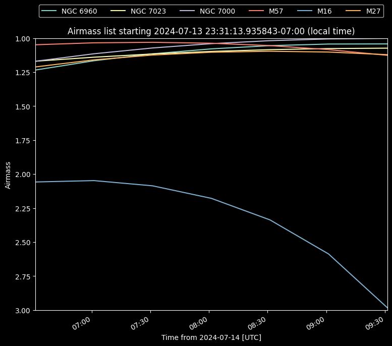
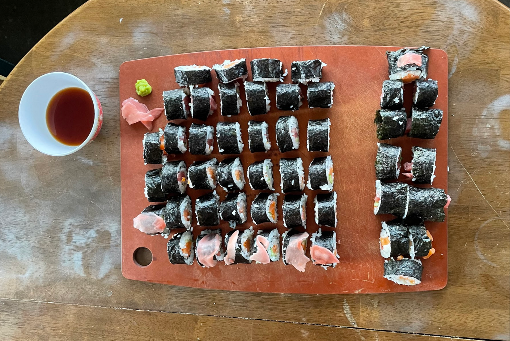
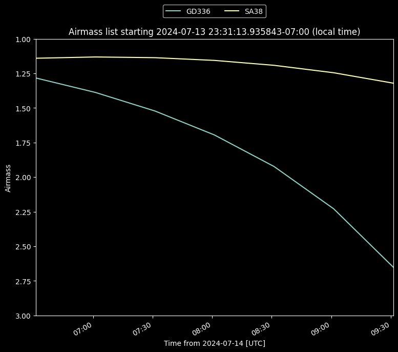
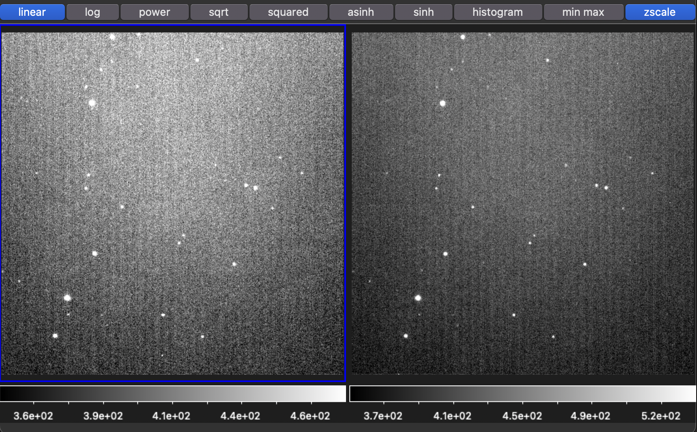
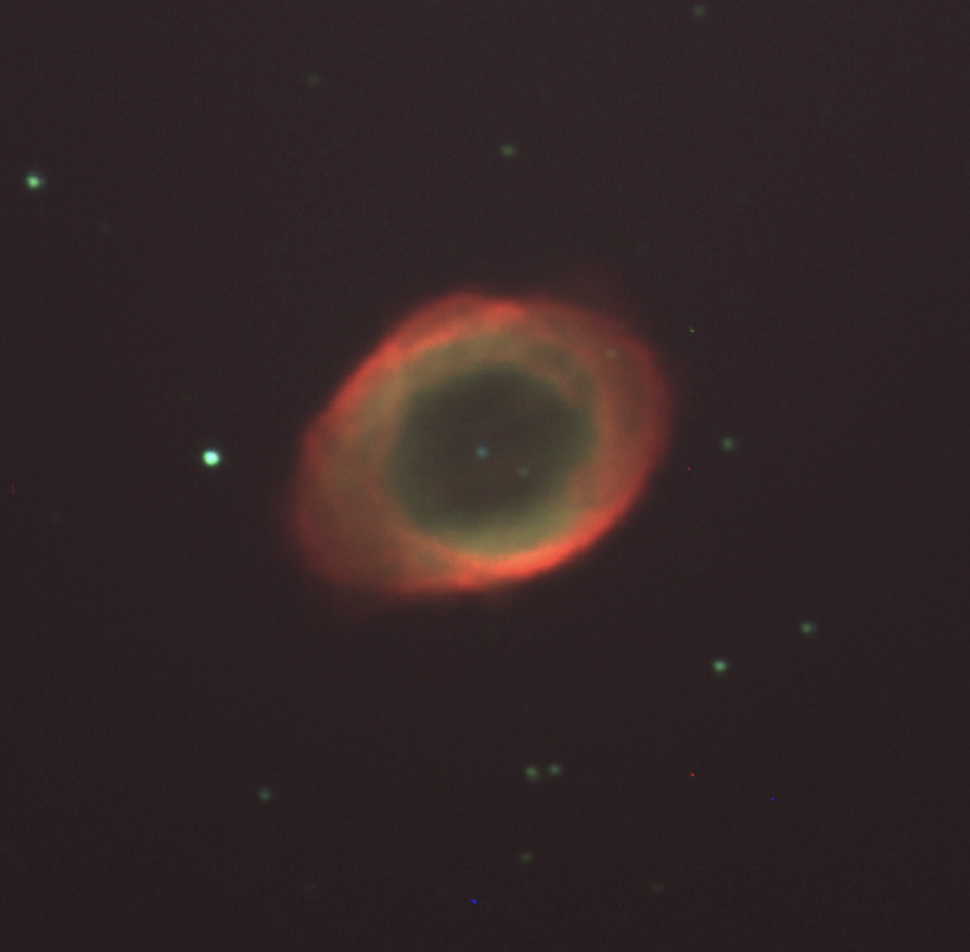
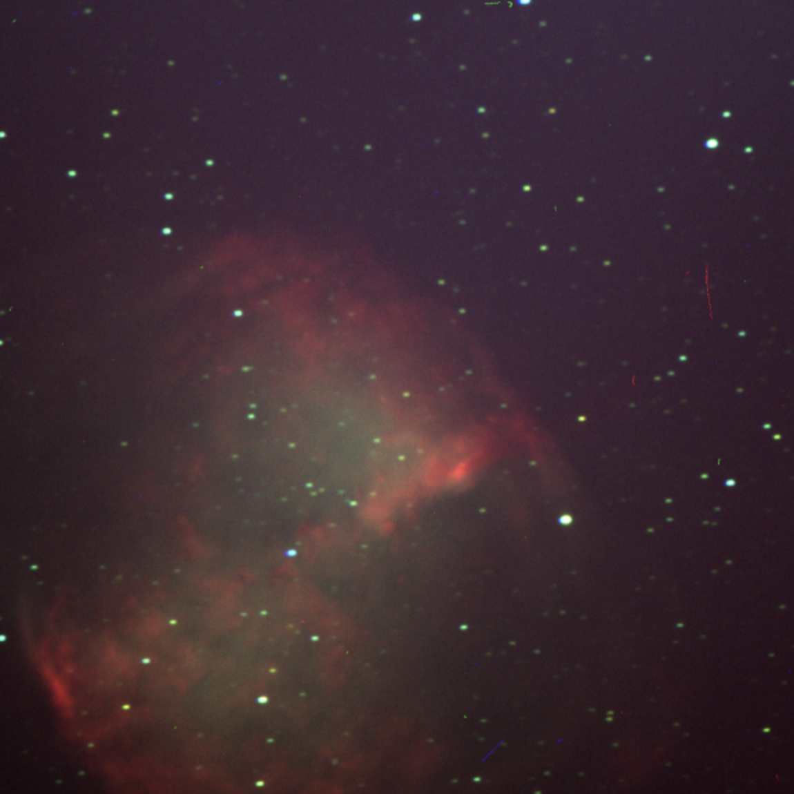
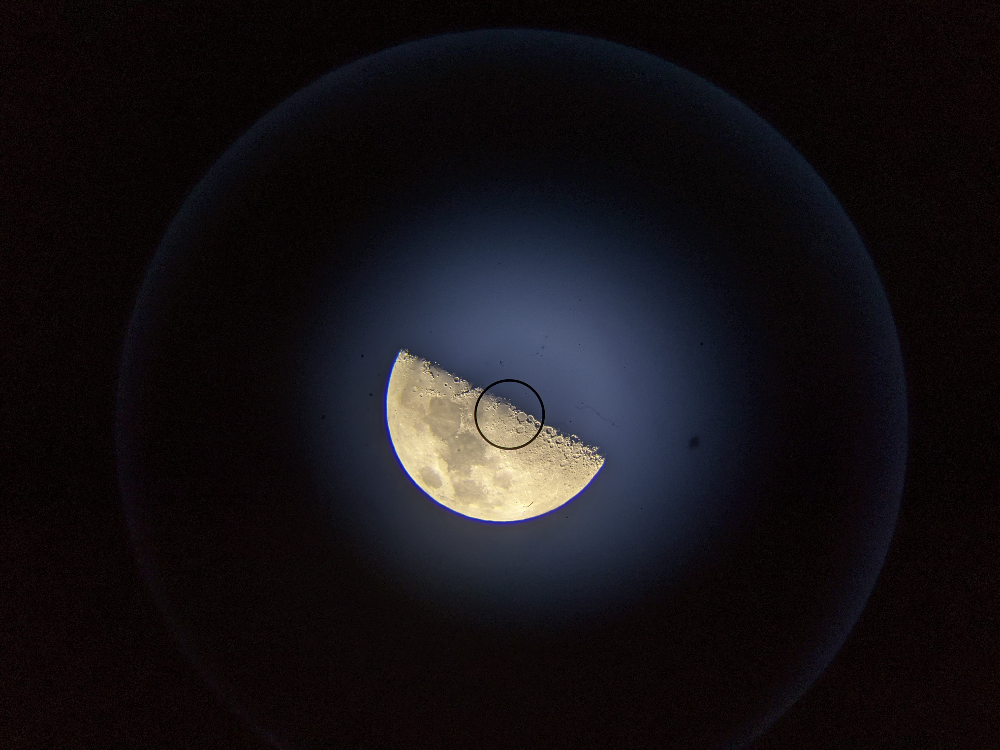
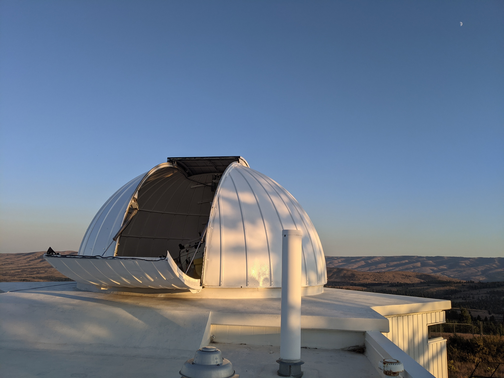

# Thurs. Jul 11 - Mon. Jul 15

José, Naim, Parker, Ryan, Anika, Daniel

**ASTR 481 Trip - Team 3 Trip 1**

---

## Week Goal(s)

> Characterize **Evora**, the iKon-M 934 camera that MRO uses as a CCD imaging camera, by obtaining extinction and transformation coefficients.

While here, our plan is:
- [x] At the start of each observing run, take 10 bias frames to act as "per-night calibration frames".
	- [x] Thurs. 11
	- [x] Fri. 12
	- [x] Sat. 13
	- [x] Sun. 14
- [x] Create a set of <20 dome flats to find the shortest accurate shutter speed without seeing the remnants of the shutter. 
	- Done Sat. 13
- [x] Create a set of <15 sky flats to show linearity from minimum to CCD saturation.
	- Done Sat. 13
- [x] Take a few darks to estimate Evora's dark current in counts / min.
	- Done Fri. 12 & Sat. 13
- [x] Take 5 dome flats in $B$ and $V$ filters at around 80% of the point that nonlinearity begins (around 40,000?)
	- Done Sat. 13
- [x] Take 5 sky flats in $B$ and $V$ filters around 80% of the nonlinearity point (similar to dome flats)
	- Done Sat. 13
- [x] Observe an extinction star field over the course of several airmasses
	- Thurs. 11 & Fri. 12
- [x] Observe standard stars at the lowest possible airmass
	- Done Fri. 12

... and to observe some DSOs of interest. 

### Possible Interesting Objects

|               | Veil Nebula | Iris Nebula | **Eagle Nebula** | **North American Nebula** | **Ring Nebula** | **Dumbbell Nebula** |
| ------------- | ----------- | ----------- | ---------------- | ------------------------- | --------------- | ------------------- |
| **Alt. Name** | NGC 6960    | NGC 7023    | M16              | NGC 7000                  | M57             | M27                 |

## Thurs. June 11

Stopped by Uwijimaya and Fred Meyer along the way to collect supplies for 5 nights' stay. It's nice out today - the skies are clear, temperatures high 70s. No bugs onsight in the observatory which was a welcome change. Started our epic dinner saga off by making sushi rolls!

After sunset, we started by calibrating the telescope. An issue that came up early in the night was that, for some reason after *updating pointing* to a target (i.e. once we got lined up with Vega), the telescope would stop tracking (without indicating such on Bifrost). This was resolved by just stopping and starting tracking again - still, curious. 

Spent a few hours focusing the telescope and making sure it was pointing alright. Spent the remainder of the night taking pictures of GD 336. 

## Fri. June 12

Quiet day today. Folks started waking up around noon - we added the spare darkroom monitor to the observing room to try getting some more real-estate on Sleipnir. 

Garlic brown butter tilapia for dinner - Ryan made some rice and Anika a salad to accompany our meal. Observations started tonight with little fuss - we continued with our extinction field GD 336 initially, then stars in our standard field SA38. 

We noticed around 2:00 AM that the red lights in the dome might've been visible in the images themselves (tested with on and off) - decided to keep them on since they'd been on for the whole night thus far. More testing needed.

**Left**: SA38 with lights on. **Right**: SA38 with lights off. 

To end the night, grabbed some pictures of the Dumbbell Nebula (M27) and the Ring Nebula (M57).

## Sat. Jul 13

Waffles for breakfast - started a Smash Bros Subspace Emissary campaign today within which we *led a campaign of carnage* (on normal mode).

Later, using [SIRIL](https://siril.org/), I processed our pictures of M57 in false color ($H\alpha$ to red, $B$ to blue and $G$ to green):

And the dumbbell nebula using a similar process

We hadn't applied our calibration frames yet, so I wonder how different they'd look if we did - let's try it once we get the master frames set up. Also each of these was only a combination of the 3 exposures - I wonder if we did a whole bunch of exposures whether we'd get a much higher SNR. 

**Wishlist item**: a non-relative focusing mechanism. The focus seems to "drift" overnight and it can be hard to know when we're on target.

At sunset, we took our sky flats, then some dome flats and darks to finish up our first project report. Since we still had an hour or so until astronomical twilight, we tried training the telescope on the Moon - and saw this!

Since the Evora control software was modified to allow <1s exposure times, we were able to take ~0.3s exposures of the lunar surface.

After this, we sat down and watched the first Alien (1979).

> Fun fact, the actor who played Bilbo Baggins in the Lord of the Rings (Ian Holm) was the same who played the science officer, Ash. 
## Sun. Jul 14

Cinnamon rolls in the AM, then more Brawl. Swamp is a hard level. Cleaned up some in the afternoon, then went on a hike in the evening. I think it was called Umpdenum Falls? When we returned, Ryan made some hotdogs with pickled onion - everyone was famished, so the meal was extra good. 

Tried to take a look at some variable stars that [needed observation on AAVSO](https://targettool.aavso.org/), but we chose one that was a bit too dim (mag 16) to be distinguished easily - it was visible with a ~200 second exposure, but the SNR was so high that it was almost indistinct - so we packed it in for the evening, anticipating an early day on Monday.

## Mon. Jul 15

Hoping to return to Seattle with some time to spare, we woke up around 8:00 AM and started cleaning, grabbing breakfast while we ran around getting everything back in order.

Inventory notes made in the class Doc and checklist followed, we packed our gear up and headed out around 8:45 AM, grabbing coffee in Ellensburg on the way back from Jenikka's.