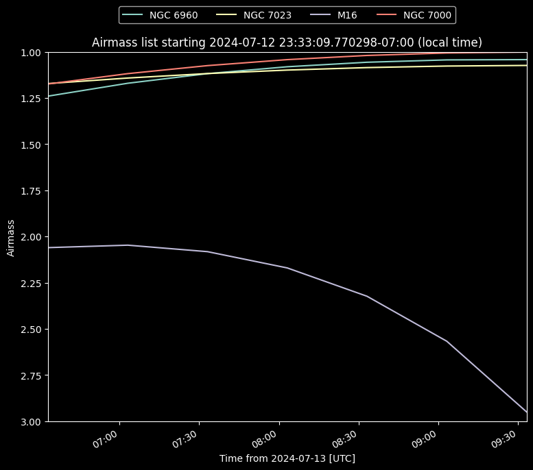

# Thurs. Jul 11 - Mon. Jul 15

José, Naim, Parker, Ryan, Anika, Daniel

**ASTR 481 Trip - Team 3 Trip 1**

---

## Week Goal(s)

> Characterize **Evora**, the iKon-M 934 camera that MRO uses as a CCD imaging camera, by obtaining extinction and transformation coefficients.

Our plan is:
1. At the start of each observing run, take 10 bias frames to act as "per-night calibration frames".

### Possible Interesting Objects

|               | Veil Nebula | Iris Nebula | **Eagle Nebula** | **North American Nebula** |
| ------------- | ----------- | ----------- | ---------------- | ------------------------- |
| **Alt. Name** | NGC 6960    | NGC 7023    | M16              | NGC 7000                  |

## Fri. June 11

Stopped by Uwijimaya and Fred Meyer along the way to collect supplies for 5 nights' stay. Started off by making sushi rolls!

[sushi roll pics]