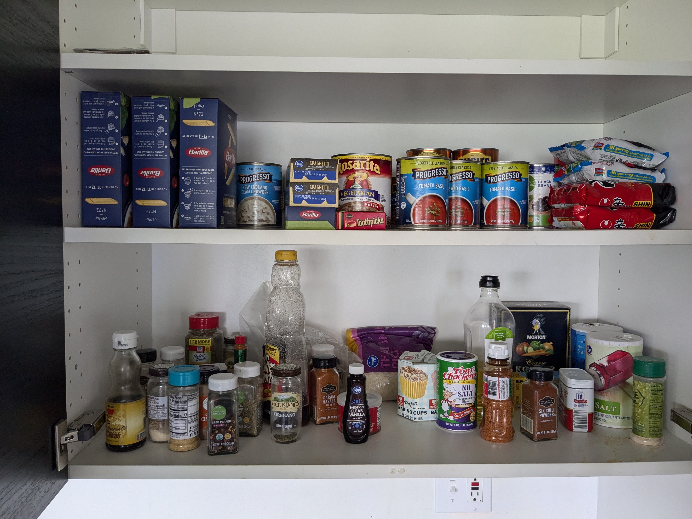
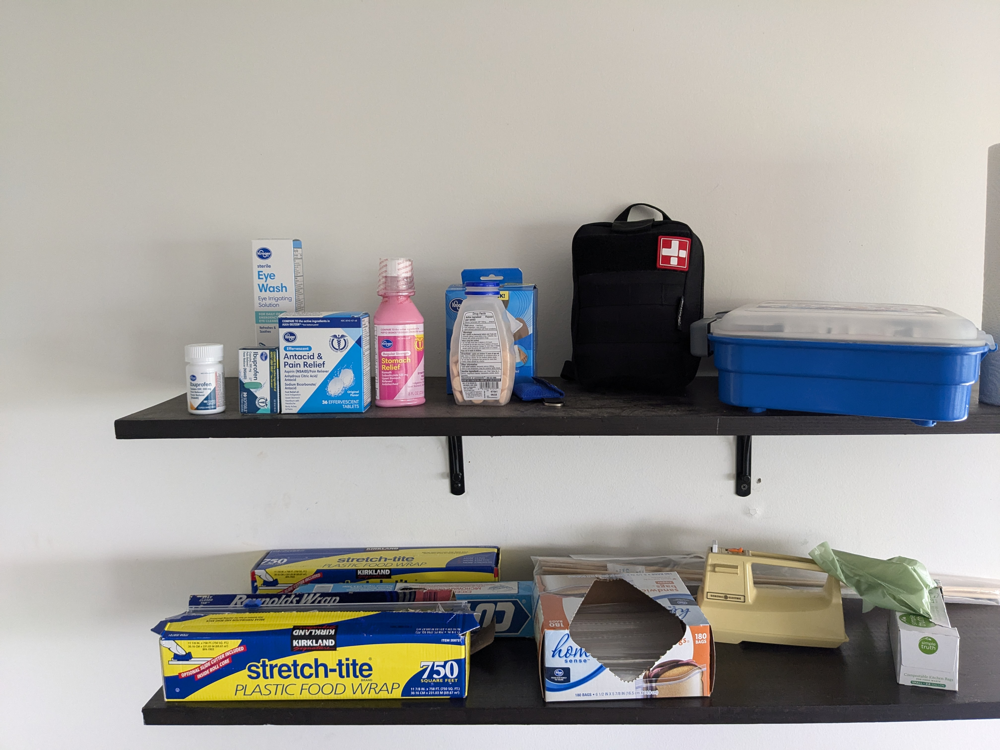
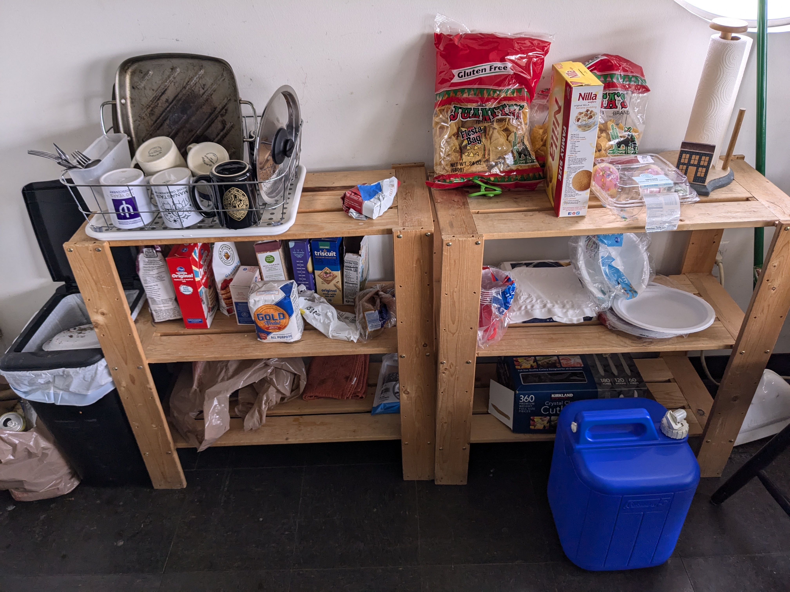

# Fri. June 21 - Sat. June 22

Oliver, Carter, Bruce, Maggie, Daniel, Thomas, Ruby, Parker, Anika

**ASTR 481 Trip - Orientation**

---

## Fri. June 21

Arrived to observatory around 3:30 PM - after tour we made (slightly undercooked :( ) baked potatoes on the grill as well as beans / guac - ended up acceptably tasty.

Set up audio server to allow AirPlay, Spotify Play and Bluetooth - see below.

Around 11:00 PM started observatory setup.

- Sleipnir didn't boot for a long time - see details below. 
- After Sleipnir woke up, we ran into issues with `telescopepi` not starting - the mounted `telescopepi` is a Pi 2 with an old version of the filter control software. The new version did not work with `evora-server`. Fixed corrupted Pi 2 with the old filter control software + restarted, no troubles after.
	- Old filter control vs. new?

Acquired Vega and Arcturus, until clouds moved in making further observation difficult. Trip snoozed around 3 AM. 

## Grocery List

- [ ] Out of white sugar, almost out of brown sugar
- [ ] Ginger powder as a spice
- [ ] Paper towels
- [ ] Aluminum foil
- [ ] Coffee creamer
- [ ] Plastic forks, napkins, paper plate

### Inventory 

|  |  |
| -------------------------------------- | -------------------------------------- |
|  |  |
## Sleipnir

Sleipnir was acting slower than usual - ironically named. Boot hung up on something to do with `SGX` - apparently okay to ignore, but boot logs also showed some issue with an `md5sum` failed verification on a portable disk image (paraphrased). StackExchange answers claimed it was probably something to do with Mint, no solutions provided. Booting takes ~3 minutes as a result, in addition to the slowness of `ubuntu`. 

To test whether the bottleneck was software or hardware, installed another distro alongside `ubuntu` - shrunk `ubuntu` disk 100 gigabytes and installed `manjaro` on it. Note - boot drive backup made at `/home/mrouser/.backup` just in case.

**Results**: Manjaro booted much faster, but still some of the same slow speeds persisted, even with no services running - so I bet it's hardware. Hard drive is a Toshiba MQ01ACF050 - 7200 rpm, Pentium 4 processor.

## Audio Server

Set up an audio server connected to the 3.5mm jack on the vinyl-amp-thing - it supports connections via Bluetooth, AirPlay and Spotify Play, and can be further configured at [http://audio](http://audio). 

As it runs on a Raspberry Pi, make sure the little black box with the fan is powered on and shows a red / green lights - if you run into any issues just restart it. 