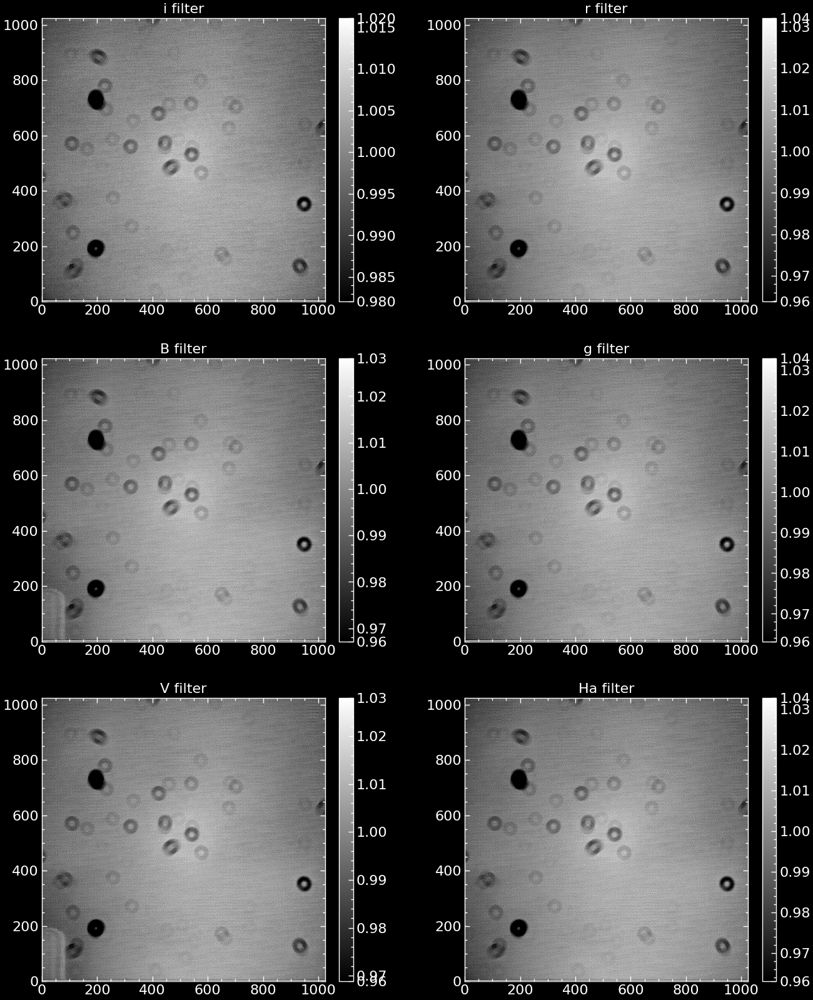
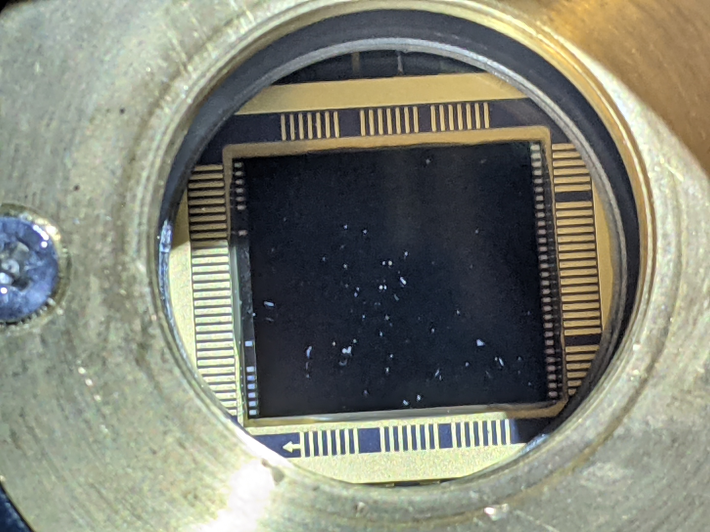
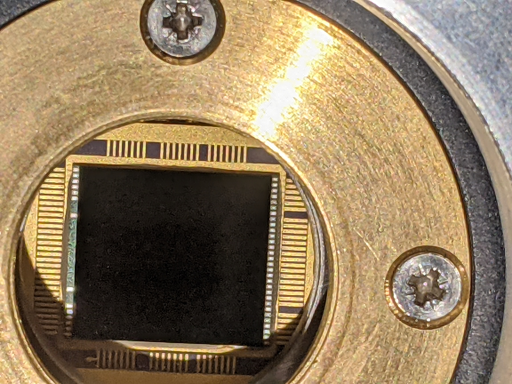
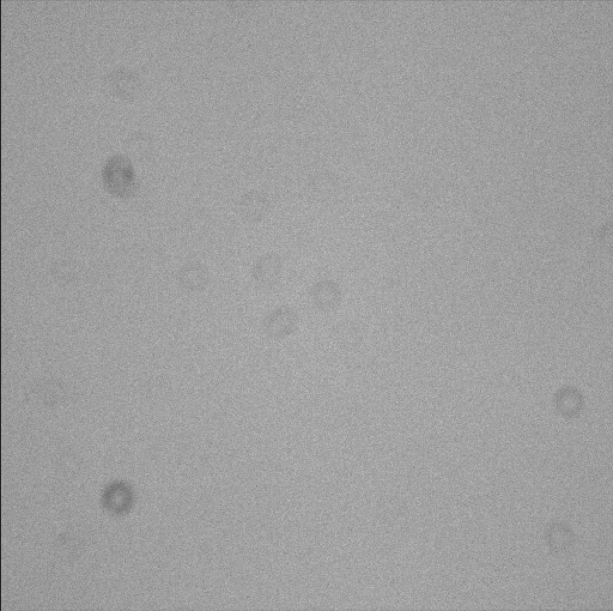

# Fri. May 24 - Sat. May 25

José, Dylan, Eliz, Parker, Matt, Yasin, Ishan

---

## Arrival

Acquired copious amounts of soda from Fred Meyer due to a bizarre buy-two-get-three deal. Arrived at MRO around 7:00 PM, skies clearing up from earlier rain, mid-50s temperature - hoping for clear skies tonight. 

**Checklist notes**: Water level in tank after turning on the pump at 20% - refill next time. 

## Night - Fri. May 24

**Notes**:
- Always use the target list to start slewing. Make sure telescope is able to slew from Vega to Arcturus. 
- Started the night aligning the finder scope with the 0.8m.
- Started observations around 3:30 AM - see problems log below. 
- Nonlabeled flats are sky flats - domeflats are indicated such in header
	- Wrote bash script to take domeflats automatically

| **Object** | **Exptime** | **Filter** | **File**      | **Notes** |
| ---------- | ----------- | ---------- | ------------- | --------- |
| M57        | 10          | V          | ecam-81       |           |
| M57        | 50          | Ha         | ecam-82       |           |
| M57        | 30          | B          | ecam-83       | DUST      |
| M57        | 10          | B          | ecam-84       | DUST :(   |
| GJ 1243    | 35          | r          | ecam-(85:105) |           |

 **Problems**:
- Focus issues early on that we worked on until midnight - emergency stop of [Bifrost](https://github.com/UWMRO/TCS) software meant we lost track of current focus position. Eventually reset.
- Slewing / connection issues with Bifrost
- DUST - see ecam-83
- Same dust particles different filters? ... filter may not have moved or dust on CCDs. 

## Sat. May 25 - Day

Forgot to disable tracking while doing domeflats - telescope slewed entire night. Spent morning re-acquiring domeflats. 

Pulled off CCD to see if dust effects were on it.

| **Dusty darling**                      | **Better**                             |
| -------------------------------------- | -------------------------------------- |
|  |  |
|                |                |

---
## Wish List
### Resupply
- [ ] AA batteries
- [ ] Recycling bin
- [ ] Sponges 🙏
### Projects
- [ ] Web interface to interface with both `evora-server` and `Bifrost`
	- [ ] Dome control in web interface
- [ ] Weather details + webcam in web interface
- [ ] Autofocus mechanism - APO-style
- [ ] Multi-filter series exposure planning
	- [x] Bash script already set up
- [ ] Old raspberry pi w/ wifi to act as an audio server (bluetooth and airplay, spot maybe)