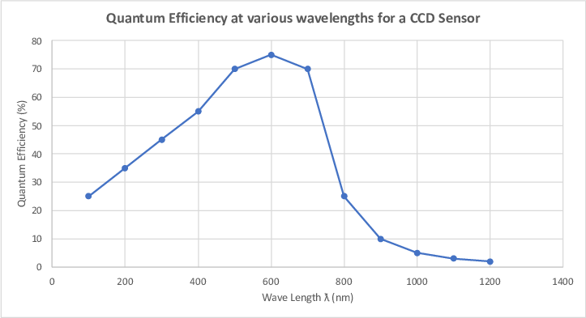
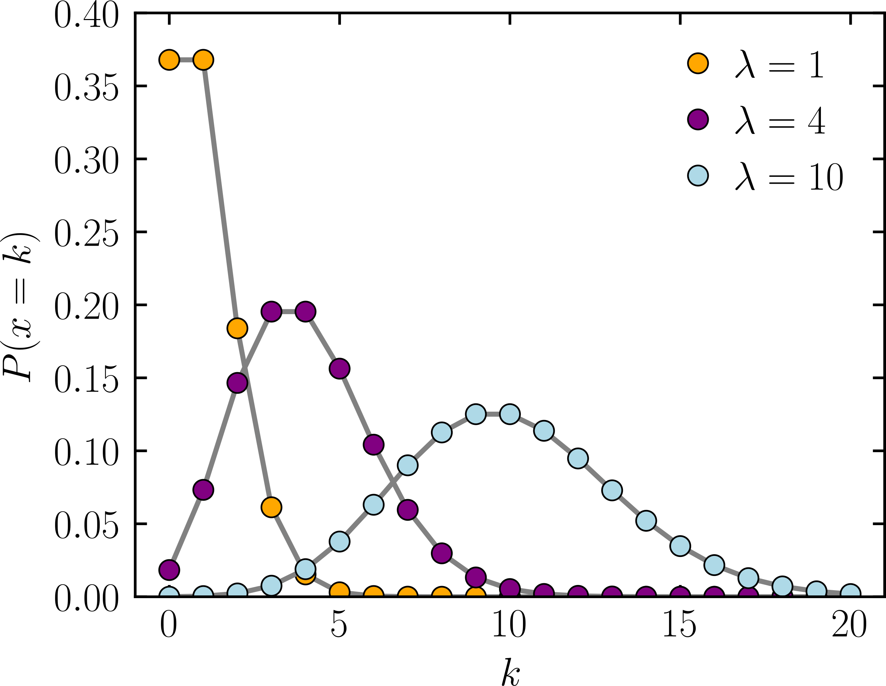
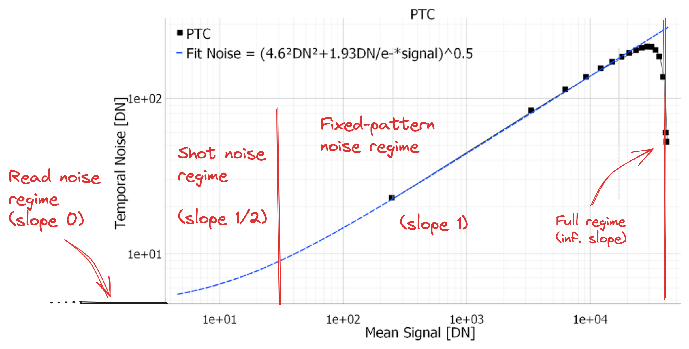

# Charge-Coupled Devices (CCDs)

The CCD process:

1. Light hits some detector array, triggering a tiny detector (typically 10-15$\mu\text{m}$ in size)
2. Detector translates energy of the incident photon to some digital value
3. Software confirms the receipt and reconstructs an array from the values. 

> High quantum efficiency (electrons per incident photon), and also generally linear (though not as we approach blue, where QE falls off sharply - though total quantum yield (number of electrons extracted per incident photon) increases). 

*Additional Reference*: see the [Hubble Space Telescope docs](https://hst-docs.stsci.edu/wfc3ihb/chapter-5-wfc3-detector-characteristics-and-performance/5-4-wfc3-ccd-characteristics-and-performance).

## CCDs vs CMOS

> **Note**: each element of a camera array is a CCD or a CMOS chip.

- CCDs do the photon-to-electron conversion at the CCD chip - then the entire array is converted at some analogue-digital (A/D) converter at the end.
- CMOS chips (such as in phones) both detect electrons and have built-in A/D converters on every CMOS array element - so each CMOS chip is able to report its current receipt value. 

The problem is CMOS chips *heat up* quickly, which causes thermal noise on the image. CCDs also generate heat in the A/D chip, but to a much smaller extent which we can correct for a bit using a cooling device. 

# CCD Noise

**Random noise** from:

- *Read noise* (incl. A/D 'digitization' noise)
- *Poisson noise* - originates from the [quantization of electric charges](https://en.wikipedia.org/wiki/Shot_noise). 

> $k$ is the number of photons detected, $P(x=k)$ is ... what?

**Systematic noise** from:
- *Bias level* - like ISO. Applied before the A/D converter to ensure the read noise is interpretable. Since the received photons will usually follow a Poisson distribution and look like a Gaussian curve, we "shift it" to avoid below-zero counts - corrected for with *bias frames*. 
- *Dark current* - originates from the [camera's electrical construction](https://en.wikipedia.org/wiki/Dark_current_(physics)) itself, from the random generation of electrons and holes within the depletion region of the camera itself - corrected for with *dark frames*.
- *Multiplicative noise* - non-uniform illumination, other sources, hot pixels, etc (often called "fixed pattern noise") - removed by using *flat frames*.

## Characterization

We can characterize the noise and linearity of detectors using Photon-Transfer-Curves (PTCs):

