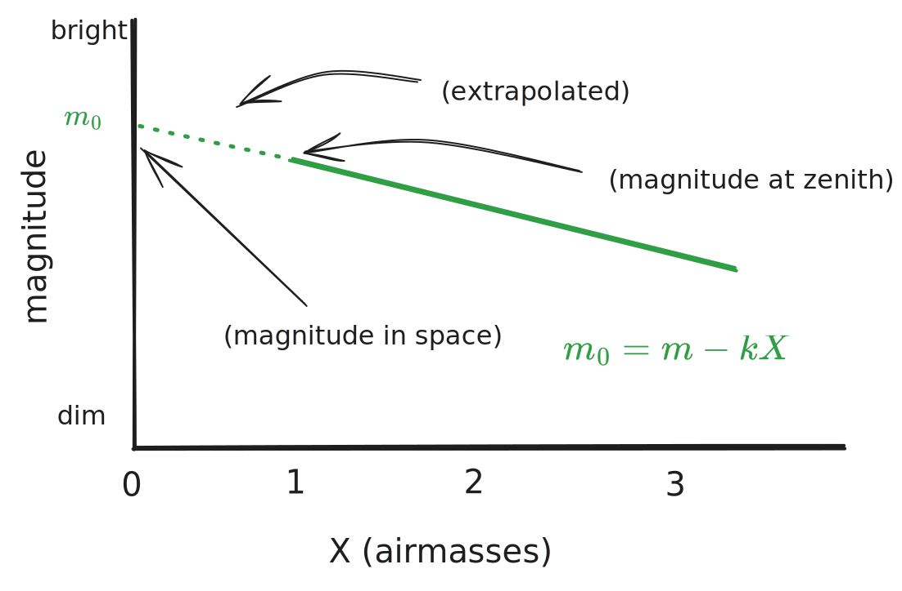
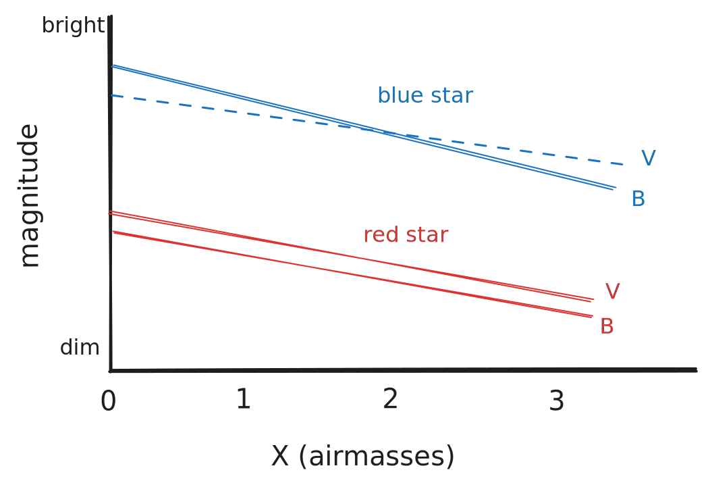

# Extinction

This is how we quantify how a star's magnitude changes with the airmass between the observer and the observed star. 

> Unfortunately, extinction varies with wavelength, since the sky absorbs some wavelengths more intensely than others ... so we'll see different values of $k$ for each filter used. 

To correct for this, let $k=k'+k''C$, where $C$ is a color (i.e. $B-V$) - then,
$$m_0 = m-k'X-k''CX$$
2nd-order $k''$ extinction is normally quite small (~0.04 magnitudes), but still important to include for high-precision photometry & blue stars. It can be determined with a close pair of different-color stars by fitting the slope of $\Delta m$ vs $X\Delta C$ (since $\Delta C$ is a constant change-in-color for the two) - we end up with
$$V = v_0+\mu_v(b_0-v_0)+C_V$$
$$B=b_0+\mu_b(b_0-v_0)+C_B$$
## Image Reduction Pipeline

> Use several Jupyter notebooks, rather than a single "The Master Notebook" - it can get long and big and slow. 

1. Take calibration frames (biases, flats (dome and/or sky) and darks, if necessary)
2. Observe targets (science, standard stars and airmass-constraint stars (extinction stars))
3. Remove  instrumental signature from observations using calibration frames.
4. Measure stellar fluxes (i.e. with aperture photometry or PSF photometry)
5. Solve for extinction coefficients / the space magnitude