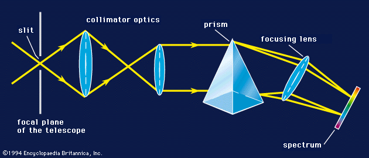

# Spectrographs

Spectrographs:
1. Take light from a source (into the telescope)
2. Pass it through a slit
3. Collimate it (force all beams to pass in a single direction)
4. Push it through a dispersing element (like a prism to separate it)
5. Pass it through a camera (to reform it)
6. Send to the observer

> Diffraction gratings are often used as the dispersing element (in place of a prism) because prisms can get really expensive. 

Sometimes, folks will sandwich prisms, gratings and another prism, to form a GRISM - this is the case at [APO's KOSMOS](https://www.apo.nmsu.edu/arc35m/Instruments/KOSMOS/userguide.html). 

## Taking spectra

We don't need great seeing for spectra - so they can be useful to take on nights with low seeing. However, spectra require long exposure times for reasonable S/N ratio in every pixel. 

Guiding can be done by a "slit view" camera (i.e. spectrograph in center, normal otherwise) or via an off-axis guider (like at MRO). 

## Resolving power

For spectra, resolution is defined as 

$$ R \equiv \frac{\lambda}{\Delta \lambda} $$
which can be $\geq 40,000$ for high-resolution spectra. $R$ is generally limited by slit-width. 

Resolution can also be related to Doppler shift via

$$
R\equiv \frac{\lambda}{\Delta \lambda} \approx \frac{c}{v}
$$

## Wavelength calibration

1. Find a lamp spectrum (i.e. using a dome light)
2. Extract an ID spectrum using the same aperture and trace
3. Using known lines and their pixel values, determine a *dispersion solution*
4. Apply it to the 1-D spectrum