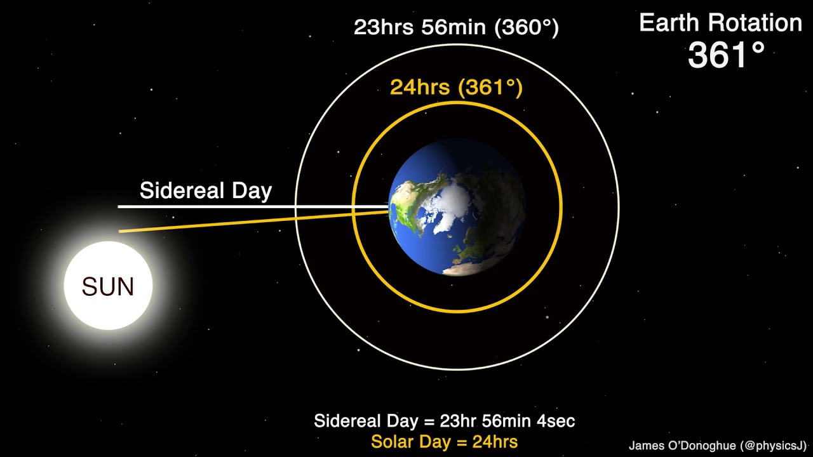

# Time

**Definitions**:
- **Solar time**: noon is defined as when the sun crossed the meridian.
- **Mean solar time**: allows each day to have the same length.
	- In 1884, London decreed the Mean Solar Time would become Greenwich Mean Time (GMT) ... which then became UTC.
	- ... which was then modified to become *independent* from GMT, now known as *UT*, as the time when stars cross the meridian (transit). 
		- UT Has versions - UT1 is most popular, UT0 or UT2 are also used (rarely).
		- Standard stars used to determine UT.
- **Transit telescope**: slews along the meridian (north / south) to tell when a star moves across - does *not* slew east-west. 
- **Julian date**: count of days since noon on January 1, 4713 BC. 
	- Created in 1582 by Joseph Scaliger to help make history line up. 
	- Synchronized with UT (i.e. J2000 is Julian 2000 w.r.t UT)
	- *M*JD is *Modified* Julian Date - first 2,400,000.5 days subtracted to make the number shorter.
		- i.e. measured since 1857 CE rather than 4713 BCE. 

## Days:

**Sidereal** (or stellar days) are measured with respect to the stars. **Solar** days are measured with respect to the sun - slightly longer because the Earth moves approximately 1 degree around it's orbit. 

## LST and Hour Angle

**Local Sidereal Time** (LST) and Hour Angle are the way we navigate using equatorial coordinates. 