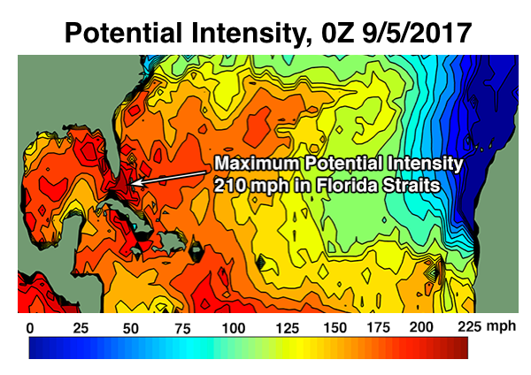
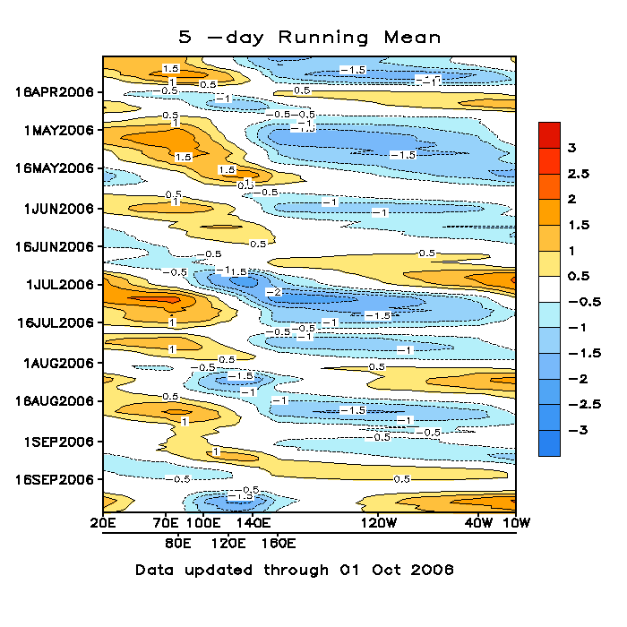

# Background Information

> Regarding a wide variety of concepts that may (or may not) act as precursors to the Helene hurricane.

---

Regarding the Coriolis effect, 

> "Schematic representation of flow around a low-pressure area (in this case, [Hurricane Isabel](https://en.wikipedia.org/wiki/Hurricane_Isabel "Hurricane Isabel")) in the Northern hemisphere. The pressure gradient force is represented by blue arrows, the Coriolis acceleration (always perpendicular to the velocity) by red arrows", by Titoxd on Wikipedia.

"A minimum distance of 500 km (310 mi) from the [equator](https://en.wikipedia.org/wiki/Equator "Equator") (about 4.5 degrees from the equator) is normally needed for tropical cyclogenesis. The [Coriolis force](https://en.wikipedia.org/wiki/Coriolis_force "Coriolis force") imparts rotation on the flow and arises as winds begin to flow in toward the lower pressure created by the pre-existing disturbance."

# Maximum Potential Intensity 

[Kerry Emanuel](https://emanuel.mit.edu/limits-hurricane-intensity/) created an equation governing hurricane intensities ([detailed here](https://wind.mit.edu/~emanuel/pcmin/pclat/pclat.html)), with an example mapping hurricane intensity here:

# Madden-Julian Oscillation

Large regions but vaguely defined, probably on a regional basis. Below map is of **terrestrial radiation** or "outgoing longform radiation". Upper-left to lower right is west to east. 

