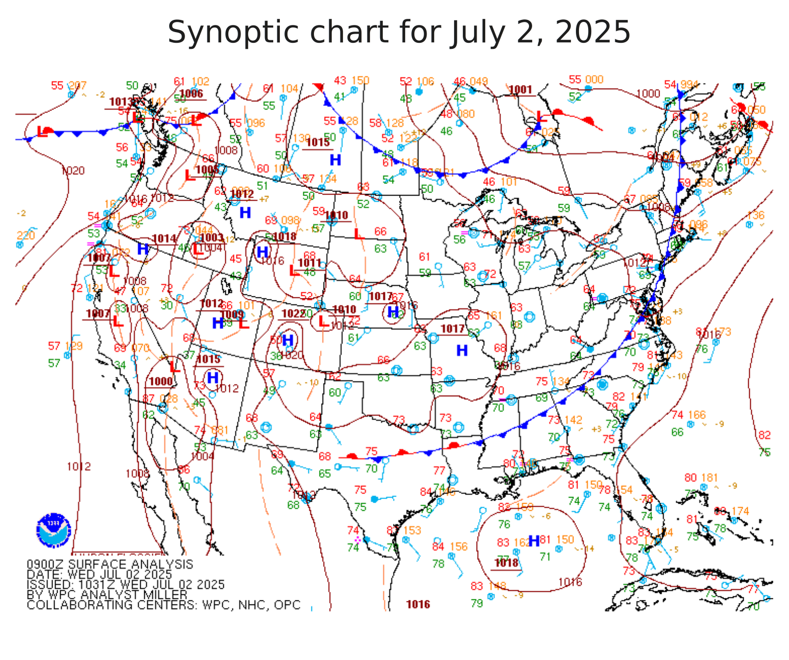
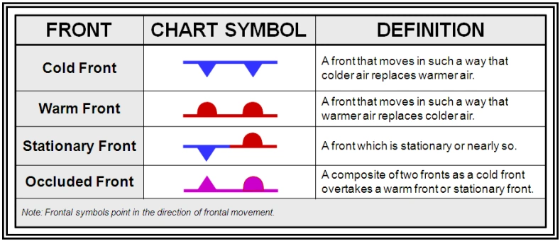
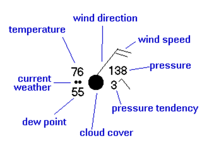

# Lesson 1 -  Fronts, Highs, Lows

Highs and lows refer to relative pressure gradients, often showed on contour maps called **synoptic charts**:

These tend to take place on the surface, as opposed to higher in the atmosphere. Historically, these were first delivered by horse, then later by telegraph - now by internet. 

> The light blue barbs indicate the direction wind is coming *from* - barb tail length indicates speed.
> 
> The solid red contours indicate regions of constant surface sea level pressure.

In the northern hemisphere, air flows:
- Clockwise (anti-cyclonic) around a high
- Counterclockwise (cyclonic) around a low

Highs are generally associated with calm weather, lows with clouds and stormy weather.

**Weather fronts**, introduced during WWII indicate regions of active change in pressure.

Fronts tend to be in low-pressure troughs. 

# Time

Meteorologists (like astronomers) use UTC (also known as GMT or Z) as a baseline time zone. 
$$\text{UTC} = \text{PST}+8\;\text{hr}$$
or $+7\;\text{hr}$ if in PDT. 

> In the United States, daylight savings time starts the **second Sunday of March** and lasts to the **first Sunday in November**, and transitions at local midnight. 

# Weather station models

Weather station models will generally take the form of this chart:

Generally, these models won't be independent entities or charts, but might be seen in surface plots (or synoptic charts) such as shown [at the start of this page](#Lesson%201%20-%20Fronts,%20Highs,%20Lows). 