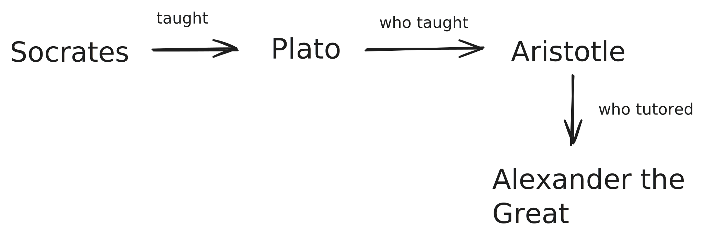

# Lecture 2

## Plato (c. 428-348 BC)

- Student of Socrates, whom he made a character in philosophical dialogues.

> Patterson claimed Rome did not produce any original philosophers of the calibre of Socrates or Plato - is this truly the case?

- Plato was anti-materialistic, anti-mechanistic, anti-normalist, anti-relativist (was an absolutist). 
- Prior to Plato was the Sophists - teaching how to conduct eloquent speech with little content.
- Anti-skeptic. 

### Theory of Ideas / Forms

- Postulated two worlds: visible (changing, mutable) and intelligible (eternally unchanging). 
	- Intelligible is unreachable physically, but we interact with it with ideas of things (i.e. intelligible is the concept).
	- Visible is the *form*, which is the instanced versions of the intelligible. 

I.e. Plato's cave: 
- Shadows on the wall are the Visible World. 
- The cave outside the cave = the Ideas (true reality).
- Persons within the cave = non-philosophers. 

### Plato and Freedom

- Plato grapples philosophically with freedom
- In 375 BC, wrote *Republic*
	- Attempts to define the idea & form of justice, leading to other high-level stuff and things and thusly attempts to reach some 'ideal state in which justice is promoted' sort of like an absolute vacuum for photons to scoot through.
- Plato proposes three classes: drones, guardians, governing class (philosopher king). 

Plato's five regimes:
- **Aristocracy** (rule by the best): ruled by philosopher-kings who display wisdom and seek the common good.
- **Timocracy** (rule by honor): rulers are ambitious and honor-focused, pursuing glory rather than wisdom.
- **Oligarchy** (rule by the few): wealthy few rule, valuing money over virtue.
- **Democracy** (rule by the people): all desires given equal weight.
- **Tyranny** (rule by a tyrant): single ruler seizes power and presents own desires as overriding to all others.

> This is a subsequence, like a decaying element - aristocracy inevitably decays into a timocracy, which decays into an oligarchy, then democracy, then into tyranny. 

> Worrisome, in the right now. 

Plato worries democracy would inevitably lead to every individual trying to get more than their fair share - until one single individual with 'sovereignal freedom' uses the democracy's institutions against its citizens. 

- Thought aristocracy was the best government, but internal flaws (improper education of the youth) would inevitably lead to deterioration into a timocracy (honor over reason). 
- Plato cites two fundamental key issues with different government:
	- Money (and unstable accumulations of it, like trash heaps) (lead to individuals respecting money more than virtue)
	- Factionalism
- Proposed human soul has three main parts: *reason*, *spiritedness*, *appetites*.
	- Aristocracy keeps all three in harmony
	- Timocracy emphasizes spiritedness
	- Oligarchy appetites
	- Democracy is a chaotic free-for-all where all three desires are given free reign
	- Tyranny - individual is slave to appetites, own reason, own spiritedness, otherwise unmoored from regulatory counsel. 

> **Q**: Do you, Dr. Bringman, have any opinions on this? Recent events, Red Rising & your class have me considering the virtues of other political systems. 
>
> Frustration with difference between eloquent appetites/spirit and perhaps ineloquent reasoning, and it's 
>
> Tyranny vs aristocracy requires (most) participants believe in the same fundamental concept of absolute good? Platonic society. 

Computer thing?