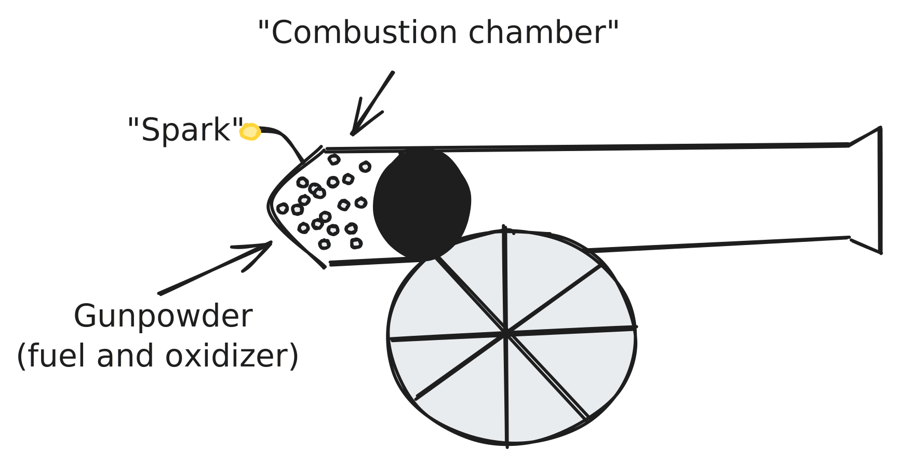

# Internal Combustion Engines

> Notes and links regarding the history and design of internal combustion engines (such as diesel and gasoline engines).

**Resources**:
- [Wikipedia: Internal Combustion Engine](https://en.wikipedia.org/wiki/Internal_combustion_engine)
- [Wikipedia: Diesel engine](https://en.wikipedia.org/wiki/Diesel_engine)
- [Wikipedia: Petrol engine](https://en.wikipedia.org/wiki/Petrol_engine)
- [Wikipedia: Engine efficiency](https://en.wikipedia.org/wiki/Engine_efficiency)

**Questions**:
- Air-alone combustion engine?
- History?
- Energy requirements of gasoline and diesel (and ethanol and natural gas)
- Ideal gas law, assuming the same combustion chamber size
- How much energy per cycle? Exhaust per cycle? 
- Chemical reaction of diesel and normal gas

---

# Fundamentals

There are two main types of engines:
- Internal combustion engines (i.e. gasoline, diesel, turbine)
- External combustion engines (steam piston, steam turbine, Stirling engine)
	- Uses some working fluid, incl. air, steam or pressurized water. 

Every engine has something called an 'efficiency' associated with it. The thermodynamic definition of it is:

$$\eta = \frac{\text{energy delivered}}{\text{heat absorbed}} = \frac{Q_1-Q_2}{Q_1}$$

> $Q_1$ is the heat absorbed by the process, and $\Delta Q=Q_1-Q_2$ is the work done on the driveshaft (useable energy delivered). 100% efficiency would use all heat, which is the result of the combustion reaction.

In a practical sense, efficiency details how much energy is lost to mechanical processes, such as thermal expansion and friction.

On a fundamental level: internal combustion engines are **heat engines** which use the energy released in a combustion reaction (some fuel, like coal gas, with some oxidizer like air) to do work on mechanical components (like pistons), such that:

1. Fuel and air enter a combustion chamber,
2. are (usually) then compressed by some piston,
3. which increases the pressure and temperature of the mixture,
4. which is then ignited (either via pressure alone or by a spark),
5. causing a combustion reaction, which releases heat, light and exhaust,
6. driving the piston back up,
7. which converts thermal into kinetic energy, 

... which then can be used to drive some external mechanical device, like a vehicle crankshaft or drive system. 

Further, there are two primary types of combustion ignition in both ICE and ECE:

- Intermittent combustion, where combustion might happen once every few "strokes" (two, four, six stroke engines).
- Continuous combustion (like rockets, jet engines and turbine engines). 

# Brief bit of history

The first "recognizable" form of an internal combustion engine emerged as early as the 12th century in China in a very different form: the cannon. 

> Gunpowder is a mixture of charcoal $C$ (15%), sulfur $S$ (10%) and saltpeter (potassium nitrate), $KNO_3$ (75%). The former two form the fuel, while the latter is the oxidizer[^1].
> $$10KNO_3 + 8C+3S \rightarrow 2K_2CO_3+3K_2SO_4+6CO_2+5N_2$$

When a spark is put to the mixture, the oxygen contained within the potassium nitrate reacts with the sulfur and charcoal in the reaction described above. As the reaction exhaust gasses are created, they put mechanical force on the cannonball, converting the chemical potential energy to kinetic energy on the cannonball.

It was inefficient though - under completely ideal circumstances, we might expect an efficiency around ~30%[^2] (i.e. 30% of the chemical potential energy is converted to kinetic energy of the projectile), with real-world scenarios demonstrating significantly lower efficiency (15-25%).

> The remaining energy might go into heating the exhaust gasses (~35%), the heat of the combustion chamber (~30%), friction of the ball leaving the cannon (basically heating the chamber as well, ~2%) or as still unburned propellant (if the mixture was not completely proportional). 

Cannons are, however, relatively single-use compared to reciprocating engines. Once the ball left the chamber, the "combustion chamber" ceases to exist until a new ball is loaded.

## Gas engines

Various patents existed for liquid and gas engines starting in the late 18th century, including the Barber gas turbine (1791), the Street liquid gas engine (1794), and the Niépce brothers' internal combustion engine (1807), which ran on a dust mixture and powered a boat (granted a patent by Napoleon). 

In 1860, Étienne Lenoir (a Belgian engineer) invented (and actually made) the Lenoir engine, which used both coal gas and air. It was not the first ever to be made (De Rivaz designed, in 1808, "the world's first internal combustion powered automobile"), but it was the first to be both produced in quantity, and be able to be used in practical scenarios (test drive from Paris to Joinville-le-Point, 18 km in 3 hours, so about 6 km/h). 

(image of it here)

The engine was, however, quite inefficient (~1.2-5.4 m$^3$/kWh), loud, and overheated easily. 

## Continued gas engine development

The Lenoir engine provided the framework by which most internal combustion engines would continue to emerge through the 19th and 20th centuries, including:

- 1864, Nicolas Otto invented the first atmospheric gas engine. 
- 1872, George Brayton created the first commercial liquid ICE. 
- 1876, Otto worked with Gottlieb Daimler and Wilhelm Maybach to create a compressed-charge four-stroke engine.
- 1879, Karl Benz created a reliable two-stroke engine, and began production on commercial vehicles using it and a later four-stroke engine (most 3-wheel). 
- 1892, Rudolf Diesel developed the first compressed-charge, compression ignition engine. 

# Engine types

There are two primary types of engine: **intermittent**, and **continuous**. Subdividing each:

## Intermittent

Modern intermittent engines include primarily **reciprocating** engines and **rotary** engines. 

**Reciprocating engines**:
- Two-stroke: one cycle per crankshaft rotation. 
- Four-stroke: four separate steps, occurring in two cycles. s

## Sources

[^1]: https://www.usni.org/magazines/proceedings/1879/december/chemical-theory-combustion-gunpowder

[^2]: https://en.wikipedia.org/wiki/Physics_of_firearms
