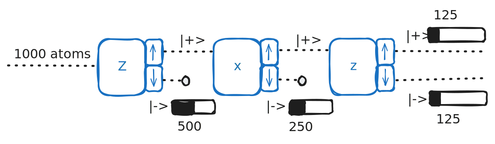

# Chapter 1 - Stern-Gerlach Experiments

> Reference *Quantum Mechanics: A Paradigms Approach* by David McIntyre.

---

First conceptualized in 1922 by Otto Stern and later performed by Walther Gerlach, the SG experiment involved sending a beam of silver atoms through a nonuniform magnetic field and observing their distribution.

**Classically**, the distribution ought to look like the input beam - since silver atoms are electrically neutral, the nonuniform magnetic field *shouldn't* affect them, and they should just pass through.

**Experimentally**, we see the silver beam *split* at the magnetic field into roughly equal-sized groups, indicating not only that the magnetic field interacts with the silver atoms, but that each electrically-neutral silver atom must have some additional property that interacts with a $B$-field (i.e. that the $B$-field puts some force on the silver atoms based on some binary property).

We know $F_z = \frac{\delta}{\delta z}(\vec{\mu} \cdot \vec{B}) = \mu_z \frac{\delta B_z}{\delta z}$ (ref: [Wikipedia entry on magnetic fields](https://en.wikipedia.org/wiki/Magnetic_field)), where $\vec{\mu}$ is the magnetic moment and $\vec{B}$ is the magnetic field strength. Classically, $F_z$ should be zero for a neutral atom (all atoms hit the center) - however, we see that there *must* be forces on the atom since our atoms diverge from the beam at the $B$-field. Further, we have an "upper" and "lower" group with equal distances - so $|+F_z| \approx |-F_z|$. With $\frac{\delta B_z}{\delta z}$ known to be constant, then by the results of the experiment we must have two values for $\mu_z$: $+\mu_z$ and $-\mu_z$ (the magnetic moment values are *quantized*). 

## Enter: Electron Spin

If we imagine (classically) an electron as a charge moving around a loop of current, 

then $\mu=IA$. Here, $A=\pi r^2$ and $I=\frac{q}{2\pi r/v}$, so
$$
\mu = IA = \frac{qrv}{2}
$$
Thus, (classically), we can imagine each charge as having some "orbital angular momentum" $L$ (like planets around a star). Angular momentum is $L=mrv$, so we can rewrite this as
$$
\mu = \frac{q}{2m}L
$$
Experimentally, we observe that, while normal orbital angular momentum of charged particles still "exists", it's not the whole picture - we also need "spin", where we can write $\mu$ as
$$
\vec{\mu} = g\frac{q}{2m}\vec{S}
$$
where $g$ is a dimensionless "gyroscopic ratio" (**note**: different from planet spin since electron is almost a 1d point). For an electron in the $z$ direction, 
$$
\mu_z = -g\frac{e}{2m_e}S_z\;,\qquad F_z= -g\frac{e}{2m_e}S_z\frac{dB_z}{dz}
$$
and, to achieve the results we observe in the experiment, we can have only two values of $S_z$:
$$
S_z=\pm \frac{\hbar}{2}
$$
where $\hbar$ is a modified Planck's constant $\hbar=h/2\pi=1.0546\times10^{-34}\;\text{J*s}$. This binary value represents a spin-1/2 system, though these aren't the only two possible values.

## Quantum States

> **Postulate 1**: the state of a quantum mechanical system includes *all* information we can know about it. Mathematically, we represent this state by a "ket", $\ket{\psi}$.

In the spin-1/2 system,

$$
\ket{\psi} = a\ket{+}+b\ket{-}
$$
where $\ket{+}$ is the quantum state of the atoms that are spin-up $S_z=+\hbar/2$, and $\ket{-}$ is the quantum state of the spin-down atoms $S_z=-\hbar/2$. 

Stern-Gerlach ran a few experiments using this basic setup to get a better understanding of the quantum nature of spin, and explore this divergence from what is classically expected.

1. **Experiment 1**: Analyzing spin in $z$ twice in a row. Spin values were conserved between measurements - if we only take $\ket{+}_z$ atoms and measure again, we only see $\ket{+}_z$ atoms.
 $$\mathcal{P}_+=|\braket{+|+}|^2=1$$
$$\mathcal{P}_-=|\braket{-|-}|^2=0$$

2. **Experiment 2**: Analyze spin in $z$, then in $x$ - $\ket{\psi}_x$ was found to be totally independent whether we used $\ket{+}_z$ or $\ket{-}_z$. 

$$\ket{+}_x=\frac{1}{\sqrt{2}}\left[\ket{+}+\ket{-}\right]\qquad \mathcal{P}_{+,x}=\frac{1}{2}$$
$$\ket{-}_x=\frac{1}{\sqrt{2}}\left[\ket{+}-\ket{-}\right]\qquad \mathcal{P}_{-,x}=\frac{1}{2}$$
Complicated, though - this is a **mixed state**, rather than the superposition of experiment 1. We'll investigate options to make it nicer later.

3. **Experiment 3**: Analyze spin in $z$, then $x$, then $z$. We expected to see the $z$ spin values conserved - but don't! Instead, by measuring $x$, we find we "reset" the spin of $z$.

4. **Experiment 4**: Analyze spin in $z$, then $x$, then $z$ - however, instead of measuring $x$, just send both outputs into the next $z$. Somehow, by not "measuring" $x$, we **don't** reset the $z$ spin measurement. 

## Bra-ket notation

> Used to represent **quantum state** vectors, which lie in the **Hilbert vector space**. The dimension of the Hilbert space is determined by the current system - in our above example, we have only two possible results, so $\ket{\psi}=a\ket{+}+b\ket{-}$ represents a complete basis with dimensionality 2.

**Note**: $a$ and $b$ are complex scalar multiples. 
$$\braket{\text{bra}|\text{ket}}$$
Some properties of the bra-ket notation (Dirac's first and only pun):
1. Each ket has a corresponding bra, such that for some state $\psi$, 
$$\bra{\psi}=a^*\bra{+}+b^*\bra{-}\qquad \ket{\psi}=a\ket{+}+b\ket{-}$$
2. Multiplying a bra with a ket represents an **inner (dot) product**.
$$\braket{+|+}=1\qquad \braket{\psi|\psi}=1$$
$$\braket{+|-}=0\qquad \braket{-|+}=0$$
$$\bra{+}a\ket{+}=a\braket{+|+}$$
>This means we can multiply $\bra{+}$ with $\ket{\psi}$ to get each constant (i.e. $a$ here), such that
>$$\braket{+|\psi}=\bra{+}(a\ket{+}+b\ket{-})$$
>$$= \bra{+}a\ket{+}+\bra{+}b\ket{-}$$
> $$= a\braket{+|+}+b\braket{+|-}$$
> $$=a$$

Likewise, $\braket{\psi|+}=a^*$ and $\braket{+|\psi} = \braket{\psi|+}^*$. 

3. All quantum state vectors must be **normalized**, such that
$$\braket{\psi|\psi}=|\braket{+|\psi}|^2+|\braket{-|\psi}|^2=|a|^2+|b|^2=1$$
> If we wanted to normalize some vector $\ket{\psi}=1\ket{+}+2i\ket{-}$, apply some normalization constant $C$, such that 
> $$\ket{\psi}=C[1\ket{+}+2i\ket{-}]$$
> and solve for $\braket{\psi|\psi}=1$.
> 
> **Note**: $C$ will be an absval by the end here - but we don't care about it's phase (not physically meaningful), so just make it real and positive. 

4. The complex constants $a$ and $b$ when squared (i.e. $|a|^2=|\braket{+|\psi}|^2$ ) represent *probabilities* for a given measurement (probability for $+S_z$ or $-S_z$ above). The **normalization** property implies the probabilities must sum up to 1 - helping prove postulate 1. 

### Matrix form

We can also represent states in matrix form, where
$$\ket{+} \equiv \begin{pmatrix}1 \\ 0\end{pmatrix} \qquad \ket{-} \equiv \begin{pmatrix}1 \\ 0\end{pmatrix}$$
and
$$\ket{\psi}=\begin{pmatrix}
\braket{+|\psi}\\
\braket{-|\psi}
\end{pmatrix} = \begin{pmatrix}
a\\
b
\end{pmatrix}$$
with the corresponding bra represented by the **row** vector
$$\bra{\psi}=\begin{pmatrix}
a^* & b^*
\end{pmatrix}$$
so

$$\braket{\psi|\psi} = \begin{pmatrix} a^* & b^* \end{pmatrix} \begin{pmatrix} a \\ b \end{pmatrix} = |a|^2+|b|^2$$
## General quantum systems

For some **general** quantum system, where we might not only have 2 results (i.e. not only spin-1/2), such as

then, generally speaking,

$$\braket{a_i|a_j}=\delta_{ij}$$
$$\ket{\psi}=\sum_i \braket{a_i|\psi}\ket{a_i}$$
> **Note**: $\braket{a_i|\psi}$ represents each corresponding complex scalar multiple, and $\delta_{ij}$ is the **Kronecker delta**, which is 1 if $i=j$ and 0 if $i\neq j$. 