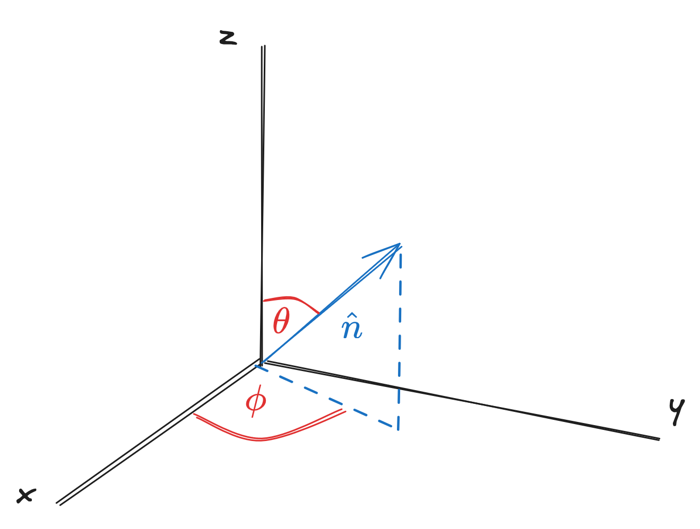
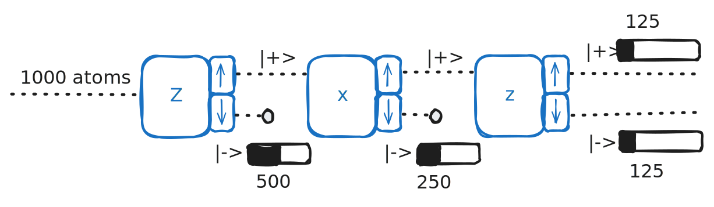
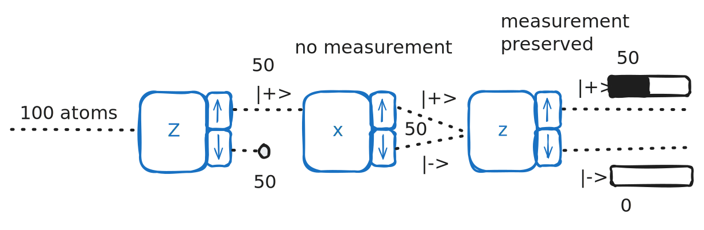

# Chapter 2 - Operators & Measurement

> Reference *Quantum Mechanics: A Paradigms Approach* by David McIntyre.

---

**Operators** are mathematical objects that operate on kets to turn them into new kets; $S_z$ is one such example. 
$$
A\ket{\psi} = \ket{\phi}
$$
If a ket is *not* changed by the application of some operator, then the ket is known as an **eigenvector** and the associated constants are **eigenvalues**. 
$$
A\ket{\psi} = a\ket{\psi}
$$
Above, $\ket{\psi}$ is the eigenvector and $a$ is an eigenvalue. Both eigenvectors and eigenvalues are properties of the operator $A$ - if it changes, so does the eigenstuff. For the operator $S_z$, the eigenvectors / values are:
$$
S_z\ket{+} = +\frac{\hbar}{2}\ket{+}\qquad S_z\ket{-} = -\frac{\hbar}{2}\ket{-}
$$
> **Postulate 3**: The only possible result of a measurement of an observable (like $S_z$) is one of the eigenvalues $a_n$ of the corresponding operator $A$.

This postulate implies that, if we have the eigenvectors and values of $A$, we can actually reconstruct $A$ from them.

Let $S_z \equiv \begin{pmatrix} a & b \\ c & d \end{pmatrix}$.
$$
S_z\ket{+} = +\frac{\hbar}{2}\ket{+}\qquad \begin{pmatrix} a & b \\ c & d \end{pmatrix}\begin{pmatrix}1\\0\end{pmatrix} = +\frac{\hbar}{2}\begin{pmatrix}1\\0\end{pmatrix}
$$
$$
S_z\ket{-} = -\frac{\hbar}{2}\ket{-}\qquad \begin{pmatrix} a & b \\ c & d \end{pmatrix}\begin{pmatrix}0\\1\end{pmatrix} = -\frac{\hbar}{2}\begin{pmatrix}0\\1\end{pmatrix}
$$
Which leads us to
$$
\begin{pmatrix}
a\\ c
\end{pmatrix} = +\frac{\hbar}{2}\begin{pmatrix}1\\0\end{pmatrix}\qquad \begin{pmatrix}
b\\ d
\end{pmatrix} = -\frac{\hbar}{2}\begin{pmatrix}0\\1\end{pmatrix}
$$
Now, plugging these solved values in,
$$
S_z \equiv \begin{pmatrix}
\hbar/2 & 0\\
0 & -\hbar/2
\end{pmatrix} = \frac{\hbar}{2}\begin{pmatrix}
1 & 0\\
0 & -1
\end{pmatrix}
$$
1. Operators are **diagonal** in their own basis (i.e. they only have elements along the main diagonal). 
2. The elements along the diagonal are the **eigenvalues** of the operator. 
	- The eigenvectors themselves are not included in the operator matrix.

> **Note**: an *observable* is some physical quantity that can be measured - such as spin. In that context, the operator $S_z$ represents that observable. 

> $$
S_z = \frac{\hbar}{2}\begin{pmatrix} 1 & 0\\0 & -1 \end{pmatrix}\qquad \ket{+}_z = \begin{pmatrix} 1\\0 \end{pmatrix}\qquad \ket{-}_z = \begin{pmatrix} 0\\1 \end{pmatrix}
> $$
> $$
S_x = \frac{\hbar}{2}\begin{pmatrix} 0 & 1\\1 & 0 \end{pmatrix}\qquad \ket{+}_x = \frac{1}{\sqrt{2}}\begin{pmatrix} 1\\1 \end{pmatrix}\qquad \ket{-}_x = \frac{1}{\sqrt{2}}\begin{pmatrix} 1\\-1 \end{pmatrix}
> $$
> $$
S_y = \frac{\hbar}{2}\begin{pmatrix} 0 & -i\\i & 0 \end{pmatrix}\qquad \ket{+}_y = \frac{1}{\sqrt{2}}\begin{pmatrix} 1\\i \end{pmatrix}\qquad \ket{-}_y = \frac{1}{\sqrt{2}}\begin{pmatrix} 1\\-i \end{pmatrix}
> $$

## Other representations of matrix elements

We can also represent an operator matrix $A$ in terms of its elements. Let the operator $A$ describe some two-dimensional spin-1/2 system (like $S_z$ does).

$$
A \equiv \begin{pmatrix}
a & b\\
c & d
\end{pmatrix} = \begin{pmatrix}
\braket{+|A|+} & \braket{+|A|-} \\
\braket{-|A|+} & \braket{-|A|-}
\end{pmatrix}
$$
Where
$$
\braket{+|A|+} = \begin{pmatrix}1 & 0\end{pmatrix}\begin{pmatrix}
a & b\\
c & d
\end{pmatrix}\begin{pmatrix}1 \\ 0\end{pmatrix} = a
$$

## Finding eigenvectors / values from an observable

If we know the operator $A$, and need to find the possible results of a measurement of the corresponding observable, we can start from the general eigenvalue equation and work from there.

$$
A\ket{\lambda} = \lambda\ket{\lambda}
$$
where $\lambda$ is the eigenvalue and $\ket{\lambda}$ is the corresponding eigenvector. Eigenvalues can be found then by solving the *secular equation*,
$$
\det|A - \lambda I| = 0
$$
**Note**: for a $2\times2$ operator (i.e. a spin-1/2 system), this is $ad-bc=0$.

After finding the eigenvalues, we now know $A$ and $\lambda$ - all that remains is to find $\ket{\lambda}$ by solving for it in $A\ket{\lambda} = \lambda\ket{\lambda}$. 

> The process of finding the eigenvectors and eigenvalues of a matrix is known as **diagonalization**. 

## Hermitian operators

To find the associated *bra* operator to some operator acting on a *ket*, we use the $^\dagger$ operator

$$
\bra{\phi} = \bra{\psi}A^\dagger\qquad \text{for} \qquad \ket{\phi}=A\ket{\psi}
$$
where $A^\dagger$ is the **Hermitian adjoint** of $A$, found by transposing and taking the complex conjugate of $A$. 
$$
A^\dagger = A_T^*
$$
If $A=A^\dagger$, then $A$ is said to be **Hermitian**, and $\bra{\phi} = \bra{\psi}A$ for $\ket{\phi}=A\ket{\psi}$.

> This is not normally the case - if $A$ is *not* Hermitian, the corresponding *bra*-state operator will be different from $A$ - i.e. $\bra{\epsilon}=\bra{\psi}A$ will not be the bra $\bra{\phi}$ corresponding to $\ket{\phi}$. 

Hermitian operators have some properties to be aware of:
1. They will always have **real** eigenvalues which ensures the results from a measurement are always real. 
2. The eigenvectors of a Hermitian operator form a complete set of basis states, ensuring we can use the eigenvectors of any observable as a valid basis. 

# New operators

Let's say we wanted to find the spin component in some general direction $\hat{n}$. 

where $\hat{n}=\sin\theta\cos\phi\hat{i}+\sin\theta\sin\phi\hat{j}+\cos\theta\hat{k}$. Projecting the spin vector onto $\hat{n}$ such that
$$
\vec{S}\cdot\hat{n} = S_x \sin\theta\cos\phi+S_y\sin\theta\sin\phi+S_z\cos\theta
$$
then
$$
S_{\hat{n}} = \frac{\hbar}{2} \begin{pmatrix}\cos\theta & \sin\theta e^{-i\phi}\\\sin\theta e^{i\phi} & -\cos\theta\end{pmatrix}
$$
and diagonalizing the vector above, we find the eigenvectors for $S_{\hat{n}}=\pm \frac{\hbar}{2}$ to be
$$
\ket{+}_{\hat{n}} = \cos\frac{\theta}{2}\ket{+}+\sin\frac{\theta}{2} e^{i\phi}\ket{-}
$$
$$
\ket{-}_{\hat{n}} = \sin\frac{\theta}{2}\ket{+}-\cos\frac{\theta}{2} e^{i\phi}\ket{-}
$$
with the state vector
$$
\ket{\psi} = |a|\ket{+}_{\hat{n}}+\sqrt{1-|a|^2}e^{i\phi} \ket{-}_{\hat{n}}
$$
> **Note**: the coefficient calculation attached to $\ket{-}_{\hat{n}}$ is from total probability being equal to 1. 

## Outer product

Instead of taking the inner product between two state vectors, we can also find the **outer product** ($\ket{+}\bra{+}$). For example, we can rewrite
$$
\ket{\psi} = \braket{+|\psi}\ket{+}+\braket{-|\psi}\ket{-}
$$
as
$$
\ket{\psi} = (\ket{+}\bra{+}+\ket{-}\bra{-})\ket{\psi}
$$
$\ket{+}\bra{+}$ and $\ket{-}\bra{-}$ are called **projection operators**:
$$
P_+=\ket{+}\bra{+} = \begin{pmatrix}1\\0\end{pmatrix}\begin{pmatrix}1&0\end{pmatrix}=\begin{pmatrix}1&0\\0&0\end{pmatrix}
$$
$$
P_-=\ket{-}\bra{-} = \begin{pmatrix}0\\1\end{pmatrix}\begin{pmatrix}0&1\end{pmatrix}=\begin{pmatrix}0&0\\0&1\end{pmatrix}
$$
$$
P_++P_-=\ket{+}\bra{+}+\ket{-}\bra{-} = \begin{pmatrix}1&0\\0&1\end{pmatrix}
$$
> This last formula is known as a **closure** or **completeness relation** due to the equivalency to the identity operator $I$, meaning that these basis states form a complete set of states.

When our projection operator acts on some state $\ket{\psi}$,

$$
P_+\ket{+}=\ket{+}\braket{+|\psi}=(\braket{+|\psi})\ket{+}
$$
$$
P_-\ket{\psi} = \ket{-}\braket{-|\psi} = (\braket{-|\psi})\ket{-}
$$
> **Note**: $\braket{\pm|\psi}$ is equivalently the $a$ or $b$ coefficients.

and the probability of observing some state is then
$$
\mathcal{P}_{\pm} = |\braket{\psi|P_{\pm}|\psi}|^2
$$
This allows us to write the fifth postulate

> **Postulate 5**: After a measurement of some observable operator $A$ that yields the result $a_n$, the quantum system is in a new state that is the normalized projection of the original system ket $\ket{\psi}$ onto the new ket $\ket{\psi'}$ corresponding to the result of the measurement
> $$
\ket{\psi'} = \frac{P_n\ket{\psi}}{\sqrt{\braket{\psi|P_n|\psi}}}
$$

# Returning to Stern-Gerlach 3 & 4

We were able to look at experiments 1 and partially 2 in [chapter 1](chapter1.md), but not experiments 3 and 4, which required expounding on operator products a bit further.

## Experiment 3

Experiment 3 measured $z$, then measured $x$, then $z$ again, observing a "reset" with the other measurement.  

The probability that an atom stays $\ket{+}$ throughout the three measurements is the product of each probability - such that

$$
\mathcal{P}_{+++} = |\braket{+|+}_x|^2|_x\braket{+|+}|^2|\braket{+|+}|^2
$$
Likewise for it to be $S_z=+\hbar/2$, then $S_x=+\hbar/2$, then $S_z=-\hbar/2$ is
$$
\mathcal{P}_{++-} = |\braket{-|+}_x|^2|_x\braket{+|+}|^2|\braket{+|+}|^2
$$
> Tradition holds QM magnitudes / probabilities to be read from right to left.

## Experiment 4

Experiment 4 measured $z$, then put the atoms through an $x$ analyzer (but didn't *measure* them), then measured $z$ again, finding the "measurement" step to be an important one. 

The results in this one are interesting but simple - representing them with **postulate 5**, 

$$
\ket{\psi_2} = \frac{(P_{+x}+P_{-x}\ket{\psi_1})}{\sqrt{\braket{\psi_1|(P_{+x}+P_{-x})|+}}} = \frac{(P_{+x}+P_{-x}\ket{+}}{\sqrt{\braket{+|(P_{+x}+P_{-x})|+}}}
$$
> This can be expanded out (and is done so in McIntyre 2.2.4), but will not be included here for the sake of brevity. 

# Mean and Standard Deviation

The expected mean (or *expectation value*) of some measurement is represented by $\braket{S_z}$, such that
$$
\braket{S_z} = \left( +\frac{\hbar}{2} \right)\mathcal{P}_{+}+\left( -\frac{\hbar}{2} \right)\mathcal{P}_{-}
$$
and is a sum of each possible result multiplied by the probability of that result. 

> Probability can be represented by both outer products and inner products - inner products are more readable, but require squared absvals $||^2$, while outer products require more terms overall.
> $$
\mathcal{P}_{+} = |\braket{+|\psi}|^2 = \braket{\psi|+}\braket{+|\psi}
$$

We can also write the expectation value for some operator $A$ as
$$
\braket{A} = \braket{\psi|A|\psi} = \sum_n a_n\mathcal{P}_{a_n}
$$
For $S_z$, this can be written out as 

$$ \braket{S_z} \Rightarrow \braket{+|S_z|+} \Rightarrow \braket{+|\frac{\hbar}{2}|+} \Rightarrow \frac{\hbar}{2}\braket{+|+} \Rightarrow \frac{\hbar}{2} $$
Which makes sense, given $\hbar/2$ is the *only* possible result of a measurement of $S_z$ for the $\ket{+}$ state. For some system prepared $\ket{+}_z$. 

$$
\braket{S_z} = {}_x\braket{+|S_z|+}_x = \frac{1}{\sqrt{2}}\begin{pmatrix}1 & 1\end{pmatrix}\frac{\hbar}{2}\begin{pmatrix}1 & 0\\0 & -1\end{pmatrix}\frac{1}{\sqrt{2}}\begin{pmatrix}1 \\ 1\end{pmatrix}
$$
$$
= \frac{\hbar}{4}\begin{pmatrix}1 & 1\end{pmatrix}\begin{pmatrix}1 \\ -1\end{pmatrix} = 0\hbar
$$
## Standard Deviation

The **root-mean-square** deviation (r.m.s. deviation) is

$$
\Delta A = \sqrt{\braket{(A-\braket{A})^2}} \equiv \sqrt{\braket{A^2}-\braket{A}^2} \equiv \sqrt{\braket{\psi|A^2|\psi}-\braket{A}^2}
$$
In the rightmost version, the second term is the squared expectation value. The first term, in the case of the $S_z\ket{+}$ initial state, can be expanded into
$$
\braket{S_z^2} = \braket{+|S_z^2|+} = \braket{+|S_zS_z|+} = \begin{pmatrix}1 & 0\end{pmatrix}\frac{\hbar}{2}\begin{pmatrix}1 & 0\\0 & -1\end{pmatrix}\frac{\hbar}{2}\begin{pmatrix}1 & 0\\0 & -1\end{pmatrix}\begin{pmatrix}1\\0\end{pmatrix} = \frac{\hbar}{2}\frac{\hbar}{2} = \left( \frac{\hbar}{2} \right)^2
$$
and
$$
\Delta S_z = \sqrt{\braket{S_z^2}-\braket{S_z}^2} = \sqrt{\left( \frac{\hbar}{2} \right)^2 - \left( \frac{\hbar}{2} \right)^2} = 0\hbar
$$
Expected, since we only have one possible result for measuring $\ket{+}$ - so no spread of possible results.
# Commuting Observables

> **Note**: eigenstates are equivalent to eigenvectors.

The **commutator** for two operators is defined as 
$$
[A,B] = AB-BA
$$
If the commutator is *zero*, then the two operators (observables) *commute*. If *nonzero*, they don't commute. Logical consequences can be determined by just this statement alone - the first being:
$$
[A,B] = 0\qquad AB-BA=0\qquad AB=BA
$$
The order of operation doesn't matter for commuting observables. Now, let $\ket{a}$ be an eigenstate (eigenvector) for some operator $A$ with eigenvalue $a$:
$$
A\ket{a} = a\ket{a}
$$
Let's apply $B$ to both sides of this. Using the commutability of $A$ and $B$, 
$$
BA\ket{a} = Ba\ket{a}
$$
$$
AB\ket{a} = aB\ket{a}
$$
$$
A(B\ket{a}) = a(B\ket{a})
$$
This last equation says $B\ket{a}$ is also an eigenvector of $A$ corresponding to the same eigenvalue $a$. Thus, $B\ket{a}$ must be a scalar multiple of $\ket{a}$ (let's say this scalar multiple is $b$) - and we can write
$$
B\ket{a} = b\ket{a}
$$
Commuting operators will therefore share *common eigenvectors* - this means the two operators (that represent observables) are compatible, and we can measure one without erasing our knowledge of the results of the other observable. 

> This is often phrased as knowing the results of these observables *simultaneously*, though realistically we're still measuring each sequentially. 

If two operators do *not* commute, then they are *incompatible*. This is the case for our orthogonal spin operators - and the commutations for $S_x$, $S_y$ and $S_z$ are

$$
[S_x, S_y] = i\hbar S_z
$$
$$
[S_y,S_z] = i\hbar S_x
$$
$$
[S_z,S_x] = i\hbar S_y
$$
## The Uncertainty Principle

We can relate the product of two standard deviations (i.e. uncertainties) of two observables with the commutator by
$$
\Delta A \Delta B \geq \frac{1}{2}|\braket{[A,B]}|
$$
$$
\Delta A \Delta B \geq \frac{1}{2}|\braket{AB-BA}|
$$
> **The Uncertainty Principle**: the product of two uncertainties will always be greater than or equal to the absolute expected value of the two.

For the $S_x$ and $S_y$ spin components, 

$$
\Delta S_x \Delta S_y \geq \frac{1}{2}|\braket{[S_x,S_y]}|
$$
$$
\Delta S_x \Delta S_y \geq \frac{1}{2}|\braket{i\hbar S_z}|
$$
$$
\Delta S_x \Delta S_y \geq \frac{\hbar}{2}|\braket{S_z}|
$$
$$
\Delta S_x \Delta S_y \geq \left( \frac{\hbar}{2} \right)^2\neq0
$$

Implying $\Delta S_x\neq0$ and $\Delta S_y\neq 0$ - while we can know one spin component, we can never know the other two (they are *incompatible* observables).

