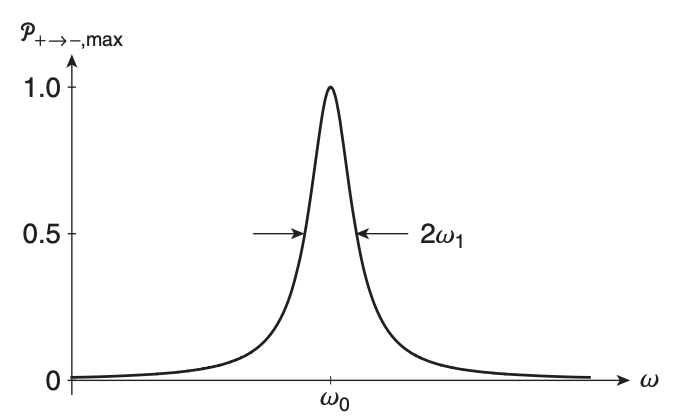
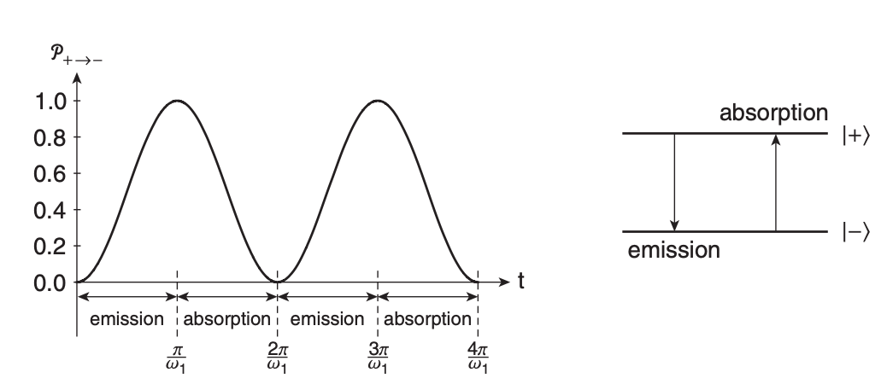

# Chapter 3 - Schrödinger Time Evolution

> Reference *Quantum Mechanics: A Paradigms Approach* by David McIntyre.

---

The time evolution of a quantum system is governed by the differential equation

$$ i\hbar\frac{d}{dt}\ket{\psi(t)} = H(t)\ket{\psi(t)} $$

where $H$ corresponds to the total energy of the system (the Hamiltonian operator, *different* from the Hermitian operator - though the Hamiltonian is still *a* Hermitian operator).

> **Postulate 6**
> The time evolution of a quantum system is determined by the Hamiltonian (total energy operator) $H(t)$, through the **Schrödinger equation**:
> $$ i\hbar\frac{d}{dt}\ket{\psi(t)} = H(t)\ket{\psi(t)} $$

The eigenvalues $E_n$ of the Hamiltonian are the *allowed energies* of the quantum system, and the eigenvectors (eigenstates) $\ket{E_n}$ are the energy eigenvectors of the system, such that
$$
H\ket{E_n} = E_n\ket{E_n}
$$
## The Energy Basis

Let's say we've already diagonalized $H$ and found values for the allowed energies $E_n$ and $\ket{E_n}$. General state vectors can be written in terms of these energy eigenstates:
$$ \ket{\psi(t)} = \sum_n c_n(t)\ket{E_n} $$
and, since the energy eigenvectors are orthonormal, we can write the **energy basis** as
$$
\braket{E_k|E_n} = \delta_{kn}
$$
Assuming the Hamiltonian $H(t)$ in this context is *time-independent*, such that $H(t_0) = H(t)$ for all $t$, then the time-dependent Schrödinger equation can be written
$$
\ket{\psi(t)} = \sum_n c_n e^{-iE_nt/\hbar}\ket{E_n} = \sum_n c_n e^{-i\omega_n t} \ket{E_n}
$$
where $\omega_n = E_n/\hbar$, an angular frequency. 
## Stationary States

Let's start with the simplest possible situation, where the quantum system is in one single energy eigenstate:
$$ \ket{\psi(0)} = \ket{E_1} $$
After some time $t$, this system will be in the state
$$ \ket{\psi(t)} = e^{-i\omega_1t} \ket{E_1} $$
where $\omega_1 = E_1/\hbar$. This state, however, differs from our initial state only by the phase factor $-i\omega_1 t$, and since phase changes will never affect the probability of measurements, the probability of observing some eigenvalue $a_j$ for an observable $A$ will be 
$$
\mathcal{P_{aj}} = |\braket{a_j|\psi(t)}|^2 = |\bra{a_j|e^{-i\omega_1t}\ket{E_1}}|^2 = |\braket{a_1|E_1}|^2
$$
This probability is *time-independent* and equal to the probability at $t_0$. There is no measurable time evolution for this state, and the energy eigenstates are called **stationary states** - if a system begins in some energy eigenstate, it will remain in that state. 

This same idea goes for multiple energy eigenstates:
$$ \ket{\psi(0)} = c_1\ket{E_1} + c_2\ket{E_2} $$
where
$$\mathcal{P}_{E_1} = |\braket{E_1|\psi(t)}|^2 \Rightarrow |c_1|^2$$

## Non-commuting Observables

If an observable $A$ commutes with $H$, then $A$ and $H$ have common eigenstates - so measuring $A$ is equivalent to measuring $H$. However, if $A$ does *not* commute with $H$, then the two observables will not share common eigenstates, and the eigenvalues of $A$ will be some superposition of energy eigenstates. 

Let the eigenstates of $A$ corresponding to $\ket{a_1}$ be represented by
$$\ket{a_1} = \alpha_1\ket{E_1} + \alpha_2\ket{E_2}$$
and the probability of measuring $a_1$ would be
$$ 
\begin{aligned}
	\mathcal{P}_{a_1} &= |\braket{a_1|\psi(t)}|^2\\
	&= |[\alpha_1^*\bra{E_1} + \alpha_2^*\bra{E_2}][c_1e^{-i\omega_1t}\ket{E_1}+c_2e^{-i\omega_2t}\ket{E_2}]|^2\\
	&= |a_1^*c_1e^{-i\omega_1t} + a_2^*c_2e^{-i\omega_2t}|^2
\end{aligned}
$$
The overall phase drops out - only the relative phase between $\omega_1$ and $\omega_2$ remains. 
$$ \omega_{21} = \frac{E_2-E_1}{\hbar} $$
which is the also **Bohr frequency**.

## Summary

In a time-dependent quantum system $\ket{\psi(t)}$ with a time independent Hamiltonian $H(t_0) = H(t)$, the probability of measuring $a_j$ of some observable $A$ at time $t$ can be found through the following process:

1. Diagonalize $H$ to find the eigenvalues $E_n$ and eigenvectors $\ket{E_n}$.
2. Write $\ket{\psi(0)}$ in terms of the energy eigenstates $\ket{E_n}$.
3. Multiply each eigenvector coefficient by $e^{-iE_nt/\hbar} = e^{-i\omega_n t}$ to get $\ket{\psi(t)}$ for some arbitrary $t$.
4. Calculate the probability $\mathcal{P}_{a_j} = |\braket{a_j|\psi(t)}|^2$.

# Time Evolution of Spin

Let's apply Schrödinger time evolution to the spin-1/2 system. 

The Hamiltonian operator represents the total energy of a system. In time-dependent solutions, only energy differences are important - thus, the Hamiltonian is just the magnetic potential energy of a spin $\vec{S}$ system
$$H = -\vec{\mu} \cdot \vec{B} = -g\frac{q}{2m_e}\vec{S}\cdot B$$
If we say the *gyromagnetic ratio* $g\approx 2$ and $q=-e$ (an electron), then
$$
H = \frac{e}{m_e}\vec{S}\cdot\vec{B}
$$
## $z$-direction

In the $z$ direction, $\vec{B}=B_0\hat{z}$, and

$$
\begin{aligned}
	H &= \frac{eB_0}{m_e}S_z \equiv \omega_0S_z\\
	&= \omega_0\frac{\hbar}{2}\begin{pmatrix}1 & 0 \\ 0 & -1\end{pmatrix}
\end{aligned}
$$
where $\omega_0 = \frac{eB_0}{m_e}$, and

$$
\begin{aligned}
	H\ket{+} &= \omega_0S_z\ket{+} = \omega_0\frac{\hbar}{2}\ket{+} = E_+\ket{+}\\
	H\ket{-} &= \omega_0S_z\ket{-} = -\omega_0\frac{\hbar}{2}\ket{-} = E_-\ket{-}
\end{aligned}
$$
with eigenstuff
$$
\begin{aligned}
	E_+ &= \omega_0\frac{\hbar}{2} \qquad E_-=-\omega_0\frac{\hbar}{2}\\
	\ket{E_+} &= \ket{+} \qquad \ket{E_-} = \ket{-}
\end{aligned}
$$
Applying the Schrödinger time evolution to a general state in direction $\theta$ with phase shift $\phi$ in $\ket{\psi(0)} = \ket{+}_n = \cos\frac{\theta}{2}\ket{+} + \sin\frac{\theta}{2}e^{i\phi}\ket{-}$:
$$
\ket{\psi(t)} = e^{-i\omega_0 t / 2}\begin{pmatrix} cos(\theta/2)\\e^{i(\theta + \omega_0t)}\sin(\theta/2) \end{pmatrix}
$$
If we were to calculate the probability of measuring $+$ along the $z$ axis for this arbitrary direction $\theta$ and phase $\phi$,
$$
\begin{aligned}
	\mathcal{P}_{+} &= |\braket{+|\psi(t)}|^2\\
	&= \left|(1\;\;0) e^{-i\omega_0t/2}	\begin{pmatrix}
		\cos(\theta/2) \\
		e^{i(\phi+\omega_0t)}\sin(\theta/2)
	\end{pmatrix}\right|^2\\
	&= |e^{-i\omega_0t/2}\cos(\theta/2)|^2\\
	&= \cos^2(\theta/2)
\end{aligned}
$$
> Probability here is *time-independent* because the $S_z$ eigenstates are *also* energy eigenstates for this problem (i.e. $H$ and $S_z$ **commute**).

## $x$-direction

The probability of measuring spin along the $x$ direction instead, where instead of $\begin{pmatrix}1 & 0\end{pmatrix}$ we have $\frac{1}{\sqrt{2}}\begin{pmatrix}1 & 1\end{pmatrix}$ is:

$$
\begin{aligned}
	\mathcal{P}_{+x} &= |_x\braket{+|\psi(t)}|^2\\
	&= \left| \frac{1}{\sqrt{2}}\begin{pmatrix}1 & 1\end{pmatrix} e^{-i\omega_0t/2}
	\begin{pmatrix}
		\cos(\theta/2) \\
		e^{i(\phi+\omega_0t)}\sin(\theta/2)
	\end{pmatrix} \right|^2\\
	&= \frac{1}{2}\left[ 1+\sin\theta\cos(\phi+\omega_0t) \right]
\end{aligned}
$$
> Probability in the $x$ axis *is* time-dependent because the $S_x$ operator does not commute with $H$. 

For $y$-direction, we'd use the same equation as above, except with $\frac{1}{\sqrt{2}}\begin{pmatrix}1 & i \end{pmatrix}$ instead.

## Expectation values

$$
\begin{aligned}
	\braket{S_z} &= \braket{\psi(t)|S_z|\psi(t)} = \frac{\hbar}{2}\cos\theta\\
	\braket{S_y} &= \braket{\psi(t)|S_y|\psi(t)} = \frac{\hbar}{2}\sin\theta\sin(\phi+\omega_0 t)\\
	\braket{S_x} &= \braket{\psi(t)|S_x|\psi(t)} = \frac{\hbar}{2}\sin\theta\cos(\phi+\omega_0 t)
\end{aligned}
$$
Irrespective of the three axis is the **total spin vector**'s expectation value $\braket{S}$, the precession of which is known as **Larmor precession**, with frequency known as the **Larmor frequency**. The expectation value of the spin vector precesses in a uniform magnetic field, as visualized below. 

> **Ehrenfest's theorem** states that quantum mechanical *expectation values* obey classical laws - as visualized above, the precession of the spin vector makes it clear the system has nonzero angular momentum (as opposed to just a magnetic dipole moment). 

## Magnetic field in a general direction

Let's say we have a magnetic field with both an $x$ and $z$ component, such that
$$
\vec{B} = B_0\hat{z} + B_1\hat{x}
$$
This field will be oriented in the $xz$-plane with some angle $\theta$ w.r.t the $z$-axis. First, we'll define Larmor frequencies with each field component:
$$
\omega_0 = \frac{eB_0}{m_e}\qquad \omega_1 = \frac{eB_1}{m_e}
$$
And the Hamiltonian is then defined as
$$
\begin{aligned}
H = -\vec{\mu}\cdot \vec{B} &= \omega_0 S_z+\omega_1 S_x\\
&= \frac{\hbar}{2}\begin{pmatrix}
\omega_0 & \omega_1\\
\omega_1 & -\omega_0
\end{pmatrix}
\end{aligned}
$$
This Hamiltonian isn't diagonal - so we need to [diagonalize it](chapter2.html#finding-eigenvectors--values-from-an-observable). This leads to
$$
\lambda = \pm \frac{\hbar}{2} \sqrt{\omega_0^2+\omega_1^2}
$$
> When $\omega_1=0$, the energy eigenvalues are just $\pm \hbar\frac{\omega_0}{2}$, same as $S_z$.

From the above figure, we know
$$
\tan\theta = \frac{B_1}{B_0} = \frac{\omega_1}{\omega_0}
$$
and
$$
\begin{aligned}
H &= \frac{\hbar}{2}\sqrt{\omega_0^2+\omega_1^2}\begin{pmatrix}\cos\theta & \sin\theta \\ \sin\theta & -\cos\theta\end{pmatrix}\\
&= \sqrt{\omega_0^2+\omega_1^2}S_n
\end{aligned}
$$
where $S_n$ is the spin operator in some direction $\hat{n}$, with vectors (found in [chapter 2](chapter2.html#new-operators))
$$
\begin{aligned}
	\ket{+}_{\hat{n}} &= \cos\frac{\theta}{2}\ket{+}+\sin\frac{\theta}{2} e^{i\phi}\ket{-}\\
	\ket{-}_{\hat{n}} &= \sin\frac{\theta}{2}\ket{+}-\cos\frac{\theta}{2} e^{i\phi}\ket{-}
\end{aligned}
$$
## Spin flip

The probability that some initial state $\ket{+}$ later evolves into $\ket{-}$ (known as **spin flip**) is
$$
\mathcal{P_{+\rightarrow-}} = \frac{\omega_1^2}{\omega_0^2+\omega_1^2}\sin^2\left( \frac{\sqrt{\omega_0^2+\omega_1^2}}{2}t \right)
$$
> This is called **Rabi's formula** - see [the Rabi cycle](https://en.wikipedia.org/wiki/Rabi_cycle).

# Neutrino Oscillations

Neutrinos are produced via decay processes, such as
$$
\begin{aligned}
	n &\rightarrow p+e^-+\bar{\nu_e}\\
	p &\rightarrow n+e^++\nu_e
\end{aligned}
$$
where $\nu_e$ is an *electron neutrino* and $\overline{\nu_e}$ is an *electron antineutrino*. Neutrinos interact with normal matter via the weak nuclear force (the weakest of the four fundamental forces), making them extremely hard to detect. Other *flavors* of neutrinos are produced via processes such as the *pion-muon* decay and *muon-electron* decay:
$$
\begin{aligned}
	\pi^+ &\rightarrow \mu^+ + \nu_\mu\\
	\mu^- &\rightarrow e^-+\nu_\mu+\overline{\nu_e}
\end{aligned}
$$
where $\nu_\mu$ is a *muon electron*. 

> Electrons, muons and tau ($\tau$) particles, as well as their neutrino byproducts, are known as **leptons**.

There is no theoretical basis for conservation of lepton flavors, so reactions of the type
$$
\nu_e \leftrightarrow \nu_\mu
$$
are possible, where an electron neutrino changes flavor to a muon neutrino or visa versa - these reactions are known as **neutrino mixing** or **neutrino oscillations.** 

When neutrinos are interacting with the weak nuclear force, they have some energy within that interaction, and the quantum states $\ket{\nu_e}$ and $\ket{\nu_\mu}$ are eigenstates of the Hamiltonian describing the weak nuclear force - in free space, with no weak nuclear force present, the only relevant Hamiltonian (energy description operator) is the relativistic energy of the particle (which due to $E=mc^2$ includes the rest masses and momenta) - this relativistic Hamiltonian has **mass eigenstates**.

> If $m_{\nu_e}\neq m_{\nu_\mu}$, then the mass eigenstates do *not* coincide with the weak interaction eigenstates - allowing for flavor-changing processes in the first place (somehow?). 

Let
$$
\begin{aligned}
	\ket{\nu_e} &= \cos\frac{\theta}{2}\ket{\nu_1}+\sin\frac{\theta}{2}\ket{\nu_2}\\
	\ket{\nu_\mu} &= \cos\frac{\theta}{2}\ket{\nu_1}-\sin\frac{\theta}{2}\ket{\nu_2}
\end{aligned}
$$
where $\theta/2$ is the **mixing angle** between the two. If this angle is small, then the small angle hypothesis applies and
$$
\begin{aligned}
	\ket{\nu_e} &\approx \ket{\nu_1}\\
	\ket{\nu_\mu} &\approx \ket{\nu_2}\\
\end{aligned}
$$

---

**Example**

Assume an electron is created by a weak-interaction process and propagates through free space to a detector. We detect it by seeing the signature of *flavor mixing*, rather than the neutrino itself. Let our initial neutrino be an electron neutrino:
$$
\begin{aligned}
	\ket{\psi(0)} &= \ket{\nu_e}\\
	&= \cos\frac{\theta}{2}\ket{\nu_1}+\sin\frac{\theta}{2}\ket{\nu_2}
\end{aligned}
$$
Since this neutrino's now propagating through free space, the energy eigenstates are just its mass eigenstates (no weak interaction) - so the Schrödinger time evolution is
$$
\ket{\psi(t)} = \cos\frac{\theta}{2}e^{-iE_1t/\hbar}\ket{\nu_1} + \sin\frac{\theta}{2}e^{-iE_2t/\hbar}
$$
where $E_i$ represents the relativistic energy eigenvalues, determined by the rest mass and momenta of each.
$$
E_i = \sqrt{(pc)^2+(m_ic^2)^2}
$$
Assuming the neutrinos are highly relativistic, then $(mc^2<<pc)$ and
$$
E_i = pc + \frac{(m_ic^2)^2}{2pc}
$$
The probability of the neutrino mixing is
$$
\begin{aligned}
	\mathcal{P}_{\nu_e\rightarrow \nu_\mu} &= |\braket{\nu_\mu|\psi(t)}|^2\\
	&= \sin^2\theta\sin^2\left( \frac{(E_1-E_2)t}{2\hbar} \right)
\end{aligned}
$$
The energy difference is just proportional to the difference in masses (see $E_i$ above), and, with $t=L/c$ where $L$ is the distance from the source from the detector and momentum $p=E/c$:
$$
\mathcal{P}_{\nu_e\rightarrow \nu_\mu} = \sin^2\theta\sin^2\left( \frac{(m_1^2-m_2^2)Lc^3}{4E\hbar} \right)
$$
The probability *oscillates* from 0 to a maximum value of $\sin^2\theta$ ... hence the term **neutrino oscillation**.

> Experimental measurements have this mass difference is approximately
> $$
m_1^2 - m_2^2 = 8\times10^{-5}\;eV^2/c^4
$$
> and $\theta\approx69^\circ$. 

---
# Time-dependent Hamiltonians

Thus far, we've only looked at time-*in*dependent Hamiltonians. Time-dependent Hamiltonians are to them what a salmon in the ocean is to nigiri - *complicated*.

Generalizing Rabi's formula with the change $\omega_0 \rightarrow -\Delta \omega$,
$$
\begin{aligned}
	\mathcal{P}_{+\rightarrow -} &= \frac{\omega_1^2}{\Delta\omega^2+\omega_1^2}\sin^2\left( \frac{\sqrt{\Delta \omega^2+\omega_1^2}}{2}t \right) \\
	&= \frac{\omega_1^2}{(\omega-\omega_0)^2+\omega_1^2}\sin^2\left( \frac{\sqrt{(\omega-\omega_0)^2+\omega_1^2}}{2}t \right)
\end{aligned}
$$
where $\omega$ is the frequency of incident light (i.e. incident light is not static, but oscillates with time). For the case of $\omega=0$ (zero-frequency light), the applied field is static and we can use our earlier definition of Rabi's equation.
> The static field case ($\omega=0$) is referred to as **spin procession**, the rotating field case ($\omega>0$) as **Rabi flopping**. 
> In the static field case, the spin precession is a natural oscillation of a quantum system operating in a superposition of energy eigenstates.
> In the rotating field case, the Rabi flopping represents transitions between energy eigenstates, and there is an exchange of energy between the particle system and the applied rotating field - since the Hamiltonian is *time-dependent*, energy is not static within the system, but *moving into and out of the applied field*. 

## Time-dependent Hamiltonian

Let's look at the scenario where some incident photons collide with some matter, increasing the energy levels of local electrons. 

> In a quantum sense, the oscillating electric field of the light wave interacts with the electric dipole of the atom, and the energy exchange between the field and the atom corresponds to the *absorption* and *emission* of photons. 

The probability of a Rabi spin flip changes/oscillates with the angular frequency
$$
\sqrt{(\omega - \omega_0)^2+\omega_1^2}
$$
(typically referred to as the **generalized Rabi frequency** - though the **Rabi frequency** itself usually refers to $\omega_1$. 

The Hamiltonian of this system is
$$
H = \frac{\hbar}{2}\begin{pmatrix}
	\omega_0 & \omega_1e^{-i\omega t}\\
	\omega_1 e^{i\omega t} & -\omega_0
\end{pmatrix}
$$

### Resonant frequency

If $\omega=\omega_0$, the frequency $\omega$ of the rotating field is equal to the Larmor precession frequency $\omega_0$, and the probability of a spin flip just becomes
$$
\mathcal{P}_{+\rightarrow -} = \sin^2\left( \frac{\omega_1^2}{2}t \right)
$$
> Spin is flipped with 100% probability with some frequency $\omega_1$.

### Non-resonant frequency

At values $\omega\neq\omega_0$, the spin flip oscillates with an amplitude smaller than 1. 

The FWHM of the above curve is $2\omega_1$.

