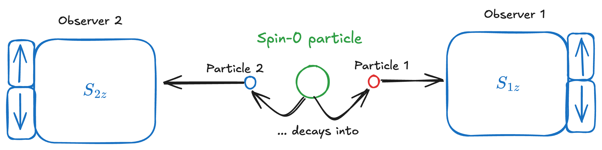
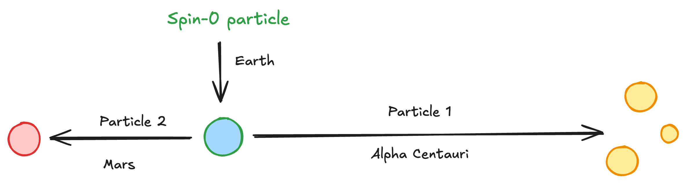
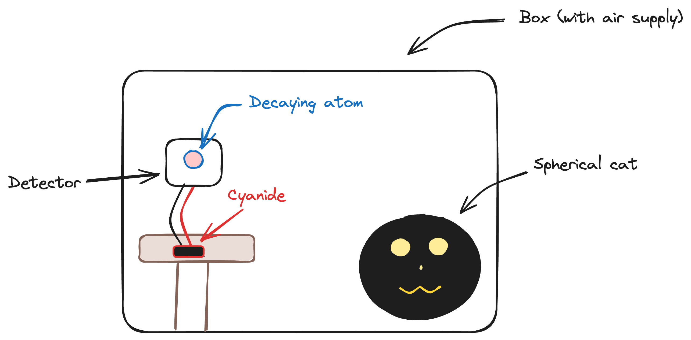

# Chapter 4 - Quantum Spookiness

> Reference *Quantum Mechanics: A Paradigms Approach* by David McIntyre.

---

In the 20th century, as quantum mechanics was first developing widespread acknowledgement, various theories were put forth to try and explain the probabilistic (rather than deterministic) nature that surprised a lot of classical physicists. 

# Einstein-Podolsky-Rosen Paradox (EPR)

> Some, such as Albert "God does not play dice" Einstein, thought the probabilistic nature of QM (especially when juxtaposed with the more-deterministic classical mechanics) was just because we weren't seeing some variables - we thought it probabilistic only because there was some backstage action we weren't seeing (an *incomplete description* of reality).

The experiment begins with an unstable particle with spin 0, which then decays into two spin $\pm 1/2$ particles (consv. of angular momentum) traveling in opposite directions (consv. of linear momentum). 

Because each spin is opposite the other, if observer 1 sees spin +1/2, observer 2 *must* see spin -1/2, and visa versa. After measurement, each observer *always* knows what the other observer sees. 

> This would be later called an **entangled state**.

There are two ways of looking at these particles:

1. Each exists as part of a state $\ket{\psi}$ that is in superposition, so neither particle has a defined spin until measurement. 
2. Both particles have spin values defined at the moment of decay - particle 1 always had spin $+$, particle 2 always spin $-$. 

For example, imagine a particle decays on Earth, and the resulting 1/2 particles are kept (unmeasured) in two chambers (i.e. the quantum state $\ket{\psi}$ describing both is in superposition by view 1). One 1/2 particle is sent with a ship to Mars, and another is sent on a ship to Alpha Centauri. 

If Mars makes the measurement $\ket{S_{2z}}=+\hbar/2$, according to idea 1, the state $\ket{\psi}$ instantaneously collapses into the state $\ket{-}_1 \ket{+}_2$ and Alpha Centauri will measure $\ket{S_{1z}} = -\hbar/2$, regardless of the distance between the two. Idea 2 says that Mars *always* had $\ket{S_{2z}}=+\hbar/2$, while perspective 1 maintains that the superposition state must have collapsed then. 

> The **EPR paradox** argues in favor of the second: the spin is a "real" property of the particle - a variable (invisible to our instruments then) describing reality. Instead of being in a superposition state pre-measurement, both particles had their spin states specified at the moment of decay and always did - Einstein's local hidden variables theory (localized to each particle). 

For a while, it was thought impossible to know whether theory 1 or theory 2 was the correct interpretation ... that is, until 1964. Enter John Bell. 

## Bell's Theorem

> [Bell's theorem](https://en.wikipedia.org/wiki/Bell's_theorem) sets up a mathematical inequality that provides different results for a setup assuming HVT and a setup assuming the Copenhagen interpretation.

In the hidden variables theory (HVT) interpretation, this equality is 
$$
\left| \braket{A_0B_0} + \braket{A_0B_1} + \braket{A_1B_0} - \braket{A_1B_1} \right| \leq 2
$$
where $A_{0,1}$ and $B_{0,1}$ represent the measurements taken by two observers $A$ and $B$ and $\braket{X}$ denotes the expectation (or average) value of some measurement. This inequality is also called the [Clauser-Horne-Shimony-Holt (CHSH) inequality](https://en.wikipedia.org/wiki/CHSH_inequality). 

Now, assume this was set up with [qubits](chapter16.md) instead - see the Wikipedia article for more details. Summing the expectation values yields
$$
\braket{A_0\;\otimes\; B_0}+\braket{A_0\;\otimes\; B_1}+\braket{A_1\;\otimes\; B_0}-\braket{A_1\;\otimes\; B_1} = 2\sqrt{2}
$$
which is greater than the maximum of 2 allowed by the CHSH inequality, implying hidden variables cannot exist. 

# Schrödinger's Cat

Schrödinger, in a fit of psychosis, proposed putting a cat in a box. Never a good idea - but further, he decided that box should include both unstable radioactive isotopes *and* a bottle of cyanide! If an isotope decay is detected, boom. Dead cat.

Now, this is a dumb experiment for *so many reasons* (animal cruelty not the least of which), but it's animal cruelty *for science* ... so ... yeah. That doesn't even justify it. Whatever. Don't do this experiment at home or anywhere else for that matter. 

The atom has a half life of 1 hour. After 1 hour, the state of the life-deciding decaying atom is described by
$$
\ket{\psi_{\text{nucleus}}} = \frac{1}{\sqrt{2}}\left( \ket{\psi_{\text{decayed}}}+\ket{\psi_{\text{undecayed}}} \right)
$$
... with the quantum state of the cat implied to be
$$
\ket{\psi_{\text{cat}}} = \frac{1}{\sqrt{2}}\left( \ket{\psi_{\text{dead}}}+\ket{\psi_{\text{alive}}} \right)
$$
... implying the cat is in a *superposition state* between dead and alive. Purgatory's got nothing on Schrödinger's pets. This (thankfully only) thought experiment raises two questions:

1. Can macroscopic (cat) states be described quantum mechanically?
2. What qualifies as a measurement? I.e. what causes the collapse of the wave function?

The **Copenhagen interpretation** states that, no, cats (nor any other macroscopic thing for that matter) cannot be represented by quantum functions - only classically, like with ... normal things, like what color it is, food, how fast it's going, etc. Normal things, like, by Jove, physicists are weird. 

> More human-centric folks have argued human consciousness causes the collapse, others that there is no collapse - rather, just a bifurcation into separate universes (the multiverse).

Feynman had the non-answer to answer this: 

> Shut up and calculate. 

Whatever man. Don't kill cats, like, damn. 