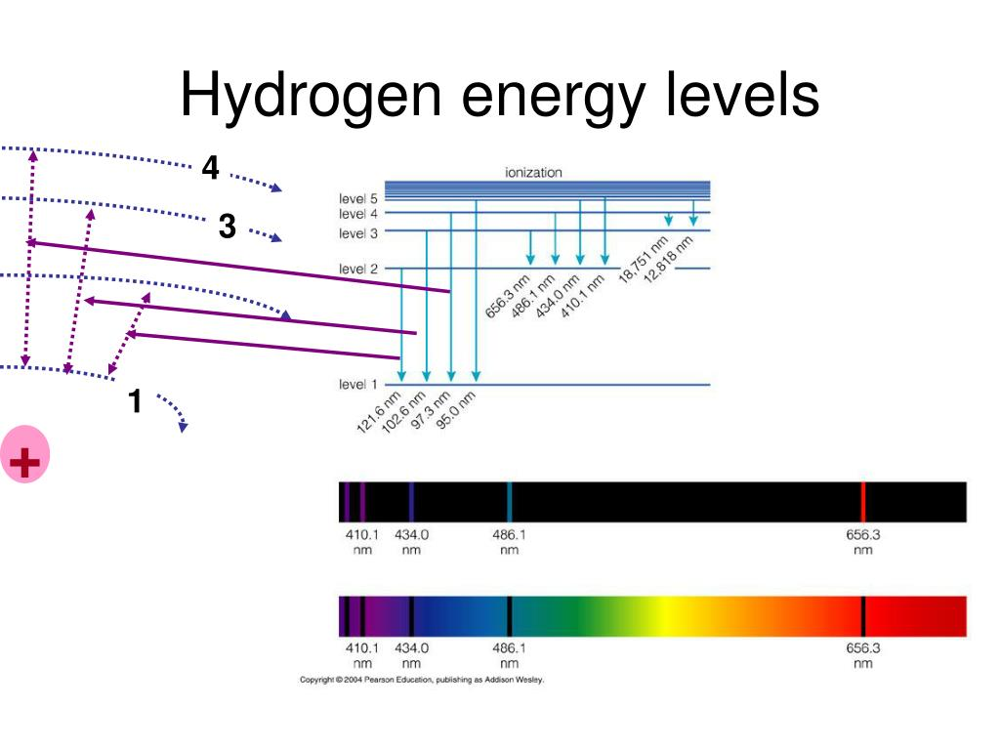

# Chapter 5 - Quantized Energies

> Reference *Quantum Mechanics: A Paradigms Approach* by David McIntyre.

---
# Spectroscopy

Atoms are differentiated by their specific atomic structure - how many neutrons, protons and electrons they have form the basis for elements in the periodic table. Electrons form the bulk of ways we can *identify* one element from another - when an atom absorbs a photon, the atom responds by raising an electron up one energy level, then dropping it (emitting a photon). 

Since the energy of a photon is 
$$
\Delta E = hf
$$
and we can only have specific values of energies, we can identify individual atoms by their frequencies - i.e. with quantized values for energy come quantized values for frequencies.

The lowest energy state ($n=1$ for hydrogen) is called the **ground state**, with higher levels called **excited states**. The set of quantized energy states is referred to as the **energy spectrum** of a system. 

---

From a quantum perspective, we can visualize the energy spectrum like this:

For a system prepared in some initial state $\ket{\psi}$, the probability of measuring some energy shift $E_i$ is
$$
\mathcal{P}_{E_i} = |\braket{E_i|\psi}|^2
$$
We can find the energy levels $E_i$ and their corresponding eigenstates $\ket{E_i}$ by applying the Hamiltonian such that
$$
\hat{H}\ket{E_i} = E_i\ket{E_i}
$$

