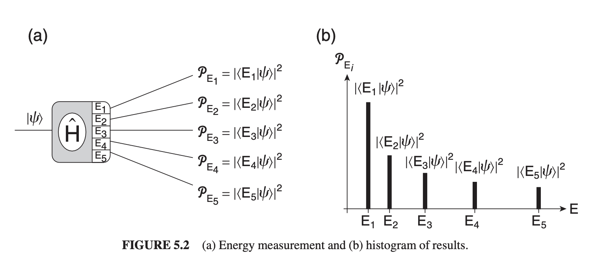

# Chapter 5 - Quantized Energies

> Reference *Quantum Mechanics: A Paradigms Approach* by David McIntyre.

---
# Spectroscopy

Atoms are differentiated by their specific atomic structure - how many neutrons, protons and electrons they have form the basis for elements in the periodic table. Electrons form the bulk of ways we can *identify* one element from another - when an atom absorbs a photon, the atom responds by raising an electron up one energy level, then dropping it (emitting a photon). 

Since the energy of a photon is 
$$
\Delta E = hf
$$
and we can only have specific values of energies, we can identify individual atoms by their frequencies - i.e. with quantized values for energy come quantized values for frequencies.

The lowest energy state ($n=1$ for hydrogen) is called the **ground state**, with higher levels called **excited states**. The set of quantized energy states is referred to as the **energy spectrum** of a system. 

From a quantum perspective, we can visualize the energy spectrum like this:

For a system prepared in some initial state $\ket{\psi}$, the probability of measuring some energy shift $E_i$ is
$$
\mathcal{P}_{E_i} = |\braket{E_i|\psi}|^2
$$
We can find the energy levels $E_i$ and their corresponding eigenstates $\ket{E_i}$ by applying the Hamiltonian in the energy eigenvalue equation, such that
$$
\hat{H}\ket{E_i} = E_i\ket{E_i}
$$

# Energy Eigenvalue Equation

> Also known as the time-independent Schrödinger equation since it can be derived from the S.E. by separating the time and space components. 

To find the equation describing energy eigenvalues, 
1. Find the classical form of the system's energy
2. Replace each physical observable (position, momentum etc) with their quantum mechanical operators.

For a simple moving particle, the energy is the sum of kinetic and potential energy. 
$$
E = K(x)+V(x) \equiv \frac{1}{2}mv^2+V(x) \equiv \frac{1}{2}\frac{\rho_x^2}{m}+V(x)
$$
where $\rho_x=mv_x$ is the momentum of the particle in the $x$ direction and $V(x)$ is the potential energy. 

In quantum mechanics, our primary physical observables are usually position $x$ and momentum $p$, so our energy operator $\hat{H}$ is just the quantum version of $E$ using $\hat{x}$ and $\hat{p}$:
$$
\hat{H} = \frac{\hat{p_x}^2}{2m}+V(\hat{x})
$$
$$
\hat{x} \equiv x \qquad \hat{p} \equiv -i\hbar\frac{d}{dx}
$$
where $-i\hbar$ is used to fix dimensions and ensure measurable results are real (non-imaginary). 

Our quantum variables $\hat{x}$ and $\hat{p}$ are both used in **wave functions**, which are really just alternate representations of quantum states:
$$
\ket{\psi} \equiv \psi(x)
$$
> This is called **position representation** since we're using the position eigenstates as the preferred basis. 

The wave function representing the energy eigenstates in position representation is
$$
\ket{E_i} \equiv \psi_{E_i}(x)
$$
so our energy eigenvalue equation $\hat{H}\ket{E_i} = E_i\ket{E_i}$ becomes
$$
\hat{H} \psi_{E_i}(x) = E_i\psi_{E_i}(x)
$$

Right. Let's combine everything. Using $\hat{H}$ with our quantum variables:
$$
\begin{aligned}
	\left( \frac{1}{2m}\left( -i\hbar\frac{d}{dx} \right)^2+V(x) \right)\psi_{E_i}(x) &= E_i\psi_{E_i}(x)
\end{aligned}
$$
simplifying, 
$$
\left( -\frac{\hbar^2}{2m}\frac{d^2}{dx^2}+V(x) \right)\psi_{E}(x) = E\psi_{E}(x)
$$
> $V(\hat{x})$ is the potential energy function, $\psi(x)$ is the wave function representing energy and $E_i$ is the energy eigenvalue. 

The big thing that happens with wave functions: *operator equations turn into differential equations*. 

# The Wave Function $\psi(x)$

The wave function $\psi(x)=\braket{x|\psi}$ is the probability amplitude for the quantum state $\ket{\psi}$ to be measured in the position eigenstate $\ket{x}$, with the actual probability of measuring some value $x$ being
$$
\mathcal{P}(x) = |\psi(x)|^2
$$

## Probability density $\mathcal{P}(x)$

Since the probabilities of all measurements still sum to unity, for a continuous probability density function $P(x)$, all of the following are equivalent:
$$
\int_{-\infty}^{\infty} \mathcal{P}(x) dx =\int_{-\infty}^{\infty}|\psi(x)|^2dx = 1
$$
$$
\braket{\psi|\psi} = \int_{-\infty}^\infty \psi^*(x)\psi(x)dx  = 1
$$

Similarly, if we wanted to know the probability a particle would be found between $x=a$ and $x=b$, 
$$
\mathcal{P}_{a<x<b} = \int_a^b |\psi(x)|^2 dx
$$

> **Note**: the above curves of $\mathcal{P}(x)$ represent *probability density*:
> $$
\frac{\text{probability}}{\text{unit length}}
 $$
 By multiplying by $dx$, we get rid of the unit length and end up with probability.

---

Generally, to translate bra-ket formulae to wave function versions:
1. Replace kets with wave function $\ket{\psi} \rightarrow \psi(x)$
2. Replace bras with wave function conjugate $\bra{\psi} \rightarrow \psi^*(x)$
3. Replace braket with integral over all space $\braket{|} \rightarrow \int_{-\infty}^{\infty} dx$
4. Replace operator with position representation $\hat{A} \rightarrow A(x)$

---

So, to convert some probability amplitude $\braket{\phi|\psi}$:
$$
\braket{\phi|\psi} = \int_{-\infty}^{\infty} \phi^*(x)\psi(x)dx
$$
with probability
$$
\mathcal{P} = |\braket{\phi|\psi}|^2 = \left| \int_{-\infty}^{\infty} \phi^*(x)\psi(x)dx \right|^2
$$
To transform expectation values, 
$$
\begin{aligned}
	\braket{\hat{x}} &= \braket{\psi|\hat{x}|\psi}\\
	&= \int_{-\infty}^{\infty} \psi^*(x)x\psi(x)dx\\
	&= \int_{-\infty}^{\infty} x|\psi(x)|^2dx
\end{aligned}
$$
# Energy Wells

Our energy eigenvalue equation is 
$$
\left( -\frac{\hbar^2}{2m}\frac{d^2}{dx^2}+V(x) \right)\psi_{E}(x) = E\psi_{E}(x)
$$
Solutions to this equation depend on what our potential energy $V(x)$ is - and $V(x)$ is dependent on context. Often, potential energy will resemble an *energy well*, such as seen below:

Some notes on vocabulary:

- **Classically-forbidden region**: kinetic energy can't be negative. Since $T=KE=E_1-V(x)$, any region where $V(x) > E_1$ is called *classically forbidden*, since it would imply a negative kinetic energy. The edges of the well by each side are called classical turning points.

- **Classical turning points**: locations where $E_1=V(x)$. The particle has only potential energy (no kinetic), and must "turn around" to go back into the well.

- Particles *within* the well are in **bound states**, while those outside the well are in **unbound states**.

> The extent of the allowed and forbidden regions depends on our total energy $E$ used for a particular bound state. $E_2$ might be less than $E_1$, and $E_1$ might change from particle to particle. 

# Infinite Square Well

The classical model for a particle well is a ball bouncing between two perfectly elastic walls, like the [old bouncing DVD screensaver](https://archive.is/nr4dc). A simple model for a bound particle follows the same rules:

1. The ball flies freely between the walls
2. The ball is reflected perfectly at each bounce
3. The ball remains in the box regardless how fast it is

Let's find the energy eigenstates & eigenvalues using the energy eigenvalue equation. Outside the box, $V(x)=\infty$, so 
$$
\left( -\frac{\hbar^2}{2m}\frac{d^2}{dx^2}+\infty \right)\psi_{E}(x) = E\psi_{E}(x)
$$
which is satisfied only if $E=\infty$ (a nice thought) or if $\psi_E(x)=0$ everywhere outside the box. Inside the box, $V(x)=0$, so 
$$
-\frac{\hbar^2}{2m}\frac{d^2}{dx^2}\psi_{E}(x) = E\psi_{E}(x)
$$
We already know $m$, $\hbar$ and is confined to a box of size $L$. We need to find our total energy $E$ and the wave function $\psi_E(x)$. Rewriting our EEQ,
$$
\begin{aligned}
\frac{d^2}{dx^2}\psi_E(x) &= -\frac{2mE}{\hbar}^2\psi_E(x)\\
&= -k^2\psi_E(x)
\end{aligned}
$$
> Above, $k^2=\frac{2mE}{\hbar^2}$ and is defined as the **wave vector**.

The solution to this equation is 
$$
\begin{aligned}
	\psi_E(x) &= A'e^{ikx} + B'e^{-ikx}\\
	&= A\sin(kx) + B\cos(kx)
\end{aligned}
$$
There are three unknowns: $A$, $B$ and $k$, which contains our total energy $E$. We can find two of them with our boundary conditions: $x=0$ and $x=L$. At $x=0$, 
$$
\begin{aligned}
	\psi_E(0) = A\sin(0)+B\cos(0) &= 0
\end{aligned}
$$
so $B = 0$. At $x=L$ with $B=0$, 
$$
\psi_E(L) = A\sin(kL) = 0
$$
which is zero if $A=0$ (implying a full-zero wave function, not very useful, *or* when $kL=n\pi$ for $n=1,2,3\ldots$, allowing us to define yet another quantity $k_n$:
$$
k_n = n\frac{\pi}{L}\qquad n=1,2,3\ldots
$$
> $n$ is called the **quantum number**, while $k_n$ is the **quantization condition**. 

If we use this quantization condition as the wave vector $k$, then we can solve for our total energy $E$ as
$$
E_n = \frac{n^2\pi^2\hbar^2}{2mL^2}\qquad n=1,2,3\ldots
$$
with allowed energy eigenstate wave functions
$$
\psi_E(x) = A\sin\frac{n\pi x}{L}\qquad n=1,2,3\ldots
$$
Our final constant $A$ can be solved for by normalizing the wave function to unity, such that
$$
\begin{aligned}
	1 = \braket{E_n|E_n} &= \int_{-\infty}^\infty \psi_n^*(x)\psi_n(x) dx = \int_{-\infty}^\infty |\psi_n(x)|^2dx\\
	&= \int_0^L |A|^2\sin^2(k_n x) dx\\
	&= |A|^2\frac{L}{2}
\end{aligned}
$$
leading us to the final definition of our wave equation,
$$
\psi_n(x) = \sqrt{\frac{2}{L}}\sin\frac{n\pi x}{L}, \qquad n=1,2,3\ldots
$$
Since probability density can be calculated from some wave equation (which represents probability amplitude) via $\mathcal{P}(x) = |\psi(x)|^2$, then our quantized probability density becomes
$$
\mathcal{P}_n(x) = |\psi_n(x)|^2 = \frac{2}{L}\sin^2\frac{n\pi x}{L}
$$
We can visualize these wave functions for different quantum numbers (and hence energy levels) like this:

# Finite Square Well

Now, our energy eigenvalue equation outside the well becomes
$$
\left( -\frac{\hbar^2}{2m}\frac{d^2}{dx^2}+V_0 \right)\psi_{E}(x) = E\psi_{E}(x)
$$
while inside the well it remains
$$
-\frac{\hbar^2}{2m}\frac{d^2}{dx^2}\psi_{E}(x) = E\psi_{E}(x)
$$
When we were forced to always have our particle sitting in the well, we only needed to worry about our wave number $k$ - let's also now set up $q$ to represent the case when the particle is outside the well.
$$
k = \sqrt{\frac{2mE}{\hbar^2}}\qquad q=\sqrt{\frac{2m}{\hbar^2}(V_0-E)}
$$
For **bound states** (i.e. when $E<V_0$ both inside and outside the well), $k$ and $q$ are real, so our EEVs are
$$
\frac{d^2\psi_E(x)}{dx^2}=-k^2\psi_E(x)\qquad \text{inside box}
$$
$$
\frac{d^2\psi_E(x)}{dx^2}=-q^2\psi_E(x)\qquad \text{outside box}
$$
with general solutions
$$
\psi_{\text{even}}(x) = \begin{cases}
	Ae^{qx}, & x < -a\\
	D\cos(kx), & -a < x<a\\
	Ae^{-qx}, & x > a
\end{cases}\qquad \psi_{\text{odd}}(x) = \begin{cases}
	Ae^{qx}, & x < -a\\
	C\sin(kx), & -a < x<a\\
	-Ae^{-qx}, & x > a
\end{cases}
$$
where the even, odd values are applied to the energy levels (i.e. $E_1,E_3,E_5\ldots$ are odd).

Let's start with the even constants. At each boundary $x=a$ and $x=-a$, the solutions are the same since we positioned our "zero point" between them. 
$$
\begin{aligned}
	\psi_{even}(a)&\qquad\qquad\;\;\;\;\: D\cos(ka) = Ae^{-qa}\\
	\frac{d}{dx}\psi_{even}(a)&\Big|_{x=a}\qquad -kD\sin(ka)=-qAe^{-qa}
\end{aligned}
$$
with the normalization constant providing the third equation for all three unknowns ($A$, $D$, $E$). Dividing the two above equations gives
$$
k\tan(ka) = q
$$
which is equivalently (by substituting in our $k$ and $q$ formulae)
$$
\sqrt{\frac{2m}{\hbar^2}E}\tan\left( \sqrt{\frac{2m}{\hbar^2}E}a \right) = \sqrt{\frac{2m}{\hbar^2}(V_0-E)}
$$
Similarly for the odd solutions:
$$
-k\cot(ka) = q
$$

---

We can simplify all of this by creating some new constants $z$, $z_0$ and $qa$, such that
$$
z = ka = \sqrt{\frac{2mEa^2}{\hbar^2}}\qquad z_0= \sqrt{\frac{2mV_0a^2}{\hbar^2}}\qquad qa = \sqrt{\frac{2m(V_0-E)a^2}{\hbar^2}}
$$
so
$$
\begin{aligned}
	ka\tan(ka) = qa\quad&\rightarrow\quad ztan(z) = \sqrt{z_0^2+z^2}\\
	-ka\cot(ka) = qa \quad &\rightarrow \quad -z\cot(z) = \sqrt{z_0^2-z^2}
\end{aligned}
$$

---

