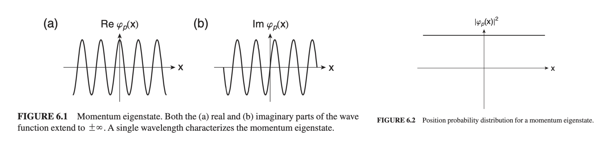
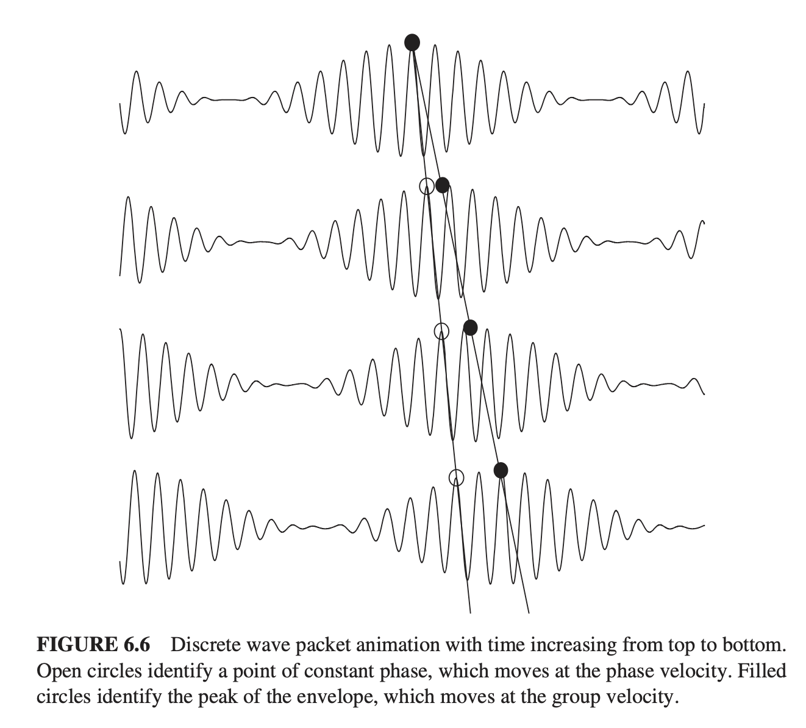
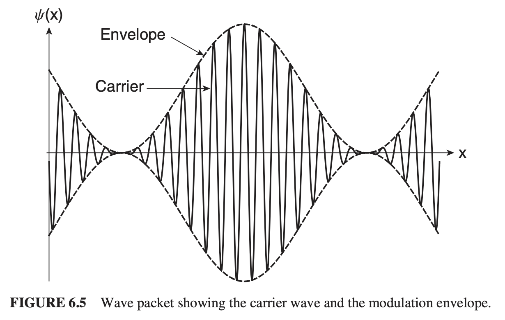

# Chapter 6 - Unbound States

> Reference *Quantum Mechanics: A Paradigms Approach* by David McIntyre.

---

In **bound states**, the energy levels of particles are *quantized* - they are restricted to specific values. In **unbound states**, energy is no longer quantized, and operates on a continuum. 

We still, however, will use the energy eigenvalue equation, its associated Hamiltonian, and the energy eigenvalue wave differential equation.
$$
	\hat{H}\ket{E}= E\ket{E}
$$
$$
\hat{H}=\frac{\hat{p}^2}{2m}+V(\hat{x})
$$
$$
\left( -\frac{\hbar^2}{2m}\frac{d^2}{dx^2}+V(x) \right)\psi_{E}(x) = E\psi_{E}(x)
$$
# Free particle eigenstates

For a free particle, $V(x)$ is zero everywhere, so the EEV differential equation becomes
$$
\frac{d^2}{dx^2}\psi_E(x) = -k^2\psi_E(x)
$$
where $k^2=\frac{2mE}{\hbar^2}$. This has the general solution of
$$
\psi_E(x) = Ae^{ikx}+Be^{-ikx}
$$
Since we're no longer in a bound state, we no longer have constraints on extrema (except for the normalization condition) - and hence *continuous* energy, no longer quantized. We can apply the Schrödinger time evolution to this by multiplying the energy basis (above) by a phase factor, such that
$$
\begin{aligned}
	\psi_E(x,t) &= \psi_E(x)e^{-iEt/\hbar}\\
	&= Ae^{ikx}+Be^{-ikx}
\end{aligned}
$$
Using the Planck energy relation $E=hf=\hbar\omega$,
$$
\psi_E(x,t) = Ae^{i(kx-\omega t)}+Be^{-i(kx+\omega t)}
$$
This wave function represents a wave that retains its shape as it moves, with a speed determined by $|v|=\omega/k$, the **phase velocity**. 

> Thus, $Ae^{i(kx-\omega t)}$ represents the part moving in the *positive direction*, while $Be^{-i(kx+\omega t)}$ represents the part moving in the *negative direction*.

> We can also use
> $$\psi_k(x) = Ae^{ikx}$$
> to represent the wave vector eigenstates, with the sign of $ikx$ indicating the direction of motion. 
> 
> **Note**: we need both positive *and* negative $k$ values to make a general energy eigenstate.

## Momentum Eigenstates & de Broglie Relation

The momentum eigenvalue equation is
$$
\hat{p}\psi_p(x) = p\psi_p(x)
$$
> This is equivalently $\hat{p}\ket{p} = p\ket{p}$ in braket notation.

Applying $\hat{p}$ to $\psi_k(x)$ above,
$$
\hat{p}\psi_k(x) = \left( -i\hbar\frac{d}{dx} \right)Ae^{ikx} = \hbar k\psi_k(x)
$$
implying that $p=\hbar k$ is the momentum eigenvalue with an associated eigenstate
$$
\psi_p(x) = Ae^{ipx/\hbar}
$$
> **Note**: this is a function of *position* $x$, not momentum $p$: $x$ is the independent variable while $p$ is the particular momentum eigenvalue. 

Since $k=2\pi/\lambda$, we can use our momentum eigenvalue $p$ to create the **de Broglie relation**:
$$\lambda_{\text{de Broglie}} = \frac{h}{p}$$
The momentum eigenstates are *also* energy eigenstates for our free particle, with energy
$$ E = \frac{p^2}{2m} $$
> This means that the momentum and energy operators commute. Any given momentum eigenstate will have some energy given by the above equation, but some energy state doesn't necessarily have a definite momentum, since a single energy state usually corresponds to 2+ momentum states - meaning the energy state is **degenerate**. 

### Momentum W.E.

The time-dependent wave equation governing a momentum eigenstate is
$$
\psi_p(x,t) = \psi_p(x)e^{-iE_pt/\hbar} = Ae^{ip/\hbar(x-pt/2m)}
$$
with a probability density given by
$$
\mathcal{P}(x) = |\psi_p(x)|^2 = |A|^2
$$

Unfortunately, this momentum eigenstate is constant *regardless of position* - it is spread out over all space unto $\infty$. This makes the momentum eigenstate impossible to normalize - *unless* we create a superposition of momentum eigenstates to create **wave packets**.

---

**Review on Basis States**:

All basis state should demonstrate

$$
\begin{aligned}
	\braket{a_i|a_{j\neq i}}=0\qquad & \text{orthogonality}\\
	\braket{a_i|a_i}=1\qquad & \text{normalization}\\
	\sum_i\ket{a_i}\bra{a_i}=\vec{1}\qquad & \text{completeness}\\
\end{aligned}
$$
with the *orthogonality* and *normalization* conditions able to be written in the form of the Kronecker delta:
$$
\braket{a_i|a_j} = \delta{ij} = \begin{cases}
	0& \text{if}\;i\neq j,\\
	1& \text{if}\;i=j
\end{cases}
$$
The **Dirac delta function** is the Kronecker delta used for continuous, rather than discrete sets, where
$$
\delta(x-x_0)
$$
is a function that is zero for all $x$, *except* at $x=x_0$, where it is infinite.

---

Thus, the orthonormality condition for the momentum eigenstate can be expressed in Dirac notation like this:
$$
\braket{p''|p'} = \delta(p''-p')
$$
which can be translated into wave function notation using the rules from [Chapter 5](chapter5.md):
$$
\int_{-\infty}^{\infty} \psi^*_{p''}(x)\psi_{p'}(x)dx = \delta(p''-p')
$$
If we define our normalization constant
$$
A = \frac{1}{\sqrt{2\pi\hbar}}
$$
then our normalized momentum eigenstates are
$$
\psi_p(x) = \frac{1}{\sqrt{2\pi\hbar}}e^{ipx/\hbar}
$$
### Momentum P.D.

If we wanted to find the probability amplitude for some general state $\ket{\psi}$ to have momentum $p$ (i.e the projection of the general state $\ket{\psi}$ onto momentum basis $\ket{p}$), we'd want to find
$$
\braket{p|\psi} = \psi(p)
$$
... however, we're using $p$ in place of $x$ in our wave-function. 

... but wait! $\psi(x)$ and $\psi(p)$ are *not the same functions*. They're the general state operating in different bases. 

So ... let's just represent this momentum wave function with a different symbol instead.
$$
\phi(p) = \braket{p|\psi}
$$
This is known as the **momentum space wave function**, a continuous wave function that represents the quantum state vector in terms of the momentum eigenstates.

The sinusoidal waves that make up this momentum eigenstate can be combined using the **Fourier transform** of $\phi(p)$ to form a combined "wave packet" with a location in the $x$ basis, given by
$$
\psi(x) = \frac{1}{\sqrt{2\pi\hbar}}\int_{-\infty}^\infty \phi(p)e^{ipx/\hbar}dp
$$
... which we can also write in the $p$ basis with an **inverse Fourier transform**:
$$
\phi(p) = \frac{1}{\sqrt{2\pi\hbar}}\int_{-\infty}^{\infty} \psi(x)e^{-ipx/\hbar}dx
$$
# Wave Packets

Wave packets are **localized superpositions of smaller waves** that obey constructive and destructive interference.

The wave packet envelope and carrier often move at different speeds. There is much more to this chapter, but I think I'll call it here for now and write up a study guide for the imminent final. 