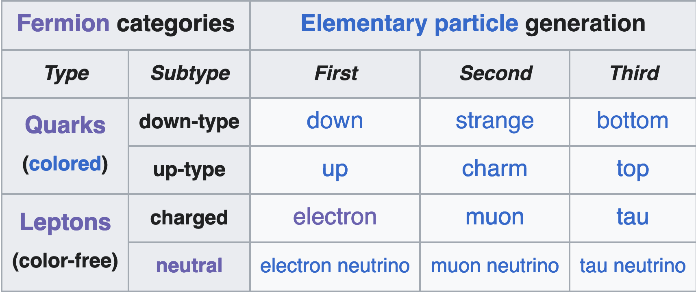

# Standard Model

## Quarks

First generation lightest, stablest. Second generation heavier, more unstable, third generation heaviest, most unstable. 

- Quarks come in three 'color charges', and will only mix such that the end particle is colorless. Color is also known as the **strong nuclear charge**. 
	- Red + green + blue = colorless (quarks)
	- Anti-red + anti-green + anti-blue = colorless (antiquarks)
	- Gluons have both a +1 and -1 color charge

**Quarks**

| Flavor | Mass | Electric charge |
| ------ | ---- | --------------- |
| u (up) |      |                 |
