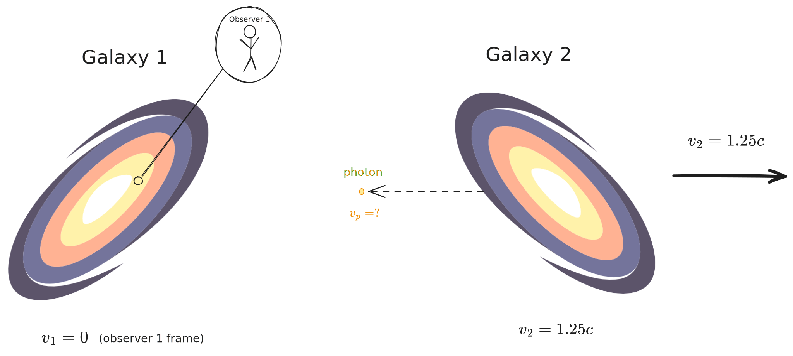

# Special Relativity

> This is my set of notes compiled from a few sources: [Spacetime Physics 2e](https://www.eftaylor.com/spacetimephysics/) (Taylor and Wheeler), [General Relativity Ch. 1](https://phys.libretexts.org/Courses/Skidmore_College/Introduction_to_General_Relativity/01%3A_Special_Relativity)  by Evan Halstead and information from lecture.

---

Newtonian mechanics (or classical mechanics) assumes that events, lengths and time intervals are observer-independent.

This changed with Albert Einstein's utterly (in my opinion) wild postulate, which formed the basis for the theory of relativity:

> The speed of light $c$ with respect to any inertial frame of reference is *constant* and is *independent* of the motion of the light source.

Say we have a universe containing two galaxies, one at rest relative to some internal observer, the other moving away from the observer at $1.25c$. 

Say a photon is emitted from galaxy 2 toward galaxy 1. Einstein's postulate claims $c$ is constant regardless of the motion of the sources - what's the velocity $v_p$ of the photon?

- In Newtonian mechanics,
$$
v_p = v_2 - c = 0.25c
$$
- In special relativity, regardless of the motion of the galaxy,
	$$
	v_p = c
	$$
	Which is a very curious result. Instead of changing speeds, the *wavelength* of the photon changes to compensate for it. Further, other things alter - we start having to deal with length and time contraction, and 

Things get a bit more interesting once we consider other frames of motion; what happens if galaxy 2 was moving in the same direction *above* galaxy 1, for instance? 