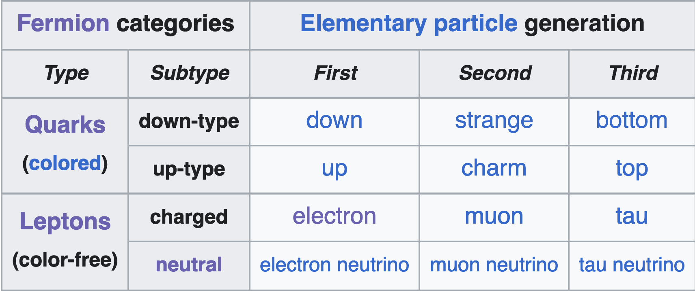
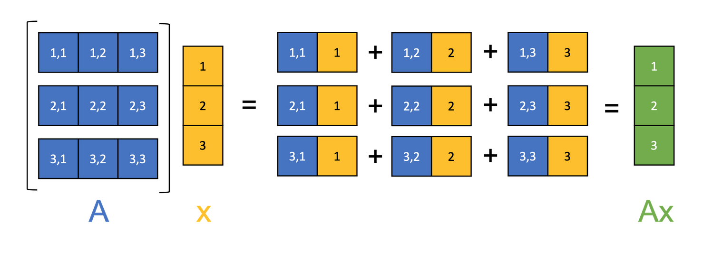

# Useful Equations and Links

- [Relativistic units](http://physicspages.com/pdf/Relativity/Relativistic%20units.pdf)
- [Special relativity (Skidmore text)](https://phys.libretexts.org/Courses/Skidmore_College/Introduction_to_General_Relativity/01%3A_Special_Relativity)
- [PHYS226 - Sp2015](https://courses.washington.edu/partsym/15Spr/)

# Table of particles

Simple (basic) particles include fermions (leptons, quarks) and bosons. Composite particles include mesons, baryons and strange quarks. 

## Simple particles

Wikipedia's simple particle set

**Fermions**

| Category    | Flavor                     | Mass (MeV)         | Spin $(\hbar)$ | Charge (e) | Antiparticle    | Notes                 |
| ----------- | -------------------------- | ------------------ | -------------- | ---------- | --------------- | --------------------- |
| **Leptons** | $e$                        | $0.511$            | $\frac{1}{2}$  | $-1$       | $e^+$, positron |                       |
|             | $\mu$                      | $105.7$            |                | $-1$       | antimuon        | unstable              |
|             | $\tau$                     | 1.78 GeV           |                | $-1$       | antitauon       | unstable              |
| (neutrinos) | $\nu_e, \nu_\mu, \nu_\tau$ | $1.2\times10^{-7}$ | $\frac{1}{2}$  | 0          | antineutrino    | flavor oscillation    |
| **Quarks**  | up $u$                     | $2.16$             | $\frac{1}{2}$  | $2/3$      | y               | Gen 1                 |
|             | charm $c$                  | 1.27 GeV           | $\frac{1}{2}$  | $2/3$      | y               | Gen 2                 |
|             | top $t$                    | 172.5 GeV          | $\frac{1}{2}$  | $2/3$      | y               | Gen 3                 |
|             | down $d$                   | $4.7$              | $\frac{1}{2}$  | $-1/3$     | y               | Gen 1                 |
|             | strange $s$                | $93.5$             | $\frac{1}{2}$  | $-1/3$     | y               | strangeness -1, Gen 2 |
|             | bottom $b$                 | $4.183$            | $\frac{1}{2}$  | $-1/3$     | y               | Gen 3                 |

- Quarks build composite particles more than act independently
	- Operate via *strong force*
- Antiparticles have opposite charge
- Mass in terms of 
	$$
	m = \text{MeV}/c^2
	$$

**Table of quarks**

**Bosons**

| Type                   | Mass    | Spin    | Charge              | Force carrier                         | Notes                                     | Notes on carrier                                                                           |
| ---------------------- | ------- | ------- | ------------------- | ------------------------------------- | ----------------------------------------- | ------------------------------------------------------------------------------------------ |
| $\gamma$ (photon)      | 0       | $\pm 1$ | 0                   | Electromagnetic (interacts w/ charge) | Massless, only $S_\gamma\pm1$ can't be 0. |                                                                                            |
| $g$ (gluon)            | 0       | $\pm 1$ | 0                   | Strong force                          | Ditto above                               | Strong charge is a complex 3-vector $SU(3)$, each component "color charge" red/blue/green. |
| $W^+,\;W^-,\;Z$ bosons | 100 GeV | $1$     | W: $\pm1$ Z: $0$ | Weak force                            |                                           |                                                                                            |
| Graviton               |         | $2$     |                     | Gravity (relativistic energy)         | Not found yet                             |                                                                                            |
| Higgs                  | 125 GeV |         |                     | Higgs field                           |                                           | Particle mass is charge, insignificant compared to others.                                 |
- These are the force carriers which cover fundamental forces.
- Photons and gluons are their own antiparticles. 

**Conservations**
- Energy, momentum, and angular momentum are all conserved
	- Spin on right can be different by integer 1s, but *not* by $1/2$. 
- Total electric charge
- Lepton number (number of leptons + antileptons)
	$$L = n_l-n_{-l}$$
- Lepton flavor (electron-ness, muon-ness, tau-ness conserved, except for neutrinos)
	- Opposite neutrino if creation, same neutrino if decay.
	- Whenever neutrinos are produced, weak force
	- Weak force ignores this idea
- Baryon number (quarks + antiquarks in composite particles)
	$$B = \frac{1}{3}(n_q-n_{\bar{q}})$$
- Quark flavor (conservation of quark type)
	- "Similarly, the only way for the strong or electromagnetic to get rid of a strange quark is to annihilate it with an anti-strange quark"
	- Violated by weak force
# Complex particles

**Baryons**: 3x quarks, $B=+1$
**Mesons**: 1 quark, 1 antiquark, $B=0$
**Antibaryons**: 3x antiquarks, $B=-1$

- Leptons have baryon number of zero (not composed of quarks)
- Same with bosons

# Which interaction?

- Short lifetimes ($10^{-23}$), only hadrons and composite particles $\rightarrow$ likely **strong force**. 
	- Flavor conserved.
- Medium lifetimes $(10^{-17})$, photons involved, likely **electromagnetic**. 
	- Flavor conserved.
- Long lifetimes $(10^{-8})$, results include neutrinos and leptons, likely **weak force**
	- Flavor violation allowed.

# Group theory

> In [mathematics](https://en.wikipedia.org/wiki/Mathematics "Mathematics"), a **group** is a [set](https://en.wikipedia.org/wiki/Set_\(mathematics\) "Set (mathematics)") with an [operation](https://en.wikipedia.org/wiki/Binary_operation "Binary operation") that combines any two elements of the set to produce a third element within the same set and the following conditions must hold.

- $GL(n)$: general linear group, all invertible $n\times n$ matrices
- $U(n)$: unitary group, all matrices such that $UU^\dagger = 1$
- $SU(n)$: belong to $U(n)$ and have $\det=1$
- $O(n)$: belong to $U(n)$, *only* made with real numbers
- $SO(n)$: belong to $O(n)$ *and* have unit determinant

# Misc

Matrix-vector mult:

Commutator of two operators is 
$$[\hat{A}\hat{B}] = AB-BA$$
- If zero, share same eigenvalues

$$\beta = \frac{v}{c}\qquad \gamma = \frac{1}{\sqrt{1-\beta^2}}$$
$$L= \frac{L_0}{\gamma}\qquad \Delta t' = \gamma \Delta t$$
> $L_0$ is the "rest length", $\Delta t$ is the "rest time". 

## Finding eigenstuff

Eigenvalues:
$$\det|A-\lambda I| = 0$$

Eigenvectors:
$$A\ket{\lambda} = \lambda\ket{\lambda}$$
> $\lambda$ eigenvalue, $\ket{\lambda}$ corresponding eigenvector

## Quantum stuff

$j$ is the spin (angular momentum) quantum number, $m$ is the spin *component* quantum number. 
$$\ket{\frac{1}{2},\frac{1}{2}} = \ket{+}$$
$$\ket{\frac{1}{2},-\frac{1}{2}} = \ket{-}$$
## Operator

$$J^2\ket{jm} = j(j+1)\ket{jm}$$
$$J_3\ket{jm} = m\ket{jm}$$
For example:
$$S_z\ket{jm}=m\hbar\ket{jm}$$
