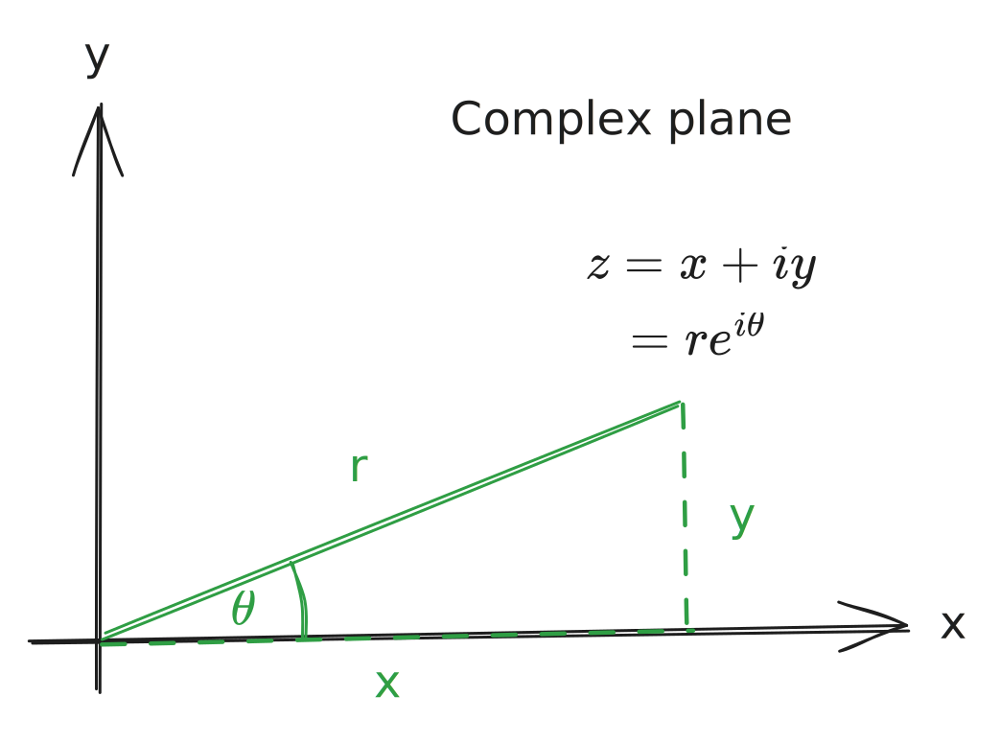

# Chapter 14 - Functions of Complex Variables

> Reference "*Mathematical Methods in the Physical Sciences*" 3e by Mary L. Boas.

---

We can represent a complex function (those including $i=\sqrt{-1}$) by $z$:
$$
\begin{align}
z &= x+iy
\end{align}
$$
Or, alternatively, with $\theta=\arctan(y/x)$ and $r=\sqrt{x^2+y^2}$:
$$
z \equiv re^{i\theta}
$$

**Complex functions** are those that are a function of $z$:
$$
f(z) = f(x+iy) = u(x,y) + iv(x,y)
$$
and are composed of their *real* and *imaginary* parts, represented by $u$ and $v$:
$$
\begin{align}
	\text{Re: }& u(x,y)\\
	\text{Im: }& v(x,y)
\end{align}
$$
> **Note**: $f(z)$ is customarily single-valued (one unique value per $z$). To handle functions that aren't single-valued ($\ln(z),\;\arctan(z)$), define a range such that $\theta$ or $x$ or $y$ are permitted. 

# Analytic Functions

A function $f(z)$ is **analytic** in a region of the complex plane if it has a *unique derivative* at every point of the region. 

> Similarly, the statement "$f(z)$ is analytic at some point $z=a$" means there's a unique derivative in some small circle around $z=a$. 

For some analytic function $f(z)$, the derivative is defined as
$$
f'(z) = \frac{df}{dz} = \lim_{\Delta z\rightarrow 0} \frac{\Delta f}{\Delta z} = \lim_{\Delta z \rightarrow 0} \frac{f(z+\Delta z)-f(z)}{\Delta z}
$$
where $\Delta z = \Delta x + i\Delta y$. Note also some definitions:

- A **regular point** of $f(z)$ is a point at which $f(z)$ is analytic.
- A **singular point** / **singularity** of $f(z)$ is a point at which $f(z)$ is not analytic. 
	- This is an *isolated* singular point if analytic everywhere else in a small circle around $f(z)$. 

---

**Ex.** derivative of an *analytic* function: $\frac{d}{dz}z^2$.
$$
\begin{align}
	\frac{d}{dz}(z^2) &= \lim_{\Delta z \rightarrow 0} \frac{(z + \Delta z)^2 - z^2}{\Delta z}\\
	&= \lim_{\Delta z \rightarrow 0} \frac{z^2+2z\Delta z + (\Delta z)^2 - z^2}{\Delta z}\\
	&= \lim_{\Delta z \rightarrow 0} (2z+\Delta z)\\
	&= 2z
\end{align}
$$

---

**Ex.** derivative of a *non*-analytic function: 
$$\frac{d}{dz}|z|^2 = \sqrt{z}^2 = \sqrt{x^2+y^2}$$
Using our limit idea above,
$$
\begin{align}
	\frac{d}{dz}(z^2) &= \lim_{\Delta z \rightarrow 0} \frac{|z+\Delta z^2| - |z|^2}{\Delta z}
\end{align}
$$
the *numerator* is always real (abs. values always real), but the denominator has different values depending on the approach. It's neither always real nor purely imaginary.

Thus, $f(z) = |z|^2$ is *not* analytic. 

---

Some relevant theorems about analytic functions:

> **Theorem I**: if $f(z)=u(x,y)+iv(x,y)$ is analytic in a region, then in the region
> $$ \frac{\partial u}{\partial x} = \frac{\partial v}{\partial y}\qquad \frac{\partial v}{\partial x} = -\frac{\partial u}{\partial y} $$
> these are the *Cauchy-Riemann conditions*. 

> **Theorem II**: if $u(x,y)$ and $v(x,y)$ (and their partial derivatives w.r.t. $x$ and $y$) are both:
> 1. Continuous.
> 2. Satisfy the Cauchy-Riemann conditions.
> 
> Then $f(z)$ is analytic at all points in the region (though not necessarily the boundary). 

> **Theorem III**: If $f(z)$ analytic in a region, then it has derivatives of *all orders* at points inside the region, and can be expanded in a Taylor series around any point $z=z_0$ inside the region.
>
> The power series converges *inside* the circle around $z_0$ which has a radius until the nearest singular point. 

> **Theorem IV**: If $f(z) = u+iv$ is analytic in a region, then $u$ and $v$ satisfy Laplace's equation in the region (i.e. $u$ and $v$ are harmonic functions).
>
> Also, if $u$ or $v$ satisfy Laplace's equation in a simply-connected region, they are respectfully the real or imaginary parts of an analytic function $f(z)$. 
>
> **Note**: this means we can find solutions of Laplace's equation just by taking the real or imaginary parts of an analytic function of $z$. 

## Contour Integrals

Some additional theorems of analytic functions involve contour integrals - or path integrals in the complex plane. 

> **Theorem V (Cauchy's theorem)**: If $C$ is some closed, smooth curve (corners allowed) in the complex plane, and $f(z)$ is analytic on and inside $C$, then 
> $$ \oint_\text{around $C$} f(z)\;dz = 0$$
> **Note**: a finite number of corners are allowed.

> **Theorem VI (Cauchy integrals)**: if $f(z)$ is analytic on and inside some closed curve $C$, then $f(z=a)$ inside $C$ is given by the path integral along $C$ below:
> $$ f(a) = \frac{1}{2\pi i} \oint_C \frac{f(z)}{z-a}\;dz $$
> If $f(z)$ is given on the boundary of a region ($C$), then this integral gives the value of $f(z=a)$ at any point $a$ within $C$. 

## Laurent Series

Laurent series are able to represent complex functions $f(z)$ as power series, which include terms of negative degrees.

> **Theorem VII (Laurent's theorem)**: Let $C_1$ and $C_2$ be two circles centered at $z_0$, and $f(z)$ analytic in the region $R$ between the circles. $f(z)$ can be expanded as
> $$
 f(z) = a_0 + a_1(z-z_0) + a_2(z-z_0)^2 + \cdots + \frac{b_1}{z - z_0} + \frac{b_2}{(z-z_0)^2} + \cdots
$$
 convergent in $R$. The $b_n$ terms are called the *principal part*. 

Some properties of $b_n$:

1. If all $b_n=0$, $f(z)$ is analytic at $z=z_0$ and $z_0$ is a *regular point* (see [Analytic Functions](chapter14.md#Analytic%20Functions)).
2. If $b_n\neq 0$ but all terms after $b_{n+m}=0$, $f(z)$ has a "pole of order" $n$ at $z=z_0$. If $n=1$ (i.e. $b_1\neq 0$, $b_{n>1}=0$), $f(z)$ has a "simple pole". 
3. If all $b_n\neq 0$, $f(z)$ has an "essential singularity" at $z=z_0$. 
4. The coefficient $b_1$ is the "residue" of $f(z)$ at $z=z_0$. 

# Residue Theorem