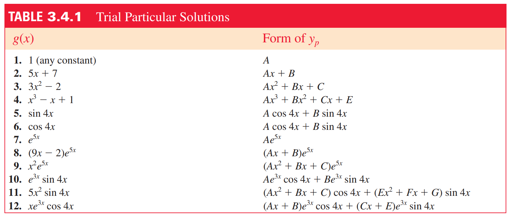
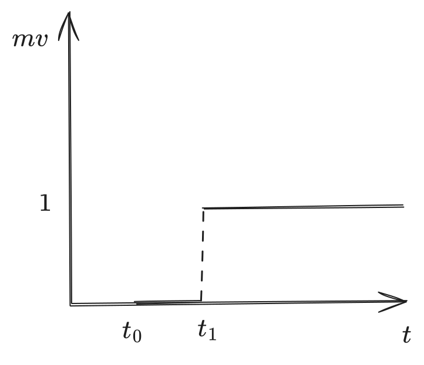

# Chapter 8 - Ordinary Differential Equations

> Reference "*Mathematical Methods in the Physical Sciences*" 3e by Mary L. Boas.

---

**Differential equations** are equations that contain both a function and it's derivative.
$$ m\frac{d^2r}{dt^2} = -kr$$
**Partial differential equations** contain partial derivatives:
$$ x\frac{\partial y}{\partial x} + z\frac{\partial y}{\partial z} = y $$
If there are no partial derivatives, it's an **ordinary differential equation**. Some properties:
- *Order* is the highest derivative in the equation (i.e. $y''(x)\equiv \frac{d^2y}{dx^2}$ is second-order). 
- *Linear* equations will take the form
	$$ a_0y + a_1y' + a_2y'' + \cdots = b $$
	where $a_n$ and $b$ are *constants* or *functions* of the independent variable ($x$), but not of the dependent variable ($y$). $y'^2$ is nonlinear. 
- *Solutions* usually mean to solve for the dependent variable: i.e. $y(x)$.

> A linear differential equation of order $n$ will have a solution (the **general solution**) containing $n$ independent constants $a_n$, from which *all* solutions of the diffeq. can be found by changing the values of the independent constants $a_n$. 

The values of these constants can be found using *boundary conditions* or *initial conditions* (at $t=0$). 

# Separable Equations

Separable differential equations are those for which we can *separate* the variables, putting the dependent variable on one side, independent on the other:
$$
\begin{align}
	\frac{dy}{dx} &= g(y)f(x)\\
	\frac{dy}{g(y)} &= f(x)dx\\
	\int \frac{1}{g(y)}dy &= \int f(x) dx
\end{align}
$$
The general solution will often have some form
$$ y = Cf(x)$$
which represents a *family of solutions* (by varying $C$). A particular solution is therefore some single value of $C$. 

## Nonlinear equations

Separable equations may also be nonlinear, such as 
$$
y' = \sqrt{1-y^2}
$$
Solving it as a separable equation yields
$$
y = \sin(x+a)
$$
which allows for *only* non-negative solutions for $y$, and is not valid for $y=\pm 1$ ($\int \frac{1}{\sqrt{1-y^2}}\;dy$ for $y=\pm 1$ is undefined). 

# First-Order Equations & Int. Factor

**Linear** first-order ODEs take the form
$$ y' + Py = Q $$
and are most easily solved via an **integrating factor**.

1. Let $I=\int P\; dx$
2. Write the equation as
	$$
		ye^I = \int Qe^I\;dx+C
	$$
3. Integrate and solve for $y$.

### Nonlinear First-Order Equations

There are other methods to solve *specific* (but not all) first order equations. 

>**Bernoulli equation**: for equations of the form
$$
y' + Py = Qy^n
$$
1. Let:
	$$ z = y^{1-n}\qquad z' = (1-n)y^{-n}y' $$
2. Multiply both sides by $(1-n)y^{-n}$:
	$$(1-n)y^{-n}y' + (1-n)Py^{1-n} = (1-n)Q$$
3. Substitute in $z$ and $z'$:
	$$ z' + (1-n)Pz = (1-n)Q $$
4. Solve for $z$ with integrating factor.
5. Substitute (again) $z=y^{1-n}$ and find $y$. 

---

> **Exact equation**: *exact differentials* (or "perfect" differentials) of some function $F(x,y)$ (even an unknown one) have the property
 $$ \frac{\partial P}{\partial y} = \frac{\partial Q}{\partial x} $$
> Integrals over them are path-independent.

1. Let some function $F(x,y)$ exist, such that
	$$ P=\frac{\partial F}{\partial x}\qquad Q = \frac{\partial F}{\partial y}, \qquad Pdx + Qdy = dF $$
2. By the definition of exact differentials, $Pdx + Qdy = dF = 0$, and $F(x,y) = \text{const}.$

**TODO**: Review chapter 6, section 8 for more information on finding $F$.

---

> **Homogenous equation**: a homogenous function of $x$ and $y$ of degree $n$ is one that can be written
$$ x^n\;f(y/x) $$
i.e. $x^3-xy^2 = x^3[1-(y/x)^2]$ is homogenous of degree 3. 

The equation
$$
P(x,y) + Q(x,y)dy = 0
$$
where $P$ and $Q$ are same-degree homogenous functions, is also homogenous. Dividing them cancels the $x^n$ terms as in the definition.  

1. Write
	$$ y' = \frac{dy}{dx} = -\frac{P(x,y)}{Q(x,y)} = f\left(\frac{y}{x}\right) $$
2. Make the change of variable $v=y/x$, such that
	$$ y = xv $$
3. Solve the resulting separable equation in $x$ and $v$.
4. Reverse-substitute $v$ to solve for $y$. 

# Constant-Coefficient SOLDEs (Homogenous)

Second-order linear differential equations (or SOLDEs) with constant coefficients tend to look like
$$
a_2y''+ a_1y'+ a_0y= f(x)
$$
and are **homogenous** if $f(x)=0$. They are solved using the differential operator $D^n=\frac{d^n}{dx^{n}}$, such that
$$
a_2y''+ a_1y'+ a_0y \equiv y(a_2D^2+a_1D+a_0) = 0
$$
Solve for the roots $r=D$ as a second-order polynomial. 
$$
r = \frac{-b\pm \sqrt{b^2 - 4(a)(a)}}{2a}
$$
Solutions vary based on multiplicity and complexity. 

>1. If the roots are **real** and **distinct** ($r = (r_1, r_2)$):
	$$ y = c_1e^{r_1t}+c_2e^{r_2t} $$
>2. If the roots are **real** and have multiplicity of 2 (i.e. $r_1=r_2$):
	$$ y = c_1e^{rt}+c_2te^{rt} $$
>3. If the roots are **imaginary** ($r = \alpha \pm i\beta$):
$$ 
\begin{align}
	y &= e^{\alpha t}(c_1e^{i\beta t} + c_2e^{-i\beta t})\\
	&= e^{\alpha t}(c_1\sin(\beta t) + c_2 \cos(\beta t))\\
	&= ce^{\alpha t}\sin(\beta t + \gamma)
\end{align}
$$
(I tend to use the second solution (5) - it's easiest and simplest). 

### Oscillators

Hooke's law + Newton's 2nd say that, for some simple harmonic oscillator,
$$
m\frac{d^2y}{dt^2} = -ky-ly'\qquad
$$
where $-k$ is the spring constant and $l$ is the "retarding force". 

Let $\omega = \frac{k}{m}$ and $2b = \frac{l}{m}$. This turns into
$$
\frac{d^2y}{dt^2} + 2b\frac{dy}{dt} + \omega^2y = 0
$$
The roots to the differential operator are $-b\pm \sqrt{b^2-\omega^2}$, with three scenarios for answers:
$$
\begin{cases}
	\text{overdamped} \qquad& b^2>\omega^2\\
	\text{critically damped}\qquad& b^2=\omega^2\\
	\text{underdamped}\qquad& b^2 < \omega^2
\end{cases}
$$
> **Overdamped**: $\sqrt{b^2-\omega^2}$ is *real* and has *two distinct* solutions, so
$$
y = Ae^{-(b+\sqrt{b^2-\omega^2}) t} + Be^{-(b-\sqrt{b^2-\omega^2})t}
$$

> **Critically damped**: $b = \omega$, so *real* roots with *one* distinct solution.
$$
y = (A+Bt)e^{-bt}
$$

> **Underdamped**: $b^2 < \omega^2$, so imaginary roots
$$ y = e^{-bt}(A\sin(\beta t) + B\cos(\beta t)) $$

# Method of Undetermined Coefficients

Non-homogenous constant-coefficient second-order linear differential equations 
$$
a_2y''+ a_1y'+ a_0y= f(x)
$$
The general solution to this equation is the sum of the homogenous and particular solutions:
$$
y = y_h + y_p
$$
The particular solution can be found primarily through the **method of undetermined coefficients**. 

1. Let $y_p$ take the form of one of the solutions below, based on what $g(x)$ looks like. 
2. Calculate $y_p'$ and $y_p''$.
3. Substitute in the guesses into the diffeq, then solve for the constants. 

>The textbook provides some additional solution options for equations of the form $(D-a)(D-b)y = e^{cx}P_n(x)$, where $P_n(x)$ is some polynomial of degree $n$. 
> $$
y_p = \begin{cases}
e^{cx}Q_n(x)\qquad & \text{if $c\neq a|b$}\\
xe^{cx}Q_n(x) \qquad & \text{if $c=a|b$ and $a\neq b$}\\
x^2e^{cx}Q_n(x) \qquad & \text{if $c=a=b$}
\end{cases}
$$

**Note**: if there are *several* terms on the right-hand-size, we can use *superposition* with each term to find $y_p=y_{p1}+y_{p2}+y_{p3}$.

# Other Second-Order Equations

Some other special second-order equations with methods to solve them are shown below.

**(a). Missing dependent variable** If $y$ is missing from the equation, substitute $y'=p$ and $y''=p'$. Solve for $p(x)$, then reverse-substitute $p=y'$ and solve the first order equation for $y$. 

**(b). Missing independent variable** If $x$ is missing, let 
$$y'=p,\quad y''=\frac{dp}{dx}=\frac{dp}{dy}\frac{dy}{dx}=p\frac{dp}{dy}$$
**(c).** $y''+f(y)=0$. Multiply by $y'$, then integrate to get
$$
\frac{1}{2}y'^2=\int f(y)\;dy=C
$$
**(d). Cauchy/Euler equations** if equation has the form
$$
a_2x^2\frac{d^2y}{dx^2}+a_1x\frac{dy}{dx}+a_0y = f(x)
$$
can be reduced to SOLDE C.C. by substituting $x=e^z$ to get
$$
a_2\frac{d^2y}{dz^2} + (a_1-a_2)\frac{dy}{dz}+a_0y = f(e^z)
$$
**(e). Reduction of order** to find a second solution of 
$$
y''+f(x)y' + g(x)y = 0
$$
given *one* solution $u(x)$, substitute
$$
y=u(x)v(x)
$$
into the differential equation and solve for $v(x)$.

# Laplace Transforms

Laplace transforms are way to solve differential equations - for some function $f(t)$,

$$
L(f) = \int_0^\infty f(t)e^{-pt}dt
$$
For example, if $f(t)=1$, $L(f) = \int_0^\infty 1*e^{-pt}dt = \frac{1}{p}$. This can be converted back into the original function by referencing a *Laplace transform table*.

> Paul's Math Notes (of course) has a [wonderful table here](https://tutorial.math.lamar.edu/pdf/laplace_table.pdf). 

To use it,

1. Apply the Laplace transform to all terms in the differential equation (both left and right).
2. Plug in initial conditions.
3. Group $p$ (or $s$) terms and try to isolate terms on each side (all $p$ terms on one side, $Y=L(y)$ terms on the other).
4. Use [table](https://tutorial.math.lamar.edu/pdf/laplace_table.pdf) to find inverse Laplace transform of $L(y)$.
	- If there *isn't* an exact equivalent on the table, try using partial fraction decomposition or other techniques to separate into individual terms, and sum them.

$$
\begin{align*}
y:&\qquad L(y)\\
y':&\qquad L(y') = pL(y) - y_0\\
y'':&\qquad L(y'') = p^2L(y) - y_0 - y_0'
\end{align*}
$$
> For higher orders of differential equations, plug $y^{(n)}$ into $L(f)$ and use integration by parts. 
# Dirac Delta Functions

The **Dirac delta function** lets us model functions which change rapidly over a very short ($dt\approx 0$) period of time, such as *unit impulses* (a hammer strike, or the impact of an air particle). 

$d(mv)/dt$ at $t=t_1$ is mathematically infinite - not very useful at all. Instead, we can represent this increase by a **delta function**:
$$
\int_a^b f(t)\delta (t-t_0)dt = \begin{cases}
	\;f(t_0), \qquad &a < t < b\\
	\;0,\qquad &\text{otherwise}
\end{cases}
$$
This is a *generalized function*, with the following properties:

- Derivatives of the $\delta$ function turn into derivatives of $f(t)$:
$$
\int_{-\infty}^\infty f(t)\delta^{(n)} (x-a)\;dx  = (-1)^nf^{(n)}(a)
$$
- $\delta$ is an *operator*. Let $u'=\delta$.
$$
\begin{align}
u'(x-a) &= \delta(x-a)\\
u(x-a) &= \begin{cases}
	\;1, \qquad x>a\\
	\;0, \qquad x<a
\end{cases}
\end{align}
$$

Some other properties:
$$
\begin{align*}
	\delta(-x) &= \delta(x)\\
	\delta'(-x) &= -\delta'(x)\\
	\delta(ax) &= \frac{1}{|a|}\delta(x)\\
	\delta[(x-a)(x-b)] &= \frac{1}{|a-b|}[\delta(x-a)+\delta(x-b)]\\
	\delta(f(x)) &= \sum_i\frac{1}{|f'(x_i)|}\delta(x-x_i)\qquad \text{if $f(x_i)=0$ and $f'(x_i)\neq 0$}
\end{align*}
$$
$\delta$ can also work in two and three dimensions, and vectors:

$$
\begin{align*}
	&\int\int f(x,y)\delta(x-x_0)\delta(y-y_0)\;dxdy = f(x_0,y_0)\\
	&\int\int\int f(r,\theta,\phi)\delta(\vec{r}-\vec{r_0})\;d\tau = f(\vec{r_0}) = f(r_0,\theta_0,\phi_0)
\end{align*}
$$
Finally, in three dimensions we have two useful operator equations:

$$
\begin{align*}
	\vec{\nabla}\cdot \frac{\vec{e}_r}{r^2} = 4\pi \delta (\vec{r})\\
	\nabla^2\frac{1}{r} = -4\pi\delta(\vec{r})
\end{align*}
$$

# Green's Function

> I'm not confident in my knowledge of these - Boas 8.12 has more info on them, but the presented examples seem surprisingly complicated.
>
> As far as I can tell, just as for $A\vec{x}=\vec{b}$ there is some $A^{-1}$ (for invertible matrices) such that $\vec{x}=A^{-1}\vec{b}$, $G(t,t')$ is a similar transform for differential equations such that $y(t) = G(t,t')f(t)$ - see [this Stack Exchange post](https://math.stackexchange.com/questions/1735746/what-is-the-idea-behind-greens-function-what-does-it-do). 

The [Wikipedia page on Green's function](https://en.wikipedia.org/wiki/Green%27s_function) says that, if $L$ is some differential operator, then

- $G$ is the solution of the equation $LG = \delta$.
- The solution of the IVP $Ly=f$ is the convolution $(G*f)$.

From Boas: for some differential equation $y'' + \omega^2y = f(t)$, we can represent $f(t)$ as a sum of *unit impulses*:
$$
f(t) = \int_0^\infty f(t')\delta(t'-t)\;dt'
$$
For instance, if $f(t)$ models the air resistance on some oscillator, a unit impulse might be a single air particle bouncing off the oscillating object. 

The differential equation in terms of unit impulses can be written with $G$ being a differential operator (like $D$ or $L$):
$$
	\frac{d^2}{dt^2} G(t,t') + \omega^2G(t,t') = \delta(t'-t)
$$
and the solution is
$$
y(t) = \int_0^\infty G(t,t')f(t')\;dt'
$$

> The [example on the Wikipedia page](https://en.wikipedia.org/wiki/Green's_function#Example) for Green's function provides (in my belief) a much better explanation than Boas does. 