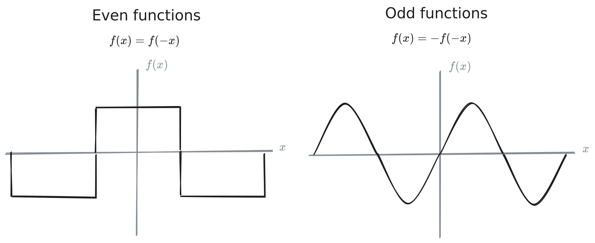

# Fourier Transforms

> Chapter 7.12 in "*Mathematical Methods in the Physical Sciences*" 3e by Mary L. Boas.

These are so cool. Go check out [the Falstad Fourier](https://www.falstad.com/fourier/) applet. 

---

**Fourier series** are useful for visualizing *periodic* functions as a sum of discrete coefficients and sines/cosines. 
$$
\begin{align}
f(x) &= \sum_{-\infty}^{\infty} c_n e^{in\pi x/l}\\
c_n &= \frac{1}{2l} \int_{-l}^l f(x)e^{-in\pi x/l}\;dx
\end{align}
$$

Visually, this GIF from the [Wikipedia article on Fourier series](https://en.wikipedia.org/wiki/Fourier_series) is delightful.

**Fourier integrals** on the other hand are useful for representing both nonperiodic *and* periodic functions in terms of sines and cosines. 

Let $f(x)$ be the function and $g(\alpha)$ its Fourier coefficients. The associated **Fourier transforms** are
$$
f(x) = \int_{-\infty}^{\infty} g(\alpha) e^{i\alpha x}\;d\alpha
$$
$$
g(\alpha) = \frac{1}{2\pi} \int_{-\infty}^\infty f(x)e^{-i\alpha x}\;dx
$$
> Though these are in terms of $e^{-i\alpha x}$, we can convert them using [Euler's formula](https://en.wikipedia.org/wiki/Euler%27s_formula):
> $$
e^{-i\alpha x} = \cos(\alpha x) - i\sin(\alpha x)
$$

To solve them,
1. Plug the original function $f(x)$ into the $g(\alpha)$ equation.
2. Solve for $g(\alpha)$.
3. Solve for the $f(x)$ Fourier transform. 

## Cosine and sine transforms

We can use cosine and sine transformations to represent *even* and *odd* functions respectively to simplify the calculation of Fourier integrals. 

> **Cosine Transform**: if $f(x)$ is an *even* function where $f(x)=f(-x)$,
> $$
\begin{align*}
f(x) &= \sqrt{\frac{2}{\pi}} \int_0^\infty g(\alpha) \cos\alpha x\;d\alpha\\
g(\alpha) &= \sqrt{\frac{2}{\pi}} \int_0^\infty f(x) \cos\alpha x\;dx
\end{align*}
$$

> **Sine Transform**: if $f(x)$ is an *odd* function where $f(x)=-f(-x)$, 
> $$
\begin{align*}
f(x) &= \sqrt{\frac{2}{\pi}} \int_0^\infty g(\alpha) \sin\alpha x\;d\alpha\\
g(\alpha) &= \sqrt{\frac{2}{\pi}} \int_0^\infty f(x) \sin\alpha x\;dx
\end{align*}
$$

