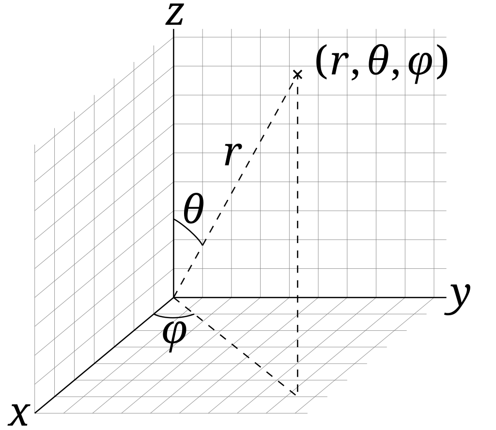
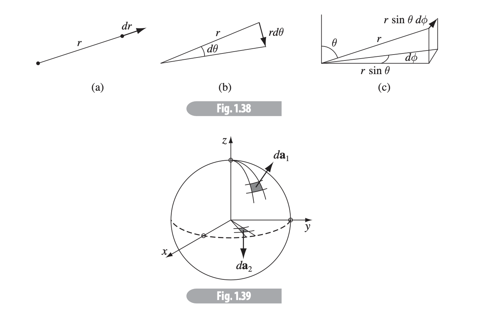
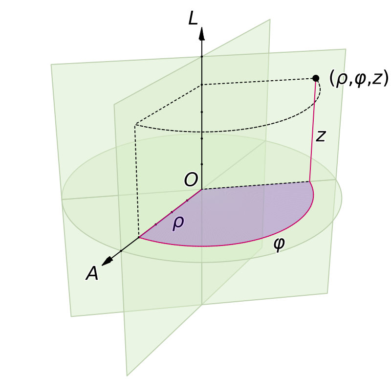
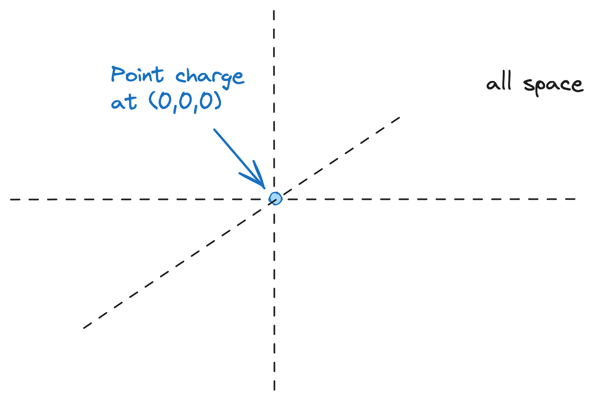

# Chapter 1 - Relevant Mathematics

> Reference "*Introduction to Electrodynamics*" by David Griffiths.

---

# Vectors

We start with a brief review of vector algebra - I'll skip most of it but keep the key things.

## Dot product

The **dot product** is a measure of how "parallel" two vectors are, maximized when parallel, minimized (0) when perpendicular.

$$
\begin{aligned}
	\vec{a}\cdot \vec{b} &= a_1b_1+a_2b_2+a_3b_3\\
	&= |\vec{a}||\vec{b}|\cos\theta
\end{aligned}
$$

It is *commutative* ($\vec{a}\cdot\vec{b} = \vec{b}\cdot \vec{a}$) and *distributive* ($\vec{a}\cdot(\vec{b}+\vec{c}) = \vec{a}\cdot \vec{b} + \vec{a}\cdot\vec{c}$). The result of the dot product is a *scalar*.

## Cross product

The **cross product** yields a third vector orthogonal to both $\vec{a}$ and $\vec{b}$, maximized in magnitude when $\vec{a}$ and $\vec{b}$ are *themselves* orthogonal to one another.

The cross product is distributive, but not exactly commutative - instead,
$$
(\vec{b}\times \vec{a}) = -(\vec{a}\times\vec{b})
$$
Some other properties:
- The result of the cross product is a *vector*, not a scalar. 
- The *magnitude* of the cross product is the area of the parallelogram generated by $\vec{a}$ and $\vec{b}$. 
- The cross product of a vector with itself is zero.

We can calculate a cross product like so:

$$
\begin{aligned}
	\vec{a}\times\vec{b} &= \left| \begin{matrix}
	\hat{x} & \hat{y} & \hat{z}\\
	a_1 & a_2 & a_3\\
	b_1 & b_2 & b_3
	\end{matrix}\right|\\
	&= |\vec{a}||\vec{b}|\sin\theta\;\hat{n}
\end{aligned}
$$
where $\hat{n}$ is the normal to the plane formed by $\vec{a}$ and $\vec{b}$. 

## Vector triple product

Triple products are combinations of cross and dot products.

1. **Scalar triple products**: the magnitude of this is the volume of the parallelepiped (3D parallelogram) generated by $\vec{a}$, $\vec{b}$ and $\vec{c}$. 
$$
\begin{aligned}
	\vec{a}\cdot(\vec{b}\times\vec{c}) &= \left| \begin{matrix}
	a_1 & a_2 & a_3\\
	b_1 & b_2 & b_3\\
	c_1 & c_2 & c_3
	\end{matrix}\right|\\
\end{aligned}
$$

2. **Vector triple products**: there's no easy geometric interpretation of this, but is useful to reduce complex cross product calculations. It can be memorized by the mnemonic **BAC-CAB**. 
$$
\vec{a}\times(\vec{b}\times\vec{c}) = \vec{b}(\vec{a}\cdot\vec{c}) - \vec{c}(\vec{a}\cdot\vec{b})
$$

## Spatial vectors

The **position vector** indicates the position of a point relative to the origin. 

In electrodynamics, usually we'll have *two* points: one for the source charge and one for the test charge. The vector $\vec{\mathcal{R}}$ from one to the other is the useful quantity then. 

# The Del Operator

Del ($\nabla$) is a **vector operator** that acts upon functions, and is defined as
$$
\nabla = \frac{d}{dx}\hat{x} + \frac{d}{dy}\hat{y} + \frac{d}{dz}\hat{z}
$$
$\nabla$ really only is meaningful when applied to functions, and has three (usual) ways of being applied:

1. To a *scalar function* ($\nabla f$) to get the **gradient** of that function.
2. To a *vector function* via the *dot product* ($\nabla \cdot \vec{a}$) to get that function's **divergence**.
3. To a *vector function* via the *cross product* ($\nabla \times \vec{a}$) to get that function's **curl**.

## Gradients

The **gradient** of some scalar function $f$ gives a vector result that will point in the direction of the max rate of increase of that function.

$$
\nabla f = \frac{df}{dx}\hat{x} + \frac{df}{dy}\hat{y} + \frac{df}{dz}\hat{z}
$$
and results in a *vector* with the derivative of the original function's units.

### Fundamental theorem for gradients

**Important**: The integral of a derivative (here, the gradient) is given by the value of the function at the boundaries $\vec{a}$ and $\vec{b}$.
$$
\int_{\vec{a}}^{\vec{b}} (\nabla T)\cdot d\vec{l} = T(\vec{b}) - T(\vec{a})
$$
## Divergence

The **divergence** of some vector function $\vec{a}$ represents how much the function "spreads out" or *diverges* from a given point.
$$
\nabla \cdot \vec{a} = \frac{da_x}{dx}+\frac{da_y}{dy} + \frac{da_z}{dz}
$$
and results in a *dimensionless scalar value* indicating the rate of divergence from a point.

### Green's theorem

Green's theorem is a special application of *Stoke's theorem* (see below). Geometrically, it relates the sources contained in some surface to the flux emitted by those sources around the boundary of a surface.
$$
\int_V (\nabla \cdot \vec{v}) \; d\tau = \oint_S \vec{v}\cdot d\vec{a}
$$
In the case of electrostatics, this might be the flux field generated by some charges in a volume to the total, superposition flux coming out of that entire region - turning one "field of charges" into a single charge.

> The integral of a **derivative** over some region will *always* be equal to the value of the function at the *boundary* ($P$) - in this case, the boundary term is an integral (a simple line may just have two endpoints, but a line bounding a volume forms a closed sufrface).
## Curl

The **curl** of some vector function $\vec{a}$ represents how much the function "swirls around" some given point. Positive curl is given by the right-hand rule (normally counterclockwise). 
$$
\nabla \times \vec{a} = \hat{x}\left(\frac{da_z}{dy} - \frac{da_y}{dz}\right) + \hat{y}\left(\frac{da_x}{dz} - \frac{da_z}{dx}\right) + \hat{z}\left(\frac{da_y}{dx} - \frac{da_x}{dy}\right)
$$
### Stokes' Theorem 

The integral of the curl over some surface is the "total amount of swirl" on that surface - and mathematically can be distilled into just finding *how much the flow* is following the boundary of that surface.
$$
\int_S (\nabla \times \vec{v})\cdot d\vec{a} = \oint_P \vec{v}\cdot d\vec{l}
$$
This last quantity, $\oint_P \vec{v}\cdot d\vec{l}$ is sometimes called the "circulation" of some vector field $\vec{v}$.

---
## A Note on Del Squared ($\nabla^2$)

Enumerating over the ways we can apply $\nabla$ twice:

1. **Laplacian**: the cross product of $\nabla$ with the gradient of a function results in the Laplacian, such that
$$
\nabla \cdot (\nabla f) = \nabla^2f= \frac{d^2f}{dx^2} + \frac{d^2f}{dy^2} + \frac{d^2z}{dz^2}
$$
2. **Curl of gradient**: always zero. 
$$
\nabla \times (\nabla f) = 0
$$
3. **Gradient of divergence**: not a lot of physical applications, calculable though. 
$$
\nabla (\nabla\cdot \vec{a})
$$
4. **Divergence of curl**: always zero. 
$$
\nabla \cdot (\nabla \times \vec{v}) = 0
$$
5. **Curl of curl**: most easily defined as the acceleration of the swirl, like a hurricane speeding up.
$$
\nabla \times (\nabla \times \vec{a}) = \nabla(\nabla \cdot \vec{a}) - \nabla^2\vec{a}
$$
---

# Integrals

In electrodynamics, we have **line** (path) integrals, **surface** integrals (or *flux*) and **volume** integrals. 

## Line integrals

Iterate over infinitesimally small displacement vectors $d\vec{l}$.
$$
\int_a^b \vec{a}\cdot d\vec{l}
$$
If $a=b$, the line integral iterates over a closed loop and we can write
$$
\oint \vec{a}\cdot d\vec{l}
$$
> In elementary physics, a common example is work done by a force. 
> $$ W = \int \vec{F}\cdot d\vec{l}$$

While path taken normally matters (distance), there are some vectors where only *displacement* matters (for forces, these are called **conservative** forces, like gravity). 

Wikipedia has a [really cool animation](https://en.wikipedia.org/wiki/Line_integral) of line integrals:

## Surface integrals

Surface integrals iterate over infinitesimally small areas $d\vec{a}$, with norms perpendicular to the surface. 
$$
\int_{\mathcal{S}} \vec{v}\cdot d\vec{a}
$$
In this case, if the surface is closed (i.e. like a sphere, rather than a hill), then we can write it in closed loop form.
$$
\oint \vec{v}\cdot d\vec{a}
$$

Surface integrals are really useful for things like *flux* where something is moving through some area - i.e. imagine radio waves passing through a curved gas cloud or radiation falling "through" a planet.

## Volume integrals

Volume integrals integrate over infinitesimally small volumes $d\tau=dx\;dy\;dz$. 

$$
\int \vec{a}\;d\tau = \int (a_x\hat{x}+a_y\hat{y}+a_z\hat{z})d\tau
$$

If some function $f(x,y,z)$ represented density of a substance, then the volume integral over it would be total mass.

# Integration by Parts

Also known as the "inverse product rule". 
$$
\int u\; dv = uv-\int v\;du
$$

---
# Curvilinear Coordinates

Taking another look at spherical and cylindrical coordinates, as well as how to convert between them. 

## Spherical coordinates

Three terms:
- $r$: the *distance* from the origin (range 0 to $\infty$)
- $\theta$: the *polar angle* from the $z$-axis (range 0 to $\pi$)
- $\phi$: the *azimuthal angle* along the $xy$-axis (range 0 to $2\pi$)

$$
\begin{aligned}
x &= r\sin\theta\cos\phi\\
y &= r\sin\phi\sin\theta\\
z &= r\cos\theta
\end{aligned}
$$
Alternatively in terms of the unit vectors:

$$
\begin{align*}

\begin{bmatrix}

\hat{x} \\ \hat{y} \\ \hat{z}

\end{bmatrix}= \begin{bmatrix}

\sin\theta\cos\phi & \cos\theta\cos\phi & -\sin\theta\\

\sin\theta\sin\phi & \cos\theta\sin\phi & \cos\theta\\

\cos\theta & -\sin\phi & 0

\end{bmatrix} \begin{bmatrix}

\hat{r}\\

\hat{\theta}\\

\hat{\phi}

\end{bmatrix}

\end{align*}
$$
> The interesting thing about the matrix form is that it is *orthogonal* - according to the invertible matrix theorem, $Q^{-1}=Q^T$ for orthogonal matrices.

We can use this to solve for $\hat{r}$, $\hat{\theta}$ and $\hat{\phi}$ easily then by just taking the transpose of the above matrix. 

$$
\begin{align*}

\begin{bmatrix}

\hat{r}\\

\hat{\theta}\\

\hat{\phi}

\end{bmatrix} = \begin{bmatrix}

\sin\theta\cos\phi & \sin\theta\sin\phi & \cos\theta\\

\cos\theta\cos\phi & \cos\theta\sin\phi & -\sin\theta\\

-\sin\theta & \cos\phi & 0

\end{bmatrix}\begin{bmatrix}

\hat{x} \\ \hat{y} \\ \hat{z}

\end{bmatrix}

\end{align*}
$$
Our line element in spherical coordinates is

$$
d\vec{l} = dr\hat{r}+rd\theta \hat{\theta} + r\sin\theta d\phi \hat{\phi}
$$

In terms of triple integrals, the textbook has a good graphic to represent the three displacements $dl_r, dl_\theta, dl_\phi$.

And a infinitesimal volume element is the product of these three:

$$
d\tau = dl_rdl_\theta dl_\phi = r^2\sin\theta \;dr\;d\theta\;d\phi
$$
> $r$ has a possible range from 0 to $\infty$, $\theta$ from 0 to $\pi$ and $\phi$ from 0 to $2\pi$. 

> The textbook represents the spherical representations of the gradient, divergence, curl and Laplacian in eqs. 1.70-1.73.

## Cylindrical coordinates

Three terms:

- $s$: *distance* from $z$-axis
- $\phi$: *azimuthal angle* along $xy$-axis
- $z$: *height* along z-axis

$$
\begin{aligned}
	x &= s\cos\phi\\
	y &= s\sin\phi\\
	z &= z
\end{aligned}
$$
with unit vectors
$$
\begin{bmatrix}

\hat{x} \\ \hat{y} \\ \hat{z}

\end{bmatrix}= \begin{bmatrix}

\cos\phi & -\sin\phi & 0\\

\sin\phi & \cos\phi & 0\\

0 & 0 & 1

\end{bmatrix} \begin{bmatrix}

\hat{s} \\ \hat{\phi} \\ \hat{z}

\end{bmatrix} \qquad \begin{bmatrix}

\hat{s} \\ \hat{\phi} \\ \hat{z}

\end{bmatrix}= \begin{bmatrix}

\cos\phi & \sin\phi & 0\\

-\sin\phi & \cos\phi & 0\\

0 & 0 & 1

\end{bmatrix} \begin{bmatrix}

\hat{x}\\

\hat{y}\\

\hat{z}

\end{bmatrix}
$$

For triple integrals, the infinitesimal displacements are
$$
dl_s = ds,\qquad dl_\phi = sd\phi,\qquad dl_z = dz
$$
our volume element is
$$
d\tau = sds\;d\phi\;dz
$$
and line displacement is
$$
d\vec{l} = ds\hat{s} + sd\phi \hat{\phi} + dz\hat{z}
$$

---

# Dirac Delta Function

Imagine we have an infinite point mass at the origin, and it is the only thing in the universe.

The total mass of the universe must be just the mass of the point charge; but the point charge exists only at $(0,0,0)$, and is a *point charge* - it has no spatial dimension. If we were to integrate over the entire universe, we'd find we have just the mass of the point charge - and can mathematically represent that with the **Dirac delta function**. 

$$
\delta (x) = \begin{cases} 
0 & \text{if } x\neq 0 \\
\infty & \text{if } x=0 
\end{cases}

$$
and
$$
\int_{-\infty}^\infty \delta(x)\;dx = 1
$$
Therefore, if we have some continuous function $f(x)$ (could be a constant or a function, anything attached to $\delta(x)$).
$$
f(x)\delta(x) = \begin{cases}
0 &\text{if } x\neq 0\\
f(0) & \text{if }x = 0
\end{cases}
$$
which brings us to the neat and nice identity:
$$
\int_{-\infty}^\infty f(x)\delta(x-a)\;dx = f(a)
$$

## Dirac Delta in 2D, 3D

$$
\delta^3(\vec{r}) = \delta(x)\delta(y)\delta(z)
$$

And, unsurprisingly,
$$
\int_{\text{all space}} f(\vec{r})\delta^3(\vec{r}-\vec{a})\;d\tau = f(\vec{a})
$$

> **Note on $\mathcal{R}$:** with $\mathcal{R}=\vec{r}-\vec{r'}$ (the separation vector), 
> $$ \nabla \cdot \left( \frac{\mathcal{\vec{R}}}{\mathcal{R}^2} \right) = 4\pi\delta^3(\vec{\mathcal{R}}) $$
> and
> $$ \nabla^2 \frac{1}{\mathcal{R}} = -4\pi\delta^3(\vec{\mathcal{R}}) $$
> Reference the textbook equations 1.100-1.102 for derivation.