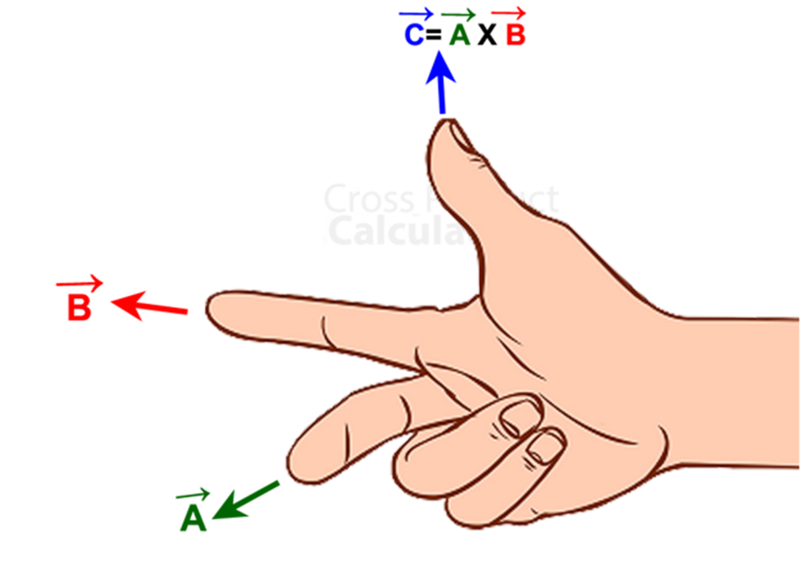
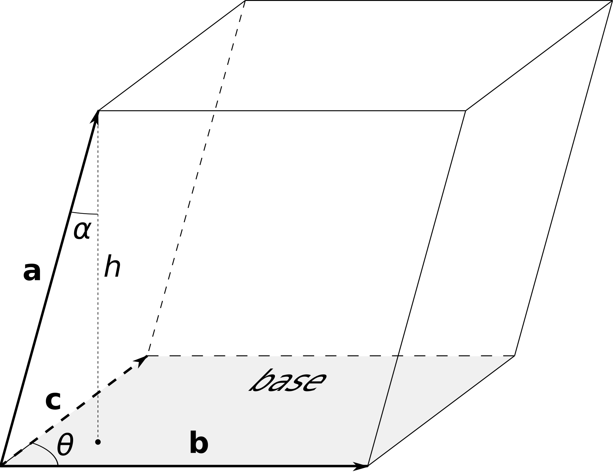
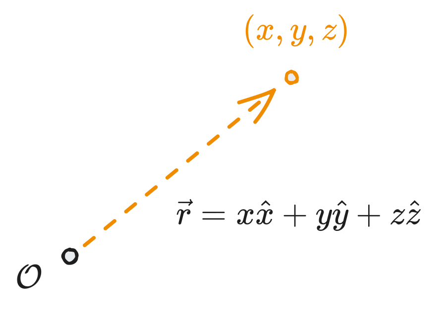
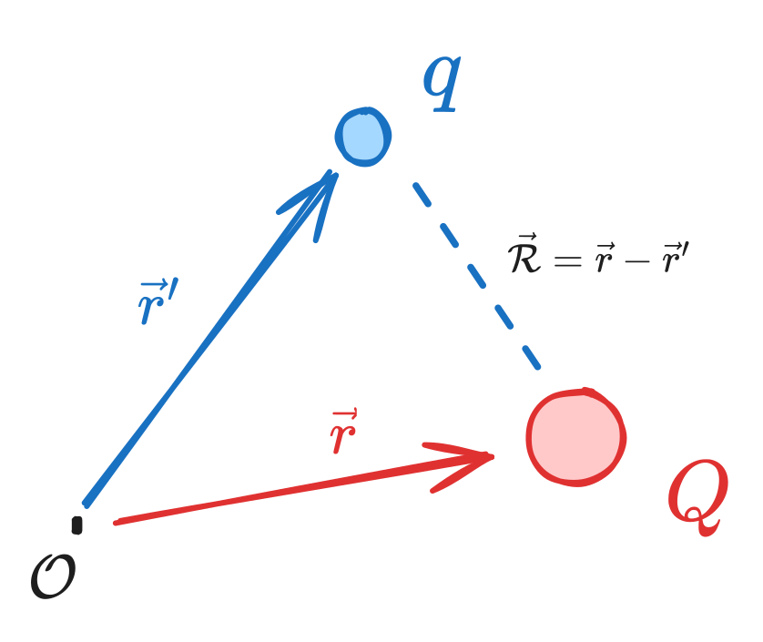
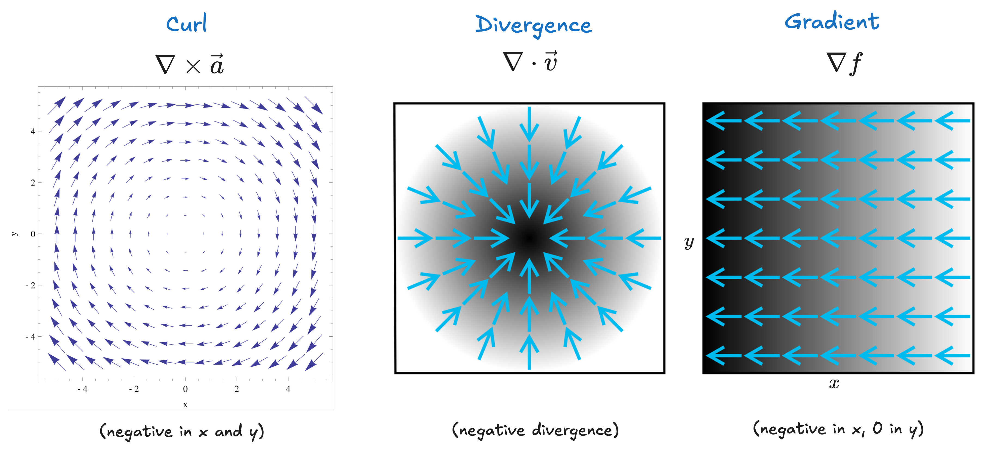

# Chapter 1 - Relevant Mathematics

> Reference "*Introduction to Electrodynamics*" by David Griffiths.

---

# Vectors

We start with a brief review of vector algebra - I'll skip most of it but keep the key things.

## Dot product

The **dot product** is a measure of how "parallel" two vectors are, maximized when parallel, minimized (0) when perpendicular.

$$
\begin{aligned}
	\vec{a}\cdot \vec{b} &= a_1b_1+a_2b_2+a_3b_3\\
	&= |\vec{a}||\vec{b}|\cos\theta
\end{aligned}
$$

It is *commutative* ($\vec{a}\cdot\vec{b} = \vec{b}\cdot \vec{a}$) and *distributive* ($\vec{a}\cdot(\vec{b}+\vec{c}) = \vec{a}\cdot \vec{b} + \vec{a}\cdot\vec{c}$). The result of the dot product is a *scalar*.

## Cross product

The **cross product** yields a third vector orthogonal to both $\vec{a}$ and $\vec{b}$, maximized in magnitude when $\vec{a}$ and $\vec{b}$ are *themselves* orthogonal to one another.

The cross product is distributive, but not exactly commutative - instead,
$$
(\vec{b}\times \vec{a}) = -(\vec{a}\times\vec{b})
$$
Some other properties:
- The result of the cross product is a *vector*, not a scalar. 
- The *magnitude* of the cross product is the area of the parallelogram generated by $\vec{a}$ and $\vec{b}$. 
- The cross product of a vector with itself is zero.

We can calculate a cross product like so:

$$
\begin{aligned}
	\vec{a}\times\vec{b} &= \left| \begin{matrix}
	\hat{x} & \hat{y} & \hat{z}\\
	a_1 & a_2 & a_3\\
	b_1 & b_2 & b_3
	\end{matrix}\right|\\
	&= |\vec{a}||\vec{b}|\sin\theta\;\hat{n}
\end{aligned}
$$
where $\hat{n}$ is the normal to the plane formed by $\vec{a}$ and $\vec{b}$. 

## Vector triple product

Triple products are combinations of cross and dot products.

1. **Scalar triple products**: the magnitude of this is the volume of the parallelepiped (3D parallelogram) generated by $\vec{a}$, $\vec{b}$ and $\vec{c}$. 
$$
\begin{aligned}
	\vec{a}\cdot(\vec{b}\times\vec{c}) &= \left| \begin{matrix}
	a_1 & a_2 & a_3\\
	b_1 & b_2 & b_3\\
	c_1 & c_2 & c_3
	\end{matrix}\right|\\
\end{aligned}
$$

2. **Vector triple products**: there's no easy geometric interpretation of this, but is useful to reduce complex cross product calculations. It can be memorized by the mnemonic **BAC-CAB**. 
$$
\vec{a}\times(\vec{b}\times\vec{c}) = \vec{b}(\vec{a}\cdot\vec{c}) - \vec{c}(\vec{a}\cdot\vec{b})
$$

## Spatial vectors

The **position vector** indicates the position of a point relative to the origin. 

In electrodynamics, usually we'll have *two* points: one for the source charge and one for the test charge. The vector $\vec{\mathcal{R}}$ from one to the other is the useful quantity then. 

# The Del Operator

Del ($\nabla$) is a **vector operator** that acts upon functions, and is defined as
$$
\nabla = \frac{d}{dx}\hat{x} + \frac{d}{dy}\hat{y} + \frac{d}{dz}\hat{z}
$$
$\nabla$ really only is meaningful when applied to functions, and has three (usual) ways of being applied:

1. To a *scalar function* ($\nabla f$) to get the **gradient** of that function.
2. To a *vector function* via the *dot product* ($\nabla \cdot \vec{a}$) to get that function's **divergence**.
3. To a *vector function* via the *cross product* ($\nabla \times \vec{a}$) to get that function's **curl**.

## Gradients

The **gradient** of some scalar function $f$ gives a vector result that will point in the direction of the max rate of increase of that function.

$$
\nabla f = \frac{df}{dx}\hat{x} + \frac{df}{dy}\hat{y} + \frac{df}{dz}\hat{z}
$$
and results in a *vector* with the derivative of the original function's units.
## Divergence

The **divergence** of some vector function $\vec{a}$ represents how much the function "spreads out" or *diverges* from a given point.
$$
\nabla \cdot \vec{a} = \frac{da_x}{dx}+\frac{da_y}{dy} + \frac{da_z}{dz}
$$
and results in a *dimensionless scalar value* indicating the rate of divergence from a point.

## Curl

The **curl** of some vector function $\vec{a}$ represents how much the function "swirls around" some given point. Positive curl is given by the right-hand rule (normally counterclockwise). 
$$
\nabla \times \vec{a} = \hat{x}\left(\frac{da_z}{dy} - \frac{da_y}{dz}\right) + \hat{y}\left(\frac{da_x}{dz} - \frac{da_z}{dx}\right) + \hat{z}\left(\frac{da_y}{dx} - \frac{da_x}{dy}\right)
$$
## Del Again ($\nabla^2$)

Enumerating over the ways we can apply $\nabla$ twice:

1. **Laplacian**: the cross product of $\nabla$ with the gradient of a function results in the Laplacian, such that
$$
\nabla \cdot (\nabla f) = \nabla^2f= \frac{d^2f}{dx^2} + \frac{d^2f}{dy^2} + \frac{d^2z}{dz^2}
$$
2. **Curl of gradient**: always zero. 
$$
\nabla \times (\nabla f) = 0
$$
3. **Gradient of divergence**: not a lot of physical applications, calculable though. 
$$
\nabla (\nabla\cdot \vec{a})
$$
4. **Divergence of curl**: always zero. 
$$
\nabla \cdot (\nabla \times \vec{v}) = 0
$$
5. **Curl of curl**: most easily defined as the acceleration of the swirl, like a hurricane speeding up.
$$
\nabla \times (\nabla \times \vec{a}) = \nabla(\nabla \cdot \vec{a}) - \nabla^2\vec{a}
$$
# Integrals

In electrodynamics, we have **line** (path) integrals, **surface** integrals (or *flux*) and **volume** integrals. 

## Line integrals

Iterate over infinitesimally small displacement vectors $d\vec{l}$.
$$
\int_a^b \vec{a}\cdot d\vec{l}
$$
If $a=b$, the line integral iterates over a closed loop and we can write
$$
\oint \vec{a}\cdot d\vec{l}
$$
> In elementary physics, a common example is work done by a force. 
> $$ W = \int \vec{F}\cdot d\vec{l}$$

While path taken normally matters (distance), there are some vectors where only *displacement* matters (for forces, these are called **conservative** forces, like gravity). 

Wikipedia has a [really cool animation](https://en.wikipedia.org/wiki/Line_integral) of line integrals:

## Surface integrals

Surface integrals iterate over infinitesimally small areas $d\vec{a}$, with norms perpendicular to the surface. 
$$
\int_{\mathcal{S}} \vec{v}\cdot d\vec{a}
$$
In this case, if the surface is closed (i.e. like a sphere, rather than a hill), then we can write it in closed loop form.
$$
\oint \vec{v}\cdot d\vec{a}
$$

Surface integrals are really useful for things like *flux* where something is moving through some area - i.e. imagine radio waves passing through a curved gas cloud or radiation falling "through" a planet.

## Volume integrals

Volume integrals integrate over infinitesimally small volumes $d\tau=dx\;dy\;dz$. 

$$
\int \vec{a}\;d\tau = \int (a_x\hat{x}+a_y\hat{y}+a_z\hat{z})d\tau
$$

If some function $f(x,y,z)$ represented density of a substance, then the volume integral over it would be total mass.

# Integration by Parts

Also known as the "inverse product rule". 
$$
\int u\; dv = uv-\int v\;du
$$
