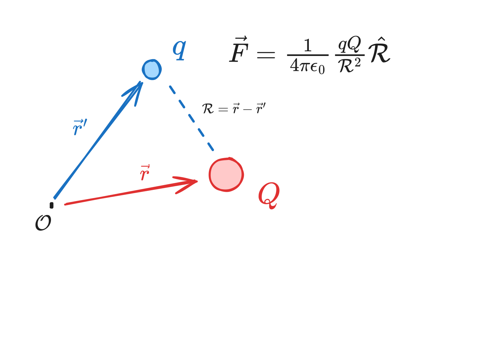

# Chapter 2 - Electrostatics

> Reference "*Introduction to Electrodynamics*" by David Griffiths.

---

Fundamentally, electrodynamics seeks to model the interaction of some set of charges $q_1, q_2, q_3$ on some other charge, $Q$. 

We can do this via **superposition**, which states the interaction between two charges is *unaffected* by the presence of others - i.e. $\vec{F_1}$, the force between $q_1$ and $Q$, is independent of the presence of $q_2$ and $q_3$. We can then sum up the forces to get our net force on $Q$:
$$
\vec{F}_{\text{net}} = \vec{F_1}+\vec{F_2}+\vec{F_3}
$$
In an **electrostatic** system (no moving charges as opposed to an electrodynamic system), the forces can be calculated via *Coulomb's law*. 

## Coulomb's Law

Electrostatics simply takes into account distance. Coulomb's law is

$$
\vec{F} = \frac{1}{4\pi\epsilon_0} \frac{qQ}{\mathbb{\mathcal{R}}^2}\hat{\mathbb{\mathcal{R}}}
$$
> $\epsilon_0$ is the permittivity of free space ($\epsilon_0=8.85\times10^{-12}$ $\text{C}^2/\text{N}\cdot\text{m}^2)$ and $\mathcal{R}=\vec{r}-\vec{r}'$ (my equivalent to Griffith's script-r).

in electrostatics, force increases with higher-magnitude charges, and decreases with distance.

If we have *several* charges, we just sum their individual Coulomb forces as calculated above:

$$
\begin{aligned}
	\vec{F} &= \vec{F_1} + \vec{F_2} + \cdots\\
			&= \frac{Q}{4\pi\epsilon_0}\left( \frac{q_1}{\mathcal{R_1}^2}\hat{\mathcal{R_1}} + \frac{q_2}{\mathcal{R_2}^2}\hat{\mathcal{R_2}} + \cdots \right)\\
			&= Q\vec{E}
\end{aligned}
$$
where $\vec{E}$, the **electric field**, is
$$
\vec{E} = \frac{1}{4\pi\epsilon_0}\sum_{i=1}^n \frac{q_i}{\mathcal{R_i}^2}\hat{\mathcal{R_i}}
$$
Note that the electric field is defined by the source charges present; it's more a model to represent the electric potential at various points, and what would happen if we dropped a test charge in. 

If the charges are continuously distributed, then we use an integral. The charge contained in some space $dq$ is $dq \approx \lambda\;dl\;\text{(1D line)} \approx \sigma\;da\;\text{(2D area)}\approx \rho\;dV\;\text{(3D volume)}$.

$$
\vec{E} = \frac{1}{4\pi\epsilon_0}\int \frac{\lambda(\vec{r'})}{\mathcal{R}^2}\hat{\mathcal{R}}\; dl'
$$
$$
\vec{E} = \frac{1}{4\pi\epsilon_0}\int \frac{\sigma(\vec{r'})}{\mathcal{R}^2}\hat{\mathcal{R}}\; da'
$$
$$
\vec{E} = \frac{1}{4\pi\epsilon_0}\int \frac{\rho(\vec{r'})}{\mathcal{R}^2}\hat{\mathcal{R}}\; dV'
$$
