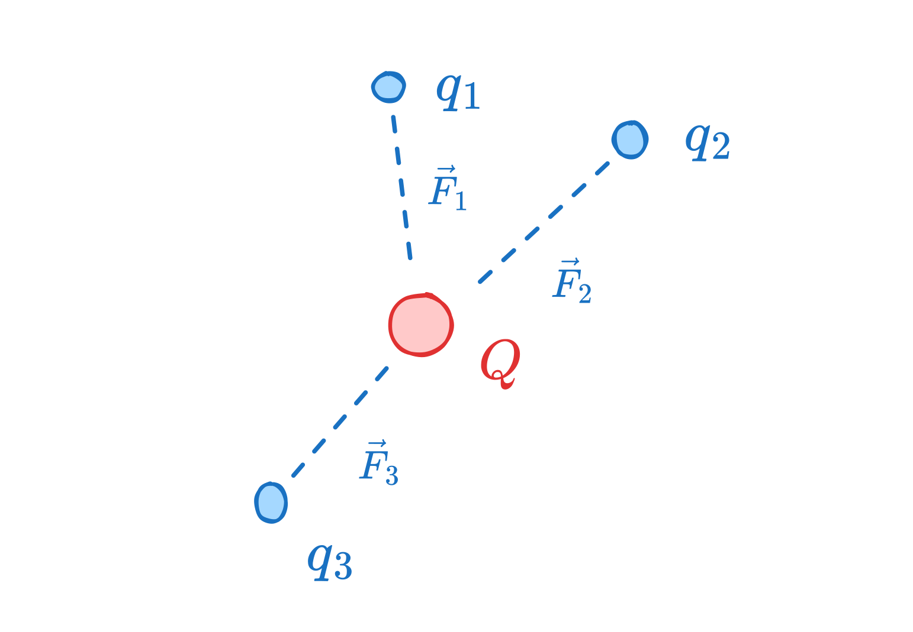
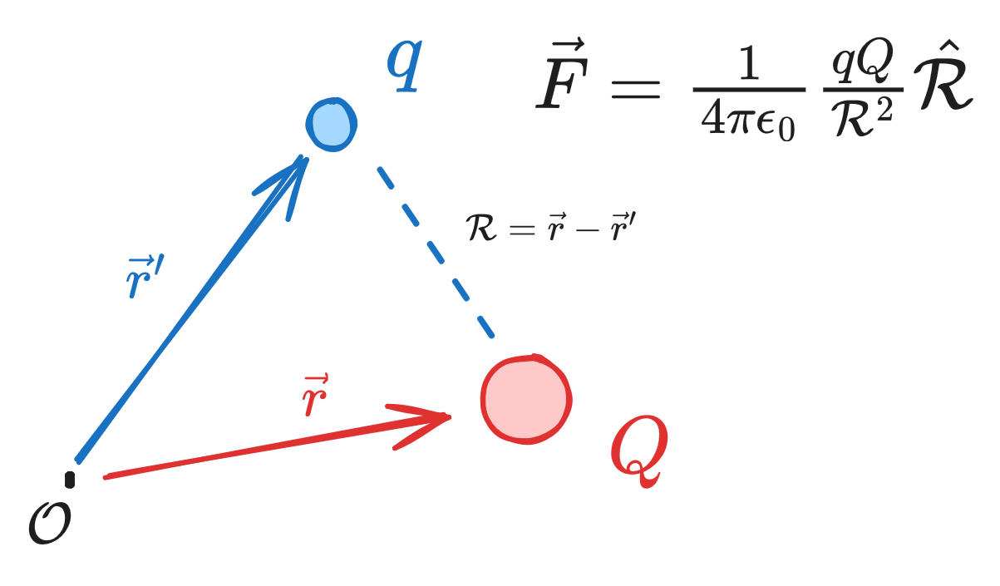
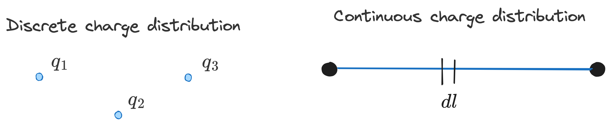
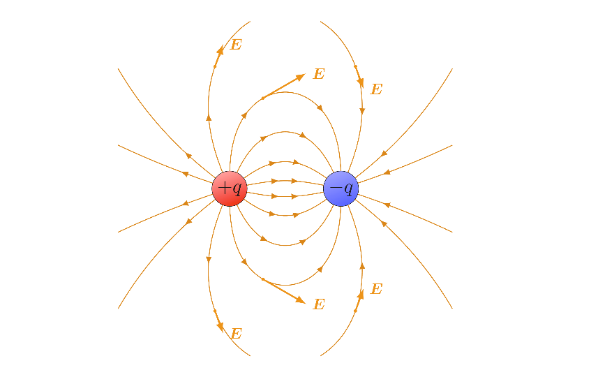
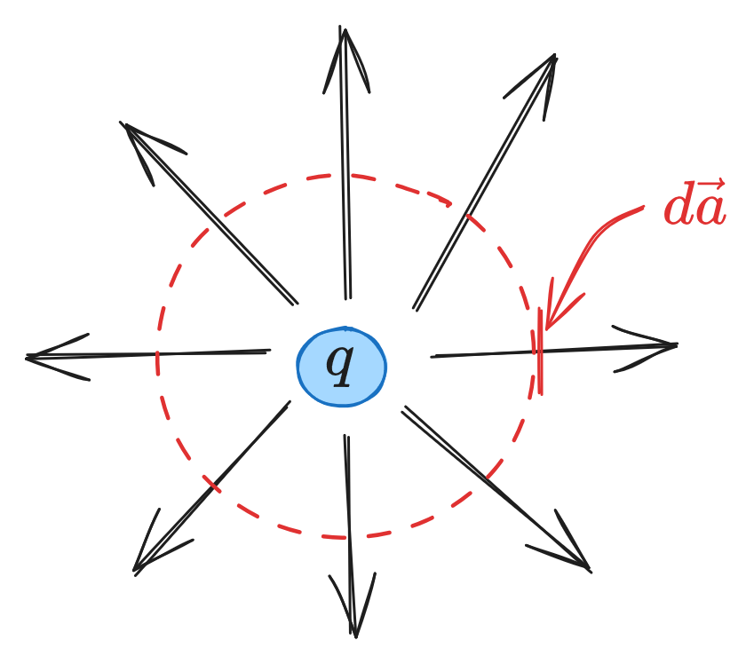
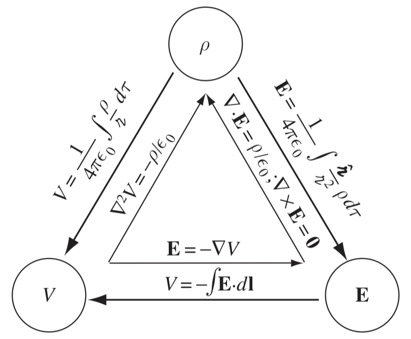
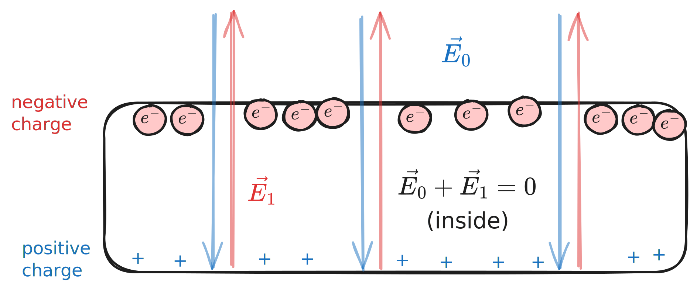
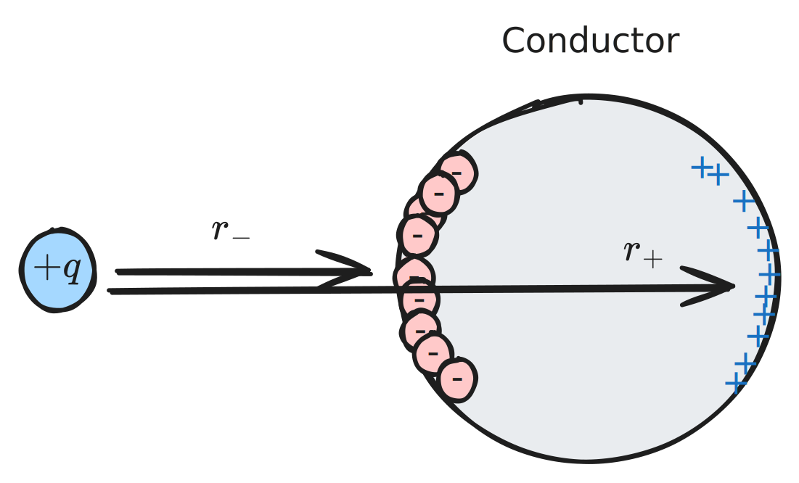
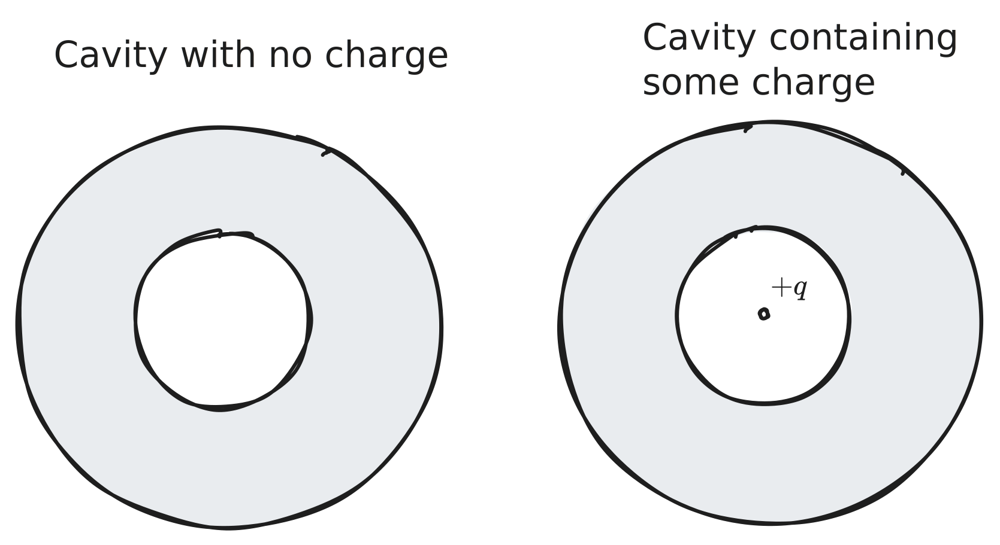
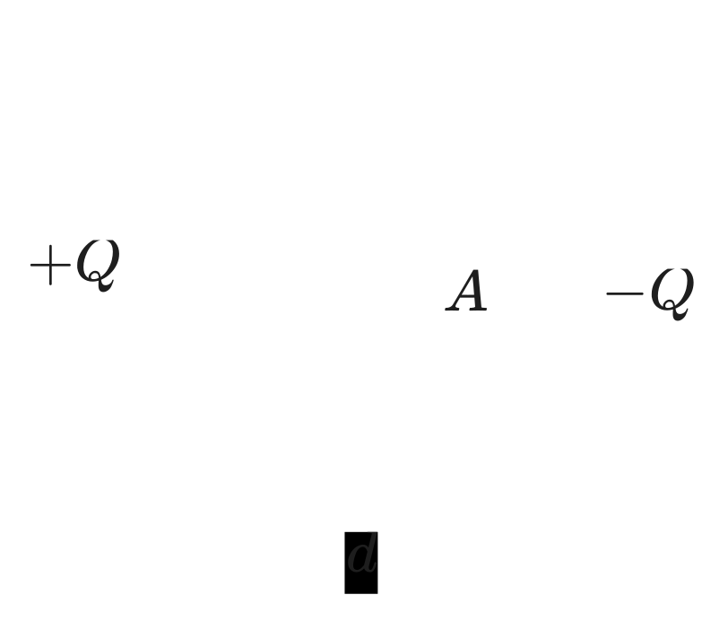

# Chapter 2 - Electrostatics

> Reference "*Introduction to Electrodynamics*" by David Griffiths.

---

Fundamentally, electrodynamics seeks to model the interaction of some set of charges $q_1, q_2, q_3$ on some other charge, $Q$. 

We can do this via **superposition**, which states the interaction between two charges is *unaffected* by the presence of others - i.e. $\vec{F_1}$, the force between $q_1$ and $Q$, is independent of the presence of $q_2$ and $q_3$. We can then sum up the forces to get our net force on $Q$:
$$
\vec{F}_{\text{net}} = \vec{F_1}+\vec{F_2}+\vec{F_3}
$$
In an **electrostatic** system (no moving charges as opposed to an electrodynamic system), the forces can be calculated via *Coulomb's law*. 

## Coulomb's Law

Electrostatics simply takes into account distance and charge strength. Coulomb's law is

$$
\vec{F} = \frac{1}{4\pi\epsilon_0} \frac{qQ}{\mathbb{\mathcal{R}}^2}\hat{\mathbb{\mathcal{R}}}
$$
> $\epsilon_0$ is the permittivity of free space ($\epsilon_0=8.85\times10^{-12}$ $\text{C}^2/\text{N}\cdot\text{m}^2)$ and $\mathcal{R}=\vec{r}-\vec{r}'$ (Griffith's script-r).

in electrostatics, force increases with higher-magnitude charges, and decreases with distance.

If we have *several* charges, we just sum their individual Coulomb forces as calculated above:

$$
\begin{aligned}
	\vec{F} &= \vec{F_1} + \vec{F_2} + \cdots\\
			&= \frac{Q}{4\pi\epsilon_0}\left( \frac{q_1}{\mathcal{R_1}^2}\hat{\mathcal{R_1}} + \frac{q_2}{\mathcal{R_2}^2}\hat{\mathcal{R_2}} + \cdots \right)
\end{aligned}
$$
In shorthand,
$$
\vec{F} = Q\vec{E}
$$
where $\vec{E}$, the **electric field**, is
$$
\vec{E} = \frac{1}{4\pi\epsilon_0}\sum_{i=1}^n \frac{q_i}{\mathcal{R_i}^2}\hat{\mathcal{R_i}}
$$
where $\epsilon_0 = 8.85\times10^{-12}\;\frac{C^2}{N\cdot{m}}$.

The electric field is the *force per unit charge* - this force can *only* be imparted by the presence of *other charges*. 

## Continuous Charge Distributions

If we have a set of charges $q_i$, then our electric field is generated from a *discrete charge distribution*. If, however, the charge is distributed continuously over some region, then we have a *continuous charge distribution* generating the $\vec{E}$-field.

The electric field calculated as an integral over that continuous distribution:
$$
\vec{E}(\vec{r}) = \frac{1}{4\pi\epsilon_0} \int \frac{1}{\mathcal{R}^2}\hat{\mathcal{R}}\;dq
$$
where $dq$ varies for our continuous distribution type (1D, 2D or 3D), such that:
- **Line**:  $dq = \lambda(\vec{r}')\;dl'$
- **Area**: $dq = \sigma(\vec{r}')\;da'$
- **Volume**: $dq = \rho(\vec{r}')\;d\tau'$
# Divergence and Curl of Electrostatic Fields

> Griffiths 2.2.

---

**Field lines** are a way to visualize electric fields on a 2D or 3D medium. 

> [Source](https://tikz.net/electric_fieldlines2/). 

where the **density** of field lines indicates the strength of the E-field at that location (strongest near the center in the above image). The flux of $\vec{E}$ through some surface $S$ is
$$
\phi_E = \int_S \vec{E}\cdot d\vec{a}
$$
and is a way to measure the **total charge** contained *within* a closed surface, while those *outside* of the surface don't affect it. 

---

This mathematically represented by **Gauss's law**, which states
$$
\oint \vec{E}\cdot d\vec{a} = \frac{1}{\epsilon_0}Q_\text{enc}
$$
There's also a differential version of Gauss's law (found by applying the [Divergence Theorem](chapter1.md#Divergence)) where $\rho$ is charge density:
$$
\vec{\nabla} \cdot \vec{E} = \frac{1}{\epsilon_0}\rho
$$

---

For example: in 3D, if a point charge $q$ is at the origin then the flux of $\vec{E}$ through a sphere around it is
$$
\oint \vec{E} \cdot d\vec{a} = \int \frac{1}{4\pi\epsilon_0} \left( \frac{1}{r^2}\hat{r} \right)\cdot (r^2 \sin\theta\;d\theta\;d\phi \hat{r}) = \frac{1}{\epsilon_0}q
$$
> We're only evaluating at the surface of the sphere, so $r$ is constant.

Note that Gauss's law is **only** useful with objects where the *E-field is pointing in the same direction as elements $d\vec{a}$*. This requires both a symmetrical charge distribution within the object, and for the Gaussian surface to be symmetric according to one of the following:

1. **Spherically symmetric** (concentric spheres)
2. **Cylindrically symmetric** (coaxial cylinders)
3. **Plane symmetric** (like a "box" that is cut in half by the plane)

The associated coordinate system is [used for each](chapter1.md#Curvilinear%20Coordinates).

**Note**: flux from *external charges is ignored*, since the flux entering a Gaussian surface from an external charge will be equal to the flux leaving that surface from the other side - hence, net flux from those external charges is zero. 

> If the object we're evaluating doesn't have perpendicular surface elements (i.e. a charge at the north pole of a sphere instead of the center), then some problems can be approached by creating another Gaussian element centered over the charge which subtends the same angle, though this can get geometrically complicated.

## Divergence of $\vec{E}$

$$
\begin{align}
\vec{\nabla}\cdot\vec{E} &= \frac{1}{4\pi\epsilon_0} \int \vec{\nabla}\cdot \left( \frac{\hat{\mathcal{R}}}{\mathcal{R}^2} \right)\rho(\vec{r}')\;d\tau'
\end{align}
$$
Since $\vec{\nabla}\cdot \left( \frac{\hat{\mathcal{R}}}{\mathcal{R}^2} \right) = 4\pi\delta^3(\vec{\mathcal{R}})$, then this just becomes
$$
\vec{\nabla}\cdot\vec{E} = \frac{1}{4\pi\epsilon_0}\int 4\pi\delta^3(\vec{r}-\vec{r}')\rho(\vec{r'})\;d\tau' = \frac{1}{\epsilon_0}\rho(\vec{r})
$$
Or, in shortform,
$$
\vec{\nabla}\cdot\vec{E} = \frac{1}{\epsilon_0}\rho(\vec{r})
$$
## Curl of $\vec{E}$

For **any** electrostatic charge distribution, the curl of the field is *always* zero.
$$
\vec{\nabla}\times \vec{E} = \vec{0}
$$

# Electric Potential $V$

> Griffiths 2.3.

---

Electric potential $V$ is a good indicator of the "strength" of an electric field between two points, and is defined as 
$$
V(\vec{r}) = -\int_{\mathcal{O}}^{\vec{r}} \vec{E}\cdot d\vec{l}
$$
with units $J/C$. 

> A "natural" origin $\mathcal{O}$ is a point infinitely far from the charge, though only when the charge distribution itself doesn't *also* extend to infinity.

in differential form, it's the reverse:
$$
\vec{E} = -\vec{\nabla}V
$$
Voltage is path-independent and only displacements matter - hence the electric potential between points $\vec{a}$ and $\vec{b}$ is
$$
V(\vec{b}) - V(\vec{a}) = -\int_{\vec{a}}^{\vec{b}} \vec{E}\cdot d\vec{l}
$$
## Poisson & Laplace Equations

**Poisson's equation** says
$$
\nabla^2V = -\frac{\rho}{\epsilon_0} 
$$
If there is no charge ($\rho = 0$), Poisson's equation turns into **Laplace's equation**:
$$
\nabla^2V = 0
$$
## Voltage in terms of charges

For a point charge $q$
$$
V(\vec{r}) = \frac{1}{4\pi\epsilon_0}\frac{q}{\mathcal{R}}
$$
> $\vec{r}$ is the reference point from origin, $\mathcal{R}$ from the point charge to the reference point $\vec{r}$.

For a continuous distribution,
$$
V(\vec{r}) = \frac{1}{4\pi\epsilon_0}\int \frac{1}{\mathcal{R}}\;dq
$$
and for a volume (to compute $V$ when we know $\rho$):
$$
V(\vec{r}) = \frac{1}{4\pi\epsilon_0} \int\frac{\rho(\vec{r}')}{\mathcal{R}}\;d\tau'
$$
> $\vec{r}'$ from origin to charge.

**Note**: this is similar to the formula for electric field, but is missing $\hat{\mathcal{R}}$ - $V$ is a scalar quantity, directionless.

## Summary

The three "fundamentals" of electrostatics are $\rho$, $\vec{E}$ and $V$, and are related by the following:

> Griffith's Fig. 2.35.

# Work and Energy

> Griffith's 2.4.

---

For a conservative force, work is *force* times *displacement*. In electrostatics, our equivalent version is
$$
\Delta V = \frac{W}{Q}\qquad W=Q\Delta V
$$

More extended,
$$
W = \int_{\vec{a}}^{\vec{b}} \vec{F}\cdot d\vec{l} = -Q\int_{\vec{a}}^{\vec{b}}  \vec{E}\cdot d\vec{l} = Q[V(\vec{b}) - V(\vec{a})]
$$

where **work** here is the work it takes, **per unit charge**, to carry a charge from $\vec{a}$ to $\vec{b}$. If our reference point $\vec{a}=\infty$ and we let $\vec{b}=\vec{r}$, then
$$
W = Q[V(\vec{r}) - V(\infty)] \equiv QV(\vec{r})
$$

## Work in a Point Charge Distribution

Imagine we had some charge $q_1$ - then brought in a new charge $q_2$ to join $q_1$. Our work done would be

It would cost 
$$W_2 = q_2V_1(\vec{r_{2}})=\frac{1}{4\pi\epsilon_0} q_2 \left( \frac{q_1}{r_{12}} \right)$$
Then, to bring in a third charge $q_3$ would act against the superposition of $q_1$ and $q_2$:
$$
W_3 = \frac{1}{4\pi\epsilon_0} q_3\left( \frac{q_1}{r_{13}} + \frac{q_2}{r_{23}} \right)
$$
... etc. To assemble $n$ charges, we'd need a work of

$$
W = \frac{1}{2}\sum^n_{i=1} q_i\left( \sum^n_{j\neq i} \frac{1}{4\pi\epsilon_0} \frac{q_j}{r_{ij}} \right) = \frac{1}{2}\sum^n_{i=1} q_i V(\vec{r_i})
$$

## Work in a Continuous Charge Distribution

For a continuous charge distribution, we use our last equation for our point charge distribution system and replace the sum $\sum$ with an integral $\int$.
$$
W = \frac{1}{2}\int \rho V\;d\tau
$$
With a bit of mathematics, this is equivalent to
$$
W = \frac{\epsilon_0}{2} \int E^2\'d\tau
$$
# Conductors

> Griffith's 2.5.

**Conductors** are materials in which electrons are free to roam (like cows, on an open ranch 👍). In contrast, **insulators** have electrons pretty much immobile and packed-together (like Monsanto farms 👎). 

We can approximate metals as ideal-case conductors (though *perfect* conductors don't yet exist, though we're gradually coming closer) with the following attributes:

1. $\vec{E} = \vec{0}$ **inside a conductor** - or, the induced field will cancel the external field. If an external field $\vec{E_0}$ is applied to a conductor, free electrons will move toward the E-field until they all sit on the surface, creating a deficit of charges on the opposite surface and *positively charging* it.
   
   Crucially, the *net* E-field is zero, so the fields must *cancel* inside:
   $$ \vec{E_1} + \vec{E_0} = 0 \qquad \rightarrow \qquad \vec{E_1} = -\vec{E_0}$$
   Charge will *continue to flow* until the cancellation is complete. *Outside* the conductor, $\vec{E}\neq 0$, since the two fields don't tend to cancel. 
2. **Charge density is zero** $(\rho=0)$: Since Gauss's law says $\vec{\nabla} \cdot \vec{E}=\rho/\epsilon_0$, zero E-field means zero charge density in the conductor.
3. **Net charge resides on surface**: positive and negative charges will only sit on the surface after enough time passes. 
4. **$\vec{E}$ is perpendicular to the surface**: somewhat obvious, but bears mentioning. 

> *Any* dynamical system will try to minimize potential energy - the charges residing on the surface are an extension of this. It might take some time, but will eventually happen. 

## Induced Charges

If we hold a charge $+q$ near a conductor, the conductor will move toward the charge - this is because negative charges will accumulate closer to $+q$ than the "effective" $+$ charges on the far side. Force falls off by $r^2$, so the conductor will be *attracted* to the $+q$ charge.

## Cavities

Let's say we have a cavity inside our conductive surface. There are two scenarios here:

**Empty cavity**: If the cavity has no charge, the field within the cavity is *zero*, regardless of the external fields applied. This is the principle of the **Faraday cage**. 

**Non-empty cavity**: The charge contained by the cavity will induce an opposite charge $-q$ *uniformly distributed* on the walls of the cavity - the only information transmitted to an external observer is the distribution of charge on the exterior wall (i.e. the *magnitude* of the internal E-field, or the amount of net charge contained). 

## Surface Charge and Force on a Conductor

Through the field inside a conductor is zero, the field immediately *outside* is
$$
\vec{E} = -\frac{\sigma}{\epsilon_0}\hat{n} \qquad\text{where}\qquad  \sigma = -\epsilon_0\frac{dV}{dn}
$$

> If we only care about the *magnitude* of the E-field, then $E = -1/\epsilon_0 \sigma$.

However, the electric field is *discontinuous* at a surface charge, so when calculating the force per unit area (or pressure) of an E-field at the surface of a conductor, we average the E-fields above and below the surface, such that
$$
\vec{f} = \frac{1}{2}\sigma(\vec{E}_{\text{above}} + \vec{E}_{\text{below}}) = \frac{1}{2\epsilon_0}\sigma^2\hat{n}
$$
This is the outward **electrostatic pressure** on the surface, tending to *draw the conductor* into a given field, regardless of the sign of $\sigma$ (squared away).

The pressure at this point, expressed in terms of the field *just outside* the surface, is
$$
P = \frac{\epsilon_0}{2}E^2
$$
## Capacitors

Put two conductors beside one another, with equal and opposite uniform net charges $+Q$ on one and $-Q$ on the other:

Since the charge density is *uniform* on each surface, $\sigma=Q/A$ (on the left plate) and the field between the two is
$$
E = \frac{\sigma}{\epsilon_0} = \frac{1}{\epsilon_0}\frac{Q}{A}
$$
with a *voltage* of
$$
\begin{aligned}
	V &= \int E\;dl \\
	&= Ed \\
	&= \frac{\sigma}{\epsilon_0}d\\
	&=\frac{1}{\epsilon_0}\frac{Q}{A}d
\end{aligned}
$$
> $V = Ed$ in a uniform E-field. 

We'll define a new term to represent the proportionality of the arrangement, *capacitance*:
$$
C = \frac{Q}{V} \equiv \frac{Q}{Ed} \equiv \epsilon_0\frac{A}{d}
$$
with units of **Farads** $(\text{F} = \frac{\text{C}}{\text{V}})$, usually expressed in $\mu \text{F}\;(10^{-6})$ or $p \text{F}\;(10^{-12})$. The **work** to go from one side to the other is
$$
W = \frac{1}{2}CV^2
$$