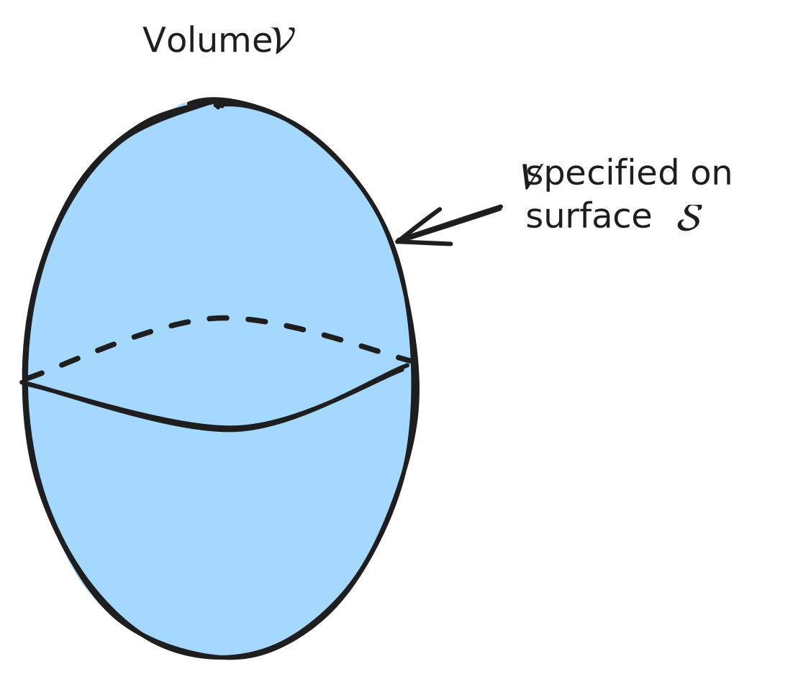
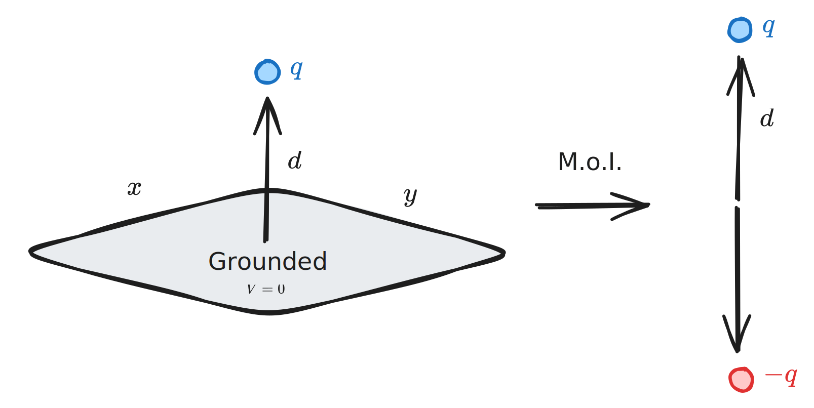
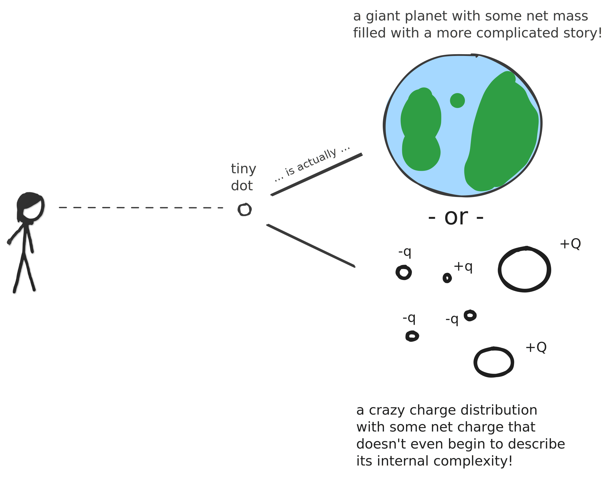

# Chapter 3 - Potentials

> Reference "*Introduction to Electrodynamics*" by David Griffiths.

---

The goal of electrostatics is to find the electric field given some stationary, immobile charge distribution. 

[Coulomb's Law](chapter2.md#Coulomb's%20Law) is the way we do this for *simple* charge configurations, but for more complex charge configurations it's often easier to work with potential $V$. For areas of nonzero charge density $\rho\neq0$ such as point, surface or volume charges, we use **Poisson's equation**:
$$
\nabla^2V = -\frac{1}{\epsilon_0}\rho
$$
Outside of these charge regons (such as in regular space), this reduces to **Laplace's equation**:
$$
\nabla^2 V = 0
$$
$$
\frac{\partial^2V}{\partial x^2}+\frac{\partial^2V}{\partial y^2}+\frac{\partial^2V}{\partial z^2}=0
$$
with solutions called **harmonic functions**.

> Laplace's equation is fundamental to the study of electrostatics according to Griffiths. 

## Laplace's Equation

In three dimensions, visualization is challenging - but the same two properties apply, with the first this time being

1. The value of $V(x,y,z)$ is the average $V$ over a spherical surface of radius $R$ centered at that point, with
   $$
   V(x,y,z) = \frac{1}{4\pi R^2} \oint_\text{sphere} V\;da
   $$
2. $V$ can have no local maxima or minima, with extreme values only permitted at the boundaries (i.e. surface of the sphere).

> Point 2 is particularly relevant in each of these circumstances - the value of $V$ at some point is the *average* of the surrounding $V$ on some surrounding boundary.

### Uniqueness Theorems

The proof that a proposed set of boundary conditions will suffice takes the form of a *uniqueness theorem* (alternatively, a criterion to determine whether a solution to the Laplace or Poisson equations is unique). 

**Uniqueness Theorem 1**: the solution to Laplace's equation $\nabla^2 V=0$ in a volume $\mathcal{V}$ is unique if $V$ is specified on a boundary surface $\mathcal{S}$ enclosing the volume $\mathcal{V}$. 

> The surface does *not* have to be Gaussian - it can look totally eldritch and crazy and the theorem would hold.

**Uniqueness Theorem 2**: given a volume $\mathcal{V}$ surrounded by conductors and containing some charge density $\rho$, the *electric field* is uniquely determined if the *total charge* on each conductor is given. 

---

## Method of Images

> Griffiths 3.2.

Say we have some charge $q$ a distance $d$ above an infinite grounded plane; what is the potential $V$ in the region *above* the plane? Our boundary conditions state 

$$
\begin{cases}
V = 0 & z=0\\
V \rightarrow 0 & \text{far from the charge}
\end{cases}
$$
We could solve Poisson's equation for this region, but a much easier technique is to use the **Method of Images**. Wikipedia says on the subject:

> The [method of image charges](https://en.wikipedia.org/wiki/Method_of_image_charges "Method of image charges") is used in [electrostatics](https://en.wikipedia.org/wiki/Electrostatics "Electrostatics") to simply calculate or visualize the distribution of the electric field of a charge in the vicinity of a conducting surface. 
> 
> It is based on the fact that the tangential component of the electrical field on the surface of a [conductor](https://en.wikipedia.org/wiki/Electrical_conductor "Electrical conductor") is zero, and that an [electric field](https://en.wikipedia.org/wiki/Electric_field "Electric field") E in some region is uniquely defined by its [normal component](https://en.wikipedia.org/wiki/Normal_component "Normal component") over the surface that confines this region (the [uniqueness theorem](https://en.wikipedia.org/wiki/Uniqueness_theorem_for_Poisson%27s_equation)).

Start by removing the conductor, and placing an opposite charge $-q$ at $-d$:

Then, the potential is easy to calculate:
$$
V(x,y,z) = \frac{1}{4\pi\epsilon_0} \left[ \frac{q}{\sqrt{x^2+y^2+(z-d)^2}} - \frac{q}{\sqrt{x^2+y^2+(z+d)^2}} \right]
$$
which obeys *both* of the boundary conditions of the original problem:

1. $V=0$ when $z=0$
2. $V\rightarrow 0$ for $x^2+y^2+z^2\gg d$ 

Thus by uniqueness theorem 1, is the solution to our original problem. 

> Uniqueness theorem 1 means that if a solution satisfies Poisson's equation in the region of interest and assumes the correct value at the boundaries, it *must* be right.

> The **Method of Images** can be used in any scenario where we have a stationary charge distribution near a grounded conducting plane. 

### Induced Surface Charges

The surface charge density induced on a conductor is 
$$
\sigma = -\epsilon_0\frac{\partial V}{\partial n}
$$
where $\partial V/\partial n$ is the normal derivative of $V$ at the surface. In the above case, this is is in the $z$ direction - if we take this partial derivative of our above calculated voltage, then
$$
\sigma(x,y) = \frac{-qd}{2\pi(x^2+y^2+d^2)^{3/2}}
$$
> As expected from a positive charge, the induced surface charge is *negative* and greatest at $x=y=0$. 

The total induced charge is
$$
\begin{align}
	Q = \int \sigma\;da &= \int_0^{2\pi}\int_0^{\infty} -\frac{qd}{2\pi(r^2+d^2)^{3/2}}r\;dr\;d\phi\\
	&= \frac{qd}{\sqrt{r^2+d^2}}\Big|_0^\infty\\
	&= -q
\end{align}
$$
Yes!

### Force & Energy

Since the induced charge on the conductor is $-q$ and our charge is $+q$, it is attracted to the plane with a force given by [Coulomb's Law](chapter2.md#Coulomb's%20Law):
$$
\vec{F} = -\frac{1}{4\pi\epsilon_0}\frac{q^2}{(2d)^2}\hat{z}
$$
While force is the *same* in our mirror problem, **energy is not**. For two point charges, $W = \frac{1}{2}\sum^n_{i=1} q_i V(\vec{r_i})$, such that
$$
W = -\frac{1}{4\pi\epsilon_0}\frac{q^2}{2d}
$$
But for a single charge and conducting plane (continuous charge distribution), energy is *half* of this.
$$
W = -\frac{1}{4\pi\epsilon_0}\frac{q^2}{4d}
$$
> The work to bring *two* point charges towards one another does work on *both* of them, while to bring a point charge toward a grounded conductor has us only doing work on *one* charge - only half the work is necessary.

---

## Separation of Variables

> Griffiths' 3.3

**Separation of variables** is a way to solve ODEs and PDEs by rewriting equations such that each of the two variables occur on different sides of the equation.

Separable equations *must* be able to be written in the form
$$
\frac{dx}{dy} = g(x)h(y)
$$
We can rearrange the terms to get
$$
dy\frac{1}{h(y)} = g(x)dx
$$
integrate,
$$
\int\frac{1}{h(y)} dy = \int g(x)\;dx
$$
and add some constant term to one side to represent all our constants of integration.
$$
H(y) = G(x)+C
$$

---

In the context of electrostatics, separation of variables is very useful when solving 2D Laplace equations, such as 
$$
\frac{\partial^2V}{\partial x^2}+ \frac{\partial^2V}{\partial y^2} = 0
$$
We need solutions in the form of
$$
V(x,y) = X(x)Y(y)
$$
This can be accomplished through some mathematical trickery to find our separated variables ...
$$
\frac{1}{X}\frac{d^2 X}{dx^2} + \frac{1}{Y}\frac{d^2Y}{dy^2} = 0
$$
... which is of the form $f(x)+g(y)=0$. Thus, *both* $f(x)$ and $g(y)$ must be *constant* (we can't hold one constant and change the other with this solution still holding). 

So,
$$
\frac{1}{X}\frac{d^2X}{dx^2}= C_1 \quad \text{and}\quad \frac{1}{Y}\frac{d^2Y}{dy^2} = C_2 \qquad C_1+C_2 = 0
$$
Converting each equation into an ODE,
$$
\frac{d^2X}{dx^2} = k^2X \qquad \frac{d^2Y}{dy^2} = -k^2Y
$$
... we converted a PDE into two ODEs, which are much easier to solve. Our solutions will be a constant coefficient set:
$$
X(x) = c_1e^{kx} + c_2e^{-kx}, \qquad Y(y) = c_3\sin(ky)+c_4\cos(ky)
$$
We can find our constants based on our boundary conditions now.

---

## Multipole Expansion

> Griffiths 3.4

Say you have some charge $Q=Q_\text{net}$ that you can see in space, far away. $Q$ is almost like an exoplanet in a sense: we know it exists, we know its total mass, and maybe we know stuff like how far away it is.

But, we don't know what the surface looks like; what it's composed of, be it rock or ice or water. Just its net mass. 

Similarly, our charge distribution might be crazy complicated, and it's net charge $Q_\text{net}$ only describes a tiny part of the story, albeit an important one - the **multipole expansion** is used to describe this fuller story, and is defined in terms of voltage as

$$
\begin{aligned}
	V(\vec{r}) &= \frac{1}{4\pi\epsilon_0}\left[ \frac{1}{r}(\text{monopole moment}) + \frac{1}{r^2}(\text{dipole moment}) + \frac{1}{r^3}(\text{quadrupole moment})\ldots \right]
\end{aligned}
$$
Thus, the monopole moment is $(1/r)$ stronger than the dipole moment, the dipole $1/r$ stronger than the quadrupole moment, and so on. 

>Mathematically, it is
> $$
V(\vec{r}) = \frac{1}{4\pi\epsilon_0} \sum_{n=0}^\infty \frac{1}{r^{n+1}} \int (r')^n P_n(\cos\alpha)\rho(\vec{r}')\;d\tau'
$$
> where $\alpha$ is the angle between $\vec{r}$ and $\vec{r'}$, $\vec{r}$ is the reference point (from origin) and $\vec{r}'$ the charge (from origin). 

> **Electric field of moments**: the electric field is defined as $E=-\nabla V$.
>  
> To find the electric field i.e. caused by the dipole moment, find the voltage term for that dipole moment, then take the negative gradient of it. 

### Monopole and dipole terms

At large $\vec{r}$, a charge distribution just looks like a net charge (like an exoplanet). Thus, the **monopole moment** $Q$ is just the net charge:
$$
\begin{aligned}
	Q \equiv \int\rho\;d\tau \qquad \qquad V_\text{mon}(\vec{r}) = \frac{1}{4\pi\epsilon_0}\frac{Q}{r}
\end{aligned}
$$
The **dipole moment** $\vec{p}$ describes the individual distribution of charges:
$$
 \vec{p} = \sum_{i=1}^n q_i \vec{r_i}' \equiv \int \vec{r}' \rho(\vec{r'})\;d\tau'\qquad \qquad V_\text{dip}(\vec{r}) = \frac{1}{4\pi\epsilon_0} \frac{\vec{p}}{r^2}
$$
> $\vec{r}'$ points from the origin to some *charge distribution*. $\vec{r}$ is from the origin to some *reference point*. 

### Origin of coordinates

Changing the origin will never change the monopole moment $Q$, but *will* change the dipole moment $\vec{p}$ *as long as* the total charge $Q\neq0$.

> **For example**: if our system has $+q$ and $-q$ as its point distribution, $Q=+q+(-q)=0$ and the dipole moment is origin-independent. 