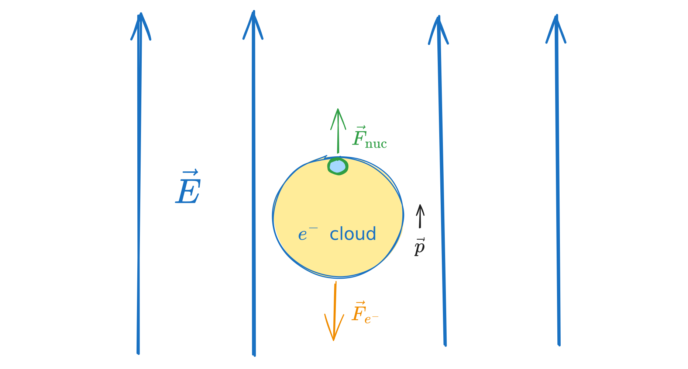
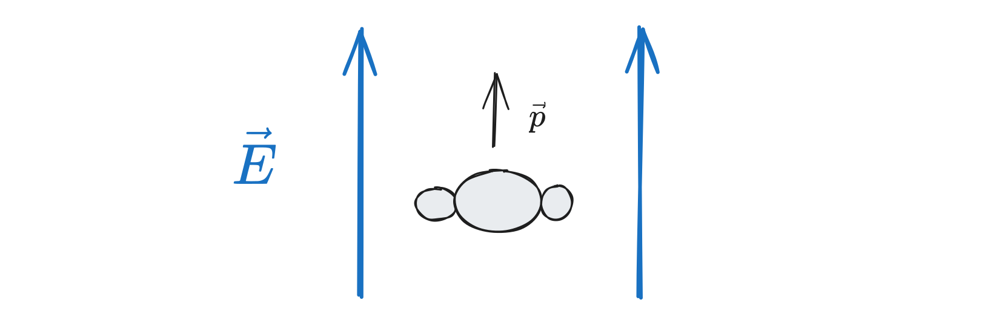
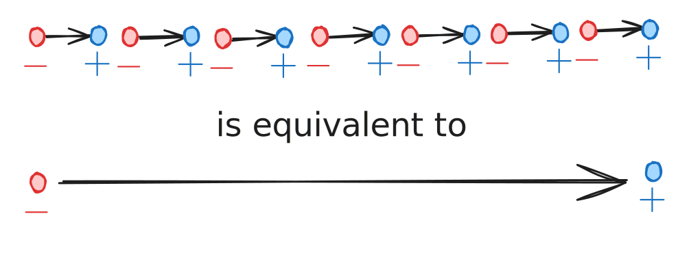

# Chapter 4 - Electric Fields in Matter

> Reference "*Introduction to Electrodynamics*" by David Griffiths.

---

This chapter looks at electric fields within matter that aren't necessarily conductors - i.e.most matter in the universe. 
# Polarization

> Griffith's 4.1

If we place a neutral atom in an electric field, the net force on it is zero (as it is uncharged) - *however*, the positively-charged nucleus is pushed along into the field, while the negatively charged electron cloud is pulled down into the field. 

The neutral atom is now **polarized**, with some tiny dipole moment $\vec{p}$:
$$
\vec{p} = \alpha \vec{E}
$$
$\alpha$ is the **atomic polarizability** and varies from atom to atom. 

> If the electric field is strong enough, the $e^-$ cloud will be ripped away from the nucleus and the atom will become ionized. Coulomb's law determines both.

>Molecules become more complicated, since they're a few individual atoms coupled together - CO$_2$ for instance has different polarizabilities parallel or orthogonal to its axis ($\vec{p}=\alpha_\perp \vec{E}_\perp + \alpha_\parallel \vec{E}_\parallel$), so for molecules, a *polarization tensor* might be more useful.
>$$
\vec{p} = [p_x,p_y,p_z] = \begin{pmatrix}
\alpha_{xx}E_x & 0 & 0\\
0 & \alpha_{yy}E_y & 0\\
0 & 0 & \alpha_{zz}E_z
\end{pmatrix}
$$

## Force on dipoles

In the presence of an electric field, a dipole will rotate to point in the direction of the $E$-field with a torque given by
$$
\vec{N} = \vec{p}\times \vec{E}
$$
> At any other point on the dipole than the origin, $\vec{N} = (\vec{p}\times\vec{E}) + (\vec{r}\times \vec{F})$.

The net force on a dipole in a uniform field is zero as seen in the first image. However, in a *non*uniform electric field, the force on a dipole is
$$
\vec{F} = (\vec{p}\cdot \vec{\nabla})\vec{E}
$$
The potential energy of a dipole in an electric field is
$$
U = -\vec{p}\cdot \vec{E}
$$

---

# The Field of a Polarized Object

> Griffiths 4.2

In the presence of an external electric field, the individual atoms of a given material will become polarized, leading to a lot of little baby dipoles, all pointing in the direction of the applied field. 

Since all of its constituent atoms are polarized, the material itself is said to be polarized with some polarization density $\vec{P}$. 
$$
\vec{P} = \frac{\text{dipole moment}}{\text{unit volume}}
$$
## Potential

Since the potential for an individual dipole is 
$$
V(\vec{r}) = \frac{1}{4\pi\epsilon_0}\frac{\vec{p}}{\mathcal{R}^2}\hat{\mathcal{R}} = \frac{1}{4\pi\epsilon_0} \frac{\vec{p}}{|\vec{r}-\vec{r}'|^3}(\vec{r}-\vec{r'})
$$
The electric potential for the *entire* object with polarization $\vec{P}$ is
$$
V(\vec{r}) = \frac{1}{4\pi\epsilon_0}\int \frac{\vec{P}(\vec{r}')\cdot\hat{\mathcal{R}}}{\mathcal{R}^2}d\tau'
$$
With *surface* and *volume* **bound charge densities** of
$$
\sigma_b = \vec{P}\cdot\hat{n}\qquad \rho_b = -\vec{\nabla}\cdot\vec{P}
$$
We can rewrite the potential of our whole polarized object in terms of these densities:
$$
V(\vec{r}) = \frac{1}{4\pi\epsilon_0}\left[\oint_S \frac{\sigma_b}{\mathcal{R}}\;da' + \int_V\frac{\rho_b}{\mathcal{R}}\;d\tau' \right]
$$
> The *net potential* is just the *sum* of the potentials produced by the bound surface and volume charges. 

> $\vec{P}\cdot \hat{n} = P\cos\theta$, where $\theta$ is the angle between $\vec{P}$ and $\vec{n}$. $r\cos\theta=z$ in spherical.

To calculate the **electric field** caused by polarization, use
$$
\vec{E} = -\vec{\nabla}V
$$

## Physical interpretation of bound charge

Say we have a long string of dipoles, as we might in a polarized dielectric in some field $\vec{E}$. The head of one dipole will cancel the tail of its neighbor, *except* at the ends, so that:

No one electron makes the whole trip - but the magnitude of the $\Delta -$ in some field will be matched by $\Delta +$, such that it's almost conductor-like - in a *uniform field*, we see only accumulations of bound charge on the surface, such that
$$
\sigma_b = \vec{P}\cdot \hat{n} \equiv P\cos\theta \quad \text{(for some oblique surface)}
$$
If, however, the polarization is *non-uniform*, then we'll see accumulations of bound charge *within* the object, as well as on the surface, 
$$
\rho_b = -\vec{\nabla}\cdot \vec{P}
$$

---

# The Electric Displacement

> Griffiths 4.3

Most materials aren't perfect conductors or perfect insulators. Conductors have free flowing electrons $(\rho_f)$, while insulators have exclusively bound charges $(\rho_b)$ - a normal dielectric will have *both* free and bound charges, such that
$$
\rho = \rho_b + \rho_f
$$
Let the **displacement field** take into account the fields of the polarization field and electric field, such that
$$
\vec{D} = \epsilon_0\vec{E}_\text{net} + \vec{P}
$$
Gauss's law for $\vec{D}$ is
$$
	\vec{\nabla}\cdot\vec{D} = \rho - \rho_b = \rho_f\qquad \oint \vec{D}\cdot d\vec{a} = Q_{f_\text{enc}}
$$
> We only have control over free charge - bound charge is a consequence of the properties of the material itself. Free charges themselves generate a field. 

> Though Gauss's law has a parallel for $\vec{D}$, Coulomb's law *does not*. 

The curl of $\vec{D}$ is
$$
\vec{\nabla} \times \vec{D} = \vec{\nabla}\times\vec{P}
$$

## Boundary conditions

For a given dielectric, the boundary conditions are:
$$
	D^\perp_\text{above}-D^\perp_\text{below} = \sigma_f\qquad \vec{D}^\parallel_\text{above}-\vec{D}^\parallel_\text{below} = \vec{P}^\parallel_\text{above} -\vec{P}^\parallel_\text{beow}
$$

> Note that since the curl of $\vec{E}$ is zero $(\vec{\nabla}\times\vec{E}=0$),
> $$\vec{E}^\parallel_\text{above}-\vec{E}^\parallel_\text{below}=0$$

---

# Linear dielectrics

> Griffiths 4.4

For *linear substances*, the polarization is linearly proportional to the total electric field:
$$
\vec{P} = \epsilon_0\chi_e\vec{E}_\text{net}
$$
> $\chi_e$ is the **electric susceptibility** of the medium (dimensionless), with
> $$\epsilon = \epsilon_0(1+\chi_e)$$
> being the **permittivity** of the material (with $\chi_e=0$ in vacuum, $\epsilon_0$ the permittivity of free space). A unit-less version is the dielectric constant, $e_r = \epsilon/\epsilon_0$. 

The displacement field in linear media is thus
$$
\begin{align}
	\vec{D} &= \epsilon_0\vec{E}+\vec{P}\\
	&= \epsilon_0\vec{E}+\epsilon_0\chi_e\vec{E}\\
	&= \epsilon_0(1+\chi_e)\vec{E}\\
	&=\epsilon\vec{E}_\text{net}
\end{align}
$$

---

**Notes on examples**

> **Example 4.5:** conducting sphere of radius $a$ and charge $Q$ surrounded by linear dielectric of radius $b$ and permittivity $\epsilon$, find potential at the center.

- The conducting sphere of charge $Q$ is our enclosed free charge, so
$$\vec{D} = \frac{Q}{4\pi r^2}\hat{r}\qquad r > a$$
- Inside the sphere, $\vec{E}=\vec{P}=\vec{D}=\vec{0}$
- Integral to find potential is (with reference to infinity):
$$
	V = -\int_\infty^0 \vec{E}\cdot d\vec{l}
$$
