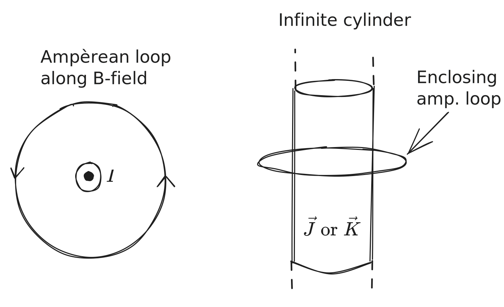

# Chapter 5 - Magnetostatics

> Reference "*Introduction to Electrodynamics*" (5e) by David Griffiths.

---

Say instead of static electric charges (electrostatics), we start dealing with *moving* electric charges (electrodynamics). 

Moving charges will generate a magnetic field around them. If the rate of moving charges (current $I$) is constant, we're working with **magnetostatics**. The $\vec{B}$-field for some current $I$ can be modeled by the **right-hand rule**:

Magnetic fields interact with one another. Using the Lorentz force law,
$$
\vec{F}_\text{mag} = Q(\vec{v}\times\vec{B})
$$
Or, in the presence of an electric field as well,
$$
\vec{F}_\text{mag} = Q(\vec{E} + \vec{v}\times\vec{B})
$$

> Magnetic forces themselves do no work:
> $$
 dW_\text{mag} = \vec{F}_\text{mag}\cdot d\vec{l} = Q(\vec{v}\times\vec{B})\cdot \vec{v}\;dt = 0
$$
> This means that magnetic forces can change the *direction* of a charged particle in motion but cannot speed up or slow them down.

## Cyclotron motion

Cyclotrons are varieties of modern particle accelerators - **cyclotron motion** is the motion a charged particle has moving around some central axis:

and adheres to the **cyclotron formula**:
$$
QvB = m\frac{v^2}{R}\qquad \text{or} \qquad p = QBR
$$
with some **cyclotron frequency** given by
$$\omega = \frac{QB}{m}$$
> If the particle has some velocity component parallel to the $B$-axis, $v_\parallel$, the circle will look more like a helix (see [this visualization](https://www.researchgate.net/figure/Cyclotron-motion-of-an-ion-along-a-uniform-and-steady-magnetic-field-line-Image-credit_fig1_261874512)), since there is no parallel component along the axis of the Lorentz force law (for this scenario). 

## Current

Current is some *charge* per *unit time* through some cross-sectional area, defined such that $$1\;\text{ampere} = 1\;\text{Coulomb}/1\;\text{second}$$
If we had some line charge of $\lambda$ Coulombs traveling at velocity $v$, $I=\lambda v$. In cases where we're not just along a straight line, $\vec{v}$ is a vector and as such current is too:
$$
\vec{I} = \lambda\vec{v}
$$
The force on this line of charge is
$$
\vec{F}_\text{mag} = I \int d\vec{l}\times\vec{B}
$$
for a constant current $I$. 

## Surface and Volume Currents

If we have some charges flowing across some $dl$ on a surface, or across some area $dA$ on a volume, we represent them with **surface current density** $\vec{K}$ and **volume current density** $\vec{J}$. 

Similar to a line charge, if our surface has density $\sigma$ (or $\rho$ for a volume charge) and charges move at velocity $\vec{v}$:
$$
\vec{K} = \sigma\vec{v}\qquad \vec{J} = \rho\vec{v}
$$
For some volume, the charge conservation equation (or continuity equation) says any charge flowing out of a volume means
$$
\begin{align}
\nabla\cdot \vec{J} &= -\frac{\partial \rho}{\partial t}\\
&= 0\;\;\;\;\qquad \text{(in magnetostatics)}
\end{align}
$$

**Note**: $\partial\rho/\partial t$ means change in charge density per change in time, meaning $\delta \vec{J}$. This is zero in magneto*statics*. 
# Biot-Savart Law

The magnetic field of some steady-state line current is

$$
\vec{B}(\vec{r}) = \frac{\mu_0}{4\pi} I \int \frac{d\vec{l}'\times\hat{R}}{R^2}
$$
> **Note**: $\vec{B}$ has units of newtons per ampere-meter (or Tesla): $1\;\text{T} = 1\;\text{N/A}\cdot\text{m}$. 

where $\vec{r}$ is the "test point" where you'd like to know the magnetic field, $\vec{r}'$ points to some (temporary) infinitesimal charge line element $dl'$, and $\vec{R}$ points from the charge element to the test point.

**Note**: the integration is along the current path. 

>$\mu_0$ is the "permeability of free space":
$$
\mu_0 = 4\pi \times10^{-7}\;\text{N/A}^2
$$

The B.S. law also works for surface and volume charges:
$$
\vec{B}_\text{surf}(\vec{r}) = \frac{\mu_0}{4\pi} K \int \frac{dA'\times\hat{R}}{R^2}\qquad \vec{B}_\text{vol}(\vec{r}) = \frac{\mu_0}{4\pi} J \int \frac{d\tau'\times\hat{R}}{R^2}
$$
where $dA' = dx'dy'$ and $d\tau' = dx'dy'dz'$, converting to polar or spherical as necessary.

# Divergence and Curl of $\vec{B}$

The curl of any magnetic field is proportional to the current density (or contained current):
$$
\nabla \times \vec{B} = \mu_0\vec{J}
$$
where $\vec{J}$ is a volume current density. It's also related to total current $I$ by taking a *surface integral* bounding the volume:
$$
I_\text{enc} = \int \vec{J}\cdot d\vec{A}
$$
> This means stronger currents have higher-magnitude $\vec{B}$-fields, and stronger $\vec{B}$-fields enclose a higher current / current density within. 

The *divergence* of a magnetic field is always zero.
$$
\nabla \cdot \vec{B} = 0
$$
> A magnetic field will circle around a wire but will not expand outward.

## Ampère's Law

For some circular magnetic field (circumference $2\pi r$) around a wire, the path integral of it is independent of radius:
$$
\oint \vec{B}\cdot d\vec{l} = \frac{\mu_0I}{2\pi}\int_0^{2\pi} d\phi = \frac{\mu_0I}{2\pi}2\pi = \mu_0I
$$
> The radius of the path integral (circle, circ. $2\pi r$) increases at the same rate as the magnitude of the $B$-field decreases - i.e. it's independent of radius.

This is known as **Ampère's Law**:
$$
\oint \vec{B} \cdot d\vec{l} = \mu_0I_\text{enc}
$$
The current enclosed by some path integral *along* the $\vec{B}$-field is proportional to the enclosed current $I_\text{enc}$. It's like the magnetostatics equivalent to Gauss's law as it relates to Coulomb's law. 

For a surface current along an infinite plane, the Ampèrean loop might be a rectangle perpendicular to the current. 

> Above, the $\hat{z}$ components of the Amp. loop aren't aligned with $\vec{B}$, so we only care about the $\hat{y}$ components - i.e. 
> $$
\begin{align}
\oint \vec{B}\cdot d\vec{l} = B\oint d\vec{l} &= \mu_0I_\text{enc}  \\B(2l) &= \mu_0 Kl\\
B &= \frac{\mu_0K}{2}\hat{y} \qquad (\text{for }z>0, \;\text{negative if }z<0)
\end{align}
$$

Note that Ampère's law *only* works for
1. Infinite straight lines / cylinders
2. Infinite planes
3. Infinite solenoids
4. Toroids (see Griffiths Ex. 5.10)

# Magnetic Vector Potential $\vec{A}$

> Magnetic vector potential $\vec{A}$ is the magnetostatics equivalent to electric potential $V$. 

$\nabla \cdot \vec{B} = 0$. If we instead write this as $\nabla \cdot (\nabla \times \vec{A}) = 0$, 
$$
\vec{B} = \nabla \times \vec{A}
$$
Griffiths has a further derivation of this in 5.4.1. Ultimately, we get to the magnetic Poisson's equation equivalent:
$$
\nabla^2\vec{A} = -\mu_0\vec{J}
$$
$$
\vec{A}(\vec{r}) = \frac{\mu_0}{4\pi} \int \frac{\vec{J}(\vec{r}')}{R}d\tau'
$$
We can pull out $J$ if constant. Use $\vec{K}(\vec{r}')\;da'$ or $I\;dl'$ for surface and volume currents respectively.

> The *direction* of $\vec{A}$ will almost always be the same as that of current. 

## Dipole Moment of $\vec{A}$

> The explicit multipole expansion of $\vec{A}$ is in Griffiths 5.4.3. I've only included the dipole moment for brevity, and because the monopole moment has no proof of existence & higher-order terms are rarely helpful.

The dipole moment tends to dominate magnetic vector potential multipole expansions (no monopole given $\nabla \cdot \vec{B}=0$), and is represented as
$$
\vec{A}_\text{dip}(\vec{r}) = \frac{\mu_0}{4\pi} \frac{\vec{m}\times\hat{r}}{r^2}
$$
where $m$ is the **magnetic dipole moment**
$$
m = I\int d\vec{a} = I\vec{a}\qquad (\vec{a}\text{ is vector area of Ampèran loop})
$$
this is *independent of origin*, since $\vec{a}$ is centered at $\vec{r}=0$. 