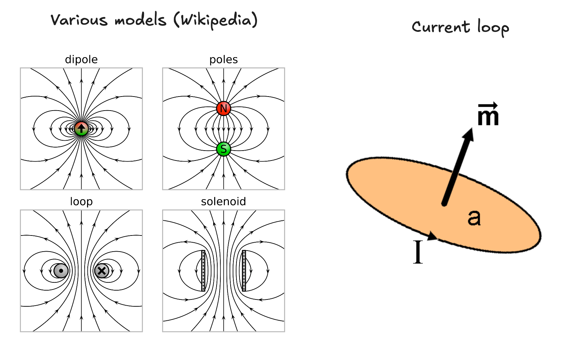
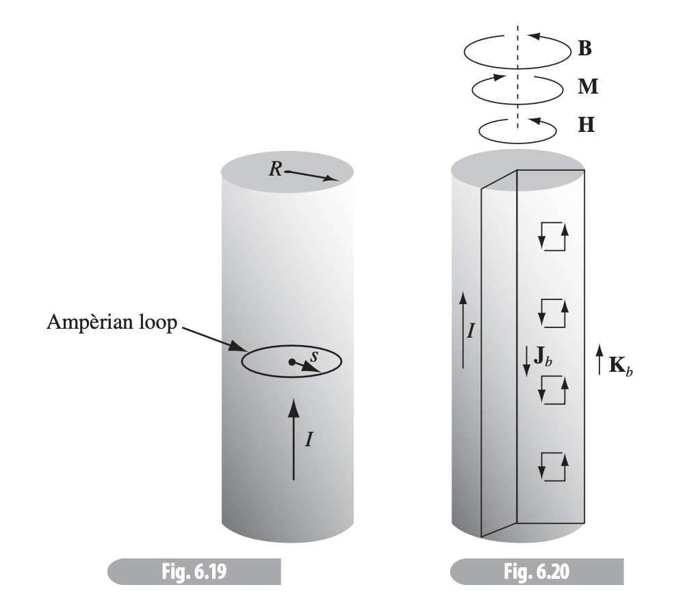
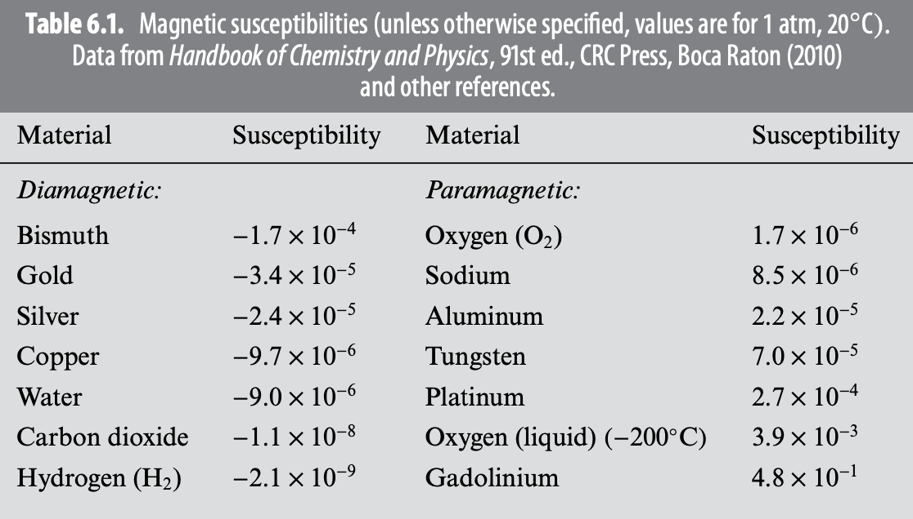
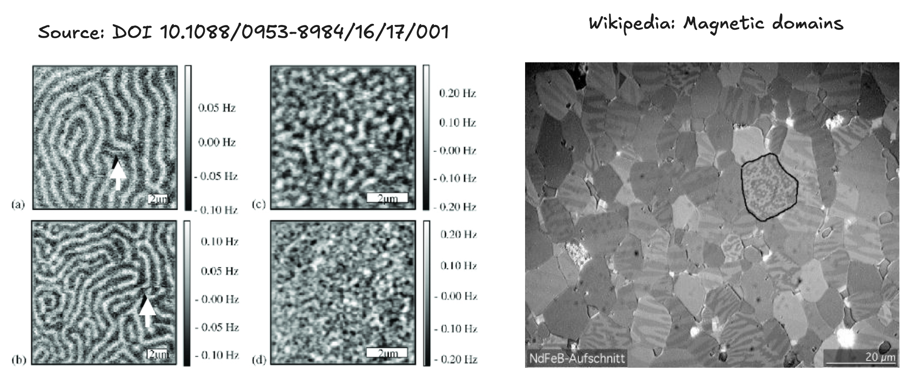
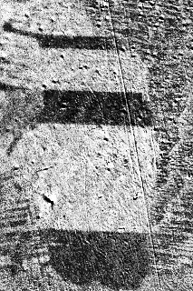
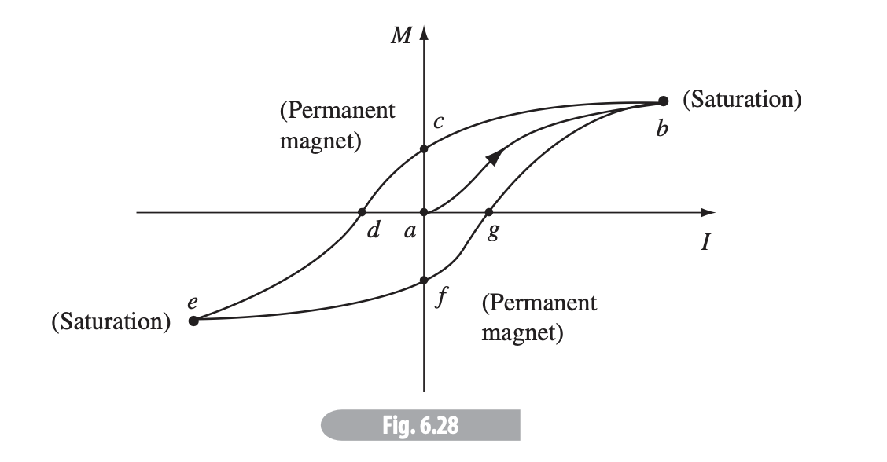

# Chapter 6 - Magnetic Fields in Matter

> Reference "*Introduction to Electrodynamics*" (5e) by David Griffiths.

---

If a material is placed in a $\vec{B}$-field, it will acquire a *magnetic polarization* (or **magnetization**). Different materials acquire different polarizations depending on their atomic structures.

- **Paramagnets**: magnetization *parallel* to applied $\vec{B}$, materials with odd # of electrons. 
- **Diamagnets**: magnetization *antiparallel* to applied $\vec{B}$, materials with an even # of electrons.
- **Ferromagnets**: magnetization persists on the material even after the applied $\vec{B}$-field is removed, and is determined by the whole "magnetic history" of the object.

> All electrons act as magnetic dipoles.

> Imagine a magnetic dipole as pointing from south to north (the Gilbert model). It's an inaccurate model at small scales according to Griffiths, but he recommends it for intuition. 

## Torques and Forces on Magnetic Dipoles

Magnetic dipoles will experience some torque $N$ in an applied field, where 
$$
\vec{N} = \vec{m}\times\vec{B}
$$
and $m$ is the magnetic dipole moment. For paramagnetic materials (odd electrons), $m$ will be roughly in the same direction as the applied $\vec{B}$-field.

For a current loop, $m=Iab$ where $a,b$ are side lengths. 

> In a uniform field the net force on the dipole is zero, though this is not the case for nonuniform fields. 

For an *infinitesimal* loop with dipole moment $\vec{m}$ in field $\vec{B}$, the force on the loop is
$$
\vec{F} = \nabla (\vec{m}\cdot \vec{B})
$$

## Diamagnets

Diamagnetism affects *all* materials, but is much weaker than paramagnetism, so is most easily observed in materials with an *even* number of electrons.

When an external $\vec{B}$-field is applied to a material, individual electrons will speed up according to
$$
\Delta v = \frac{eRB}{2m_e}
$$
where $R$ is the "radius" of the electron from the nucleus of an atom. This increase in orbital speed will change the dipole moment
$$
\Delta \vec{m} = -\frac{1}{2}e(\Delta v)(R)\hat{z} = -\frac{e^2R^2}{4m_e}\vec{B}
$$
this change in the dipole moment is **antiparallel** to $\vec{B}$ as shown above. 

## Magnetization

Magnetization $\vec{M}$ is
$$
\vec{M} = \text{magnetic dipole moment }\vec{m} \text{ per unit volume}
$$
For a paramagnet, perhaps suspended above a solenoid, the magnetization would be positive/upward, and force downward. For a diamagnet, the magnetization would be instead downward, and force upward. 

> In general in a *non*uniform field, paramagnets are attracted into the field, and diamagnets are repelled away. 

**Note**: $\vec{M}$ is an *average* over a wildly complex set of infinitesimal dipoles and "smooths out" the dipole into a macroscopic view.

**Note**: both diamagnetism and paramagnetism are quite *weak* compared to, for instance, ferromagnetism, and so are often neglected in experimental calculations. 

---

# Field of a Magnetized Object

For some single dipole, the magnetic vector potential is
$$
\vec{A}(\vec{r}) = \frac{\mu_0}{4\pi} \frac{\vec{m}\times{\hat{R}}}{R^2}
$$
For a magnetized object with magnetization $\vec{M}$,
$$
\vec{A}(\vec{r}) = \frac{\mu_0}{4\pi} \int \frac{\vec{M}(\vec{r}')\times\hat{R}}R^2
d\tau'$$
Alternatively, we can look at the object in terms of its volume current density $\vec{J}_b$ and surface current density $\vec{K}_b$, where
$$
\vec{J}_b = \nabla\times\vec{M}\qquad \vec{K}_b = \vec{M}\times\hat{n}
$$
$$
\vec{A}(\vec{r}) = \frac{\mu_0}{4\pi} \int_V \frac{\vec{J}_b(\vec{r}')}{R}d\tau'+\frac{\mu_0}{4\pi} \oint_S \frac{\vec{K}_b(\vec{r}')}{R}dA'
$$
> This means the potential (and therefore magnetic field) is the same as would be made by some volume current $\vec{J}_b$ throughout the material plus the surface current $\vec{K}_b$ on the boundary.
>
> This means we needn't integrate all the infinitesimal dipoles, but rather just determine the **bound currents** $\vec{J}_b$ and $\vec{K}_b$ and find the field they produce. 

**Note**: $\nabla \cdot \vec{J}_b = 0$ 

---
# Auxiliary Field $H$

> The **auxiliary field** $H$ is, in a sense, *the* magnetic field since, it represents the real-world field we'd observe - including both the magnetic flux field $\vec{B}$ *and* magnetism $\vec{M}$. 

The **free current** is the current composed of moving free charges $\vec{J}_f$ (often caused by a battery or other current). The bound current $\vec{J}_b$ is caused by magnetization. The **total current** is then the free-charge-current plus the magnetized current (or bound current). 
$$
\vec{J} = \vec{J}_b+\vec{J}_f
$$
Ampère's law can be then written as

$$
\begin{align}
\frac{1}{\mu_0}(\vec{\nabla}\times \vec{B}) &= \vec{J} \\
&\equiv \vec{J}_f+\vec{J}_b \\
&= \vec{J}_f+(\vec{\nabla}\times \vec{M})
\end{align}
$$
We can simplify by moving both curls to the left
$$
\vec{\nabla}\times \left( \frac{1}{\mu_0}\vec{B}- \vec{M} \right) = \vec{J}_f
$$
This curl grouping is called the **auxiliary field** $\vec{H}$.
$$
\vec{H} = \frac{1}{\mu_0}\vec{B} - \vec{M}
$$

Ampère's law becomes
$$
\vec{\nabla} \times \vec{H} = \vec{J}_f \qquad \oint \vec{H}\cdot d\vec{l} = I_{f_\text{enc}}
$$
where $I_{f_\text{enc}}$ is the *free* current passing through the Ampèrian loop. 

> We see $\vec{H}$ when looking at a magnetometer. $\vec{B}$ is difficult to isolate unless we know both the exact amount of current and/or the magnetic properties of the material, such that we can evaluate $\vec{M}$.
### Note / warning:

$\vec{H}$, though more physically relevant in some ways, is harder to calculate:

- It has a non-zero divergence
$$
\vec{\nabla} \cdot \vec{H} = -\vec{\nabla}\cdot \vec{M}
$$
- It cannot be calculated without knowing the material type

## Symmetries

$$
H^\perp_\text{above} - H^\perp_\text{below} = -(M^\perp_\text{above} - M^\perp_\text{below})
$$
$$
\vec{H}^\|_\text{above} - \vec{H}^\|_\text{below} = \vec{K}_f\times\hat{n}
$$
If you know the material type, this can be more helpful than the corresponding $\vec{B}$ boundary conditions
$$
B^\perp_\text{above} - B^\perp_\text{below} = 0
$$
$$\vec{B}^\|_\text{above} - \vec{B}^\|_\text{below} = \mu_0(\vec{K}\times\hat{n})$$

--- 
# Linear & Nonlinear Media

**Linear media** are those for which $\vec{M}$ is *linearly proportional* to the magnetic field, $\vec{B}$. 

This is the case for most materials, which tend to be either  paramagnetic (odd # of electrons) or diamagnetic (even # of electrons), and the proportionality is
$$
\vec{M} = \chi_m\vec{H}
$$
$\chi_m$ (chi) is the **magnetic susceptibility** of a substance, and is:
- Positive for paramagnets.
- Negative for diamagnets.
- Dimensionless. 
- Typically around $10^{-5}$.

Therefore
$$
\vec{B} = \mu_0(\vec{H}+\vec{M}) = \mu_0(1+\chi_m)\vec{H}
$$
Thus, $\vec{B}\propto \vec{H}$, and
$$\vec{B} = \mu\vec{H}$$where $\mu=\mu_0(1+\chi_m)$ is the **permeability** of a material. 

> $\mu_0$ (the permeability of *free space*) is the case when $\chi_m=0$.

## Nonlinear media (ferromagnetism)

Ferromagnets require *no* external fields to sustain the magnetization, with each magnetic dipole pointing in the same direction as its neighbors.

*However* - this "pointing" only occurs in small patches called **domains**, with each domain cancelling the others out (usually), so not all iron devices are fully magnetic.

However, each domain will *expand* when placed in a sufficiently powerful magnetic field.

From [Wikipedia](https://commons.wikimedia.org/wiki/File:Moving_magnetic_domains_by_Zureks.gif): *"Moving domain walls in a grain of silicon steel caused by an increasing external magnetic field in the 'downward' direction, observed in a Kerr microscope. White areas are domains with magnetization directed up, dark areas are domains with magnetization directed down."*

If the field is strong enough such that one domain dominates, the iron becomes *saturated*. However, too-large domains are inherently *unstable* and will collapse into smaller fields without the presence of a large field, though the similar polarity will be present in each domain, so the iron remains magnetized until other fields affect it to go back to individual domains. 

---

### Ferromagnet design

Wrap a coil of wire around the iron to be magnetized, then run a current $I$ through it to generate a $\vec{B}$ field. As $I$ increases, the domain boundaries move until they reach the saturation point. 

If we turn off the current, the permanent magnet remains. If we, however, run $-I$ through the coil, we reverse the effect, as shown above, known as a **hysteresis loop**. 

> Ferromagnetic "history" may also be reset by increasing the temperature of the iron to 770$^\circ$ C, the **Curie point** - above this, iron also behaves more like a paramagnet. 
