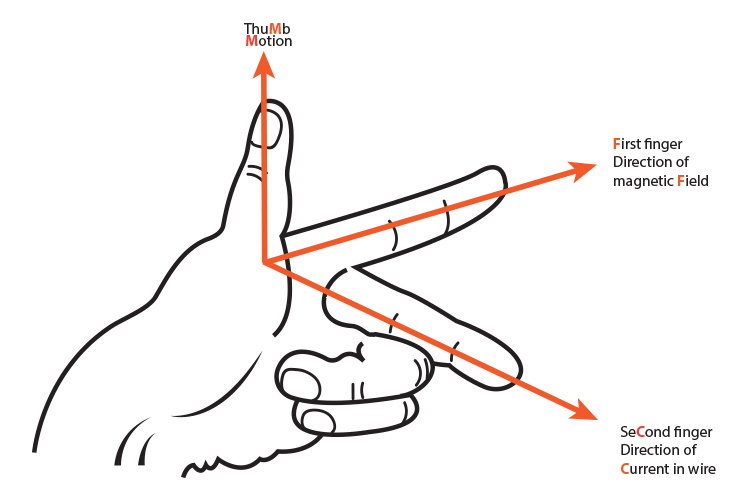
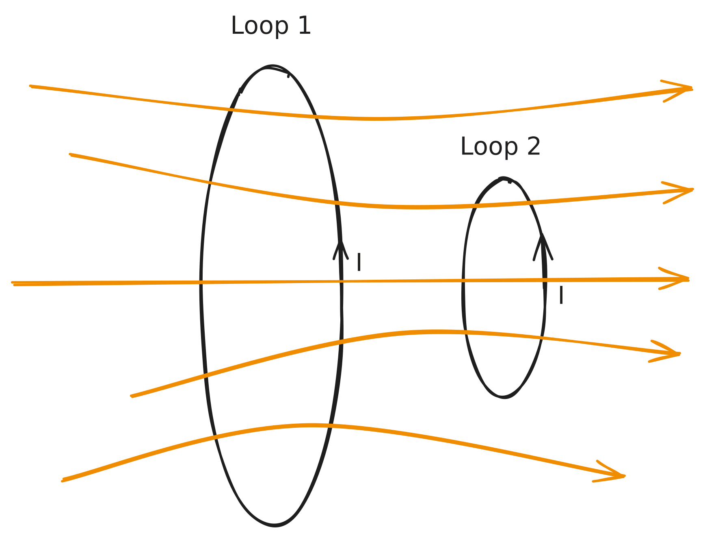
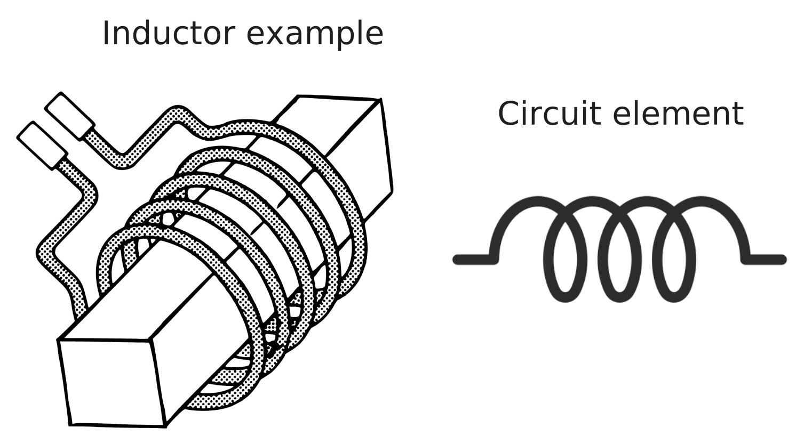

# Chapter 7 - Electrodynamics

> Reference "*Introduction to Electrodynamics*" (5e) by David Griffiths.

---

Electrostatics is the study of the electric field $\vec{E}$ of static electric charges; magnetostatics is the study of the magnetic field $\vec{B}$ of *moving* electric charges. **Electrodynamics** is therefore the study of the electric field $\vec{E}$ of moving electric charges.

# Ohm's Law

To make a current flow, some force on the charges is needed - thus, current density can be written as proportional to the *force per unit charge* $\vec{f}$. 
$$
\vec{J} = \sigma \vec{f} = \sigma (\vec{E}+\vec{v}\times\vec{B})
$$
Usually, the charge velocity is small enough that $\vec{v}\times\vec{B}=0$, so
$$ \vec{J} = \sigma \vec{E}$$
> This is a more primitive variety of Ohm's law, $I=V/R$. Note that $I=\int \vec{J}\cdot d\vec{a}$.

$\sigma$ is the **conductivity** of a material, with the **resistivity** being
$$
\rho = \frac{1}{\sigma}
$$
- Metals can be regarded as perfect conductors: $\sigma \approx \infty$
- Insulators/dielectrics: $\sigma \approx 0$

> Resistors are made of low-conducting (hence high-resistivity) materials.

Actual *resistance* $R$ will depend on the dimensions of the material in question:
$$R = \frac{\rho L}{A}$$
- $\rho$ is a quality of the material itself, while $R$ depends on the amount of that material used. 

## Power

Also known as the *Joule heating law*, power is measured in joules per second and is the amount of "energy" consumed by something, and is defined as
$$P = VI = I^2R$$

---

# Electromotive Force

Now, regarding the EMF. **Electromotive force** (or electromotance) is *not* a force. Rather, it is the integral over the **force per unit charge**, or the forces driving each electron in a material, and is defined as 
$$\epsilon = \oint \vec{f}\cdot d\vec{l}$$
$\vec{f} = \vec{f_s}+\vec{E}$, where $\vec{f_s}$ is the 'source' or 'driving' force on each charge, usually a battery or something to create some potential difference $V$, while $\vec{E}$ "smooths out" the conductor such that we have an equal distribution of electrons everywhere (no buildups). 

For an *electrostatic circuit*, 
$$\oint \vec{E}\cdot d\vec{l} = 0$$
and as such 
$$\epsilon = \oint \vec{f}_s\cdot d\vec{l}$$
An *ideal* EMF source (resistanceless battery) has $\sigma=\infty$, so $\vec{E}=-\vec{f_s}$ and thus
$$V = -\int_a^b\vec{E}\cdot d\vec{l} = \int_a^b \vec{f}_s\cdot d\vec{l} \equiv \oint \vec{f}_s\cdot d\vec{l} = \epsilon$$
> $V = \epsilon$ for an ideal EMF source (ideal battery).

> $\epsilon$ is effectively the "work done per unit charge". 

## Motional EMF

When we move a wire through a magnetic field, we get a motional EMF. 

From the Lorentz force law of a single charge moving through a magnetic field,
$$\vec{f}_\text{mag} = q(\vec{v}\times\vec{B})$$
EMF is force per unit charge $\vec{f}/q$, so
$$\begin{align}
\epsilon &= \oint \vec{f}_\text{mag} \cdot d\vec{l}\\
&= \oint (\vec{v}\times{\vec{B}})\cdot d\vec{l}
\end{align}$$
This is fine, but can get complicated to calculate (as evidenced by homework 6). A much simpler way to calculate $\epsilon$ of some loop is via **Faraday's law**, where
$$\epsilon = -\frac{d\Phi}{dt}$$
Here, $\Phi$ is the *magnetic flux*, so $d\Phi/dt$ is the change in magnetic flux through a loop.

> EMF only happens when a loop and magnetic field are *moving* with respect to one another - i.e. if a loop moves further away from a source of magnetic field, or we move our line of current away from our loop. 

$$\begin{align}
\Phi &= \int\vec{B}\cdot d\vec{a}
\end{align}$$

Flux is really just the amount of magnetic field passing through some loop.

---

# Induction & Faraday's Law

Michael Faraday noted some key things about induction - mainly:

> A changing magnetic field induces an electric field.

This is represented by Faraday's law:
$$\oint \vec{E}\cdot d\vec{l} = -\int \frac{\partial\vec{B}}{\partial t}\cdot d\vec{a}$$
In differential form,
$$\vec{\nabla}\times\vec{E} = -\frac{\partial \vec{B}}{\partial t}$$
Thus, whenever the magnetic flux through a loop changes (or magnetic field $\vec{B}$ changes w.r.t. a loop), an **emf** of 
$$\epsilon = -\frac{d\phi}{dt}$$
will appear in the loop.

> This emf is often called Faraday's Law of Induction - Griffiths disagrees but Griffiths is Griffiths.

## Lenz's Law

In Griffiths' words, 

> Nature abhors a change in flux.

According to the [Wikipedia definition](https://en.wikipedia.org/wiki/Lenz%27s_law) on the subject, "[the] magnetic field created by the induced current opposes changes in the initial magnetic field."

**Fleming's right hand** rule is a good mnemonic to remember this:

## Induced Electric Field

Induced electric fields can be calculated in a manner similar to Ampere's law:

$$
\oint \vec{E} \cdot d\vec{l} = -\frac{d\phi}{dt}
$$

> The rate of change of magnetic flux plays the same role as $\mu_0 I_\text{enc}$.

---

# Mutual Inductance

Say we have two loops with the same current flowing through each. 

Let
$$
\Phi_2 = \int \vec{B}_1\cdot d\vec{a}_2\qquad \Phi_1 = \int \vec{B}_2\cdot d\vec{a}_1
$$
Since both $B_1$ and $B_2$ are proportional to $I_1$ and $I_2$ respectively, we can rewrite this as 
$$
\Phi_2 = M_{21}I_1\qquad \Phi_1 = M_{12}I_2
$$
If $I_1=I_2$ as shown above, then
$$\Phi_2 \equiv M_{21}I\qquad \Phi_1 \equiv M_{12}I$$
> With the same currents, the magnetic flux through loop 2 ($\Phi_2$) *must be equal* to the flux through loop 1 ($\Phi_1$), and
> $$M_{21}=M_{12}$$

Since $\epsilon=-\frac{d\Phi}{dt}$, with the same current $I$ and 
$$\epsilon_2 = -\frac{d\Phi_2}{dt} = -M\frac{d{I_1}}{dt}$$
# Inductors

For several loops with constant current $I$ and mutual inductance $M=L$, 
$$\Phi = LI$$
with 
$$\epsilon = -L\frac{dI}{dt}$$

## Energy in Inductors

$$\frac{dW}{dt} = -\epsilon I = LI\frac{dI}{dt}$$
If we start with $I=0$ and build it up to $I=I$, the total work done is 
$$\begin{align}
W &= \frac{1}{2}LI^2\\
&= \frac{1}{2\mu_0} \int B^2\;d\tau
\end{align}$$

---

# Maxwell's Equations

**Prior** to Maxwell, we had four equations governing electric and magnetic fields:
$$
\begin{align}
\vec{\nabla}\cdot \vec{E}&= \frac{1}{\epsilon_0}\rho\qquad\text{Gauss's law}\\
\vec{\nabla}\cdot\vec{B} &= 0\\
\vec{\nabla}\times\vec{E} &= -\frac{\partial \vec{B}}{\partial t}\qquad\text{Faraday's law}\\
\vec{\nabla}\times\vec{B} &= \mu_0\vec{J}\qquad\text{Ampère's law}
\end{align}
$$

However, these equations fail to account for two things:

- Ampère's law stops applying for nonsteady currents.
- $\nabla\cdot(\nabla\times\vec{B})=0$, but $\mu_0(\nabla\cdot\vec{J})=-\frac{\partial{\rho}}{\partial t}$ (generally). 

The key issue here is thus:

> **Changing electric fields induce magnetic fields**, just as changing magnetic fields induces an electric field. 

Maxwell added a "**displacement current**" term $\vec{J}_d$ to "fix" Ampère's law:
$$
\vec{J}_d = \epsilon_0\frac{\partial\vec{E}}{\partial t}
$$
such that, now
$$\vec{\nabla}\times{\vec{B}} = \mu_0\left( \vec{J} + \vec{J}_d \right)$$
> This term is *only* visible in the presence of changing electric fields - magnetodynamics. 

In terms of our "usual" form of Ampère's law, 
$$ \oint \vec{B}\cdot d\vec{l} = \mu_0I_\text{enc} + \mu_0\epsilon_0 \int \frac{\partial \vec{E}}{\partial t}\cdot d\vec{a} $$

## The Equations

---

$$
\begin{align}
\vec{\nabla}\cdot \vec{E}&= \frac{1}{\epsilon_0}\rho\\
\vec{\nabla}\cdot\vec{B} &= 0\\
\vec{\nabla}\times\vec{E} &= -\frac{\partial \vec{B}}{\partial t}\\
\vec{\nabla}\times\vec{B} &= \mu_0\vec{J} + \mu_0\epsilon_0\frac{\partial \vec{E}}{\partial t}
\end{align}
$$

---
