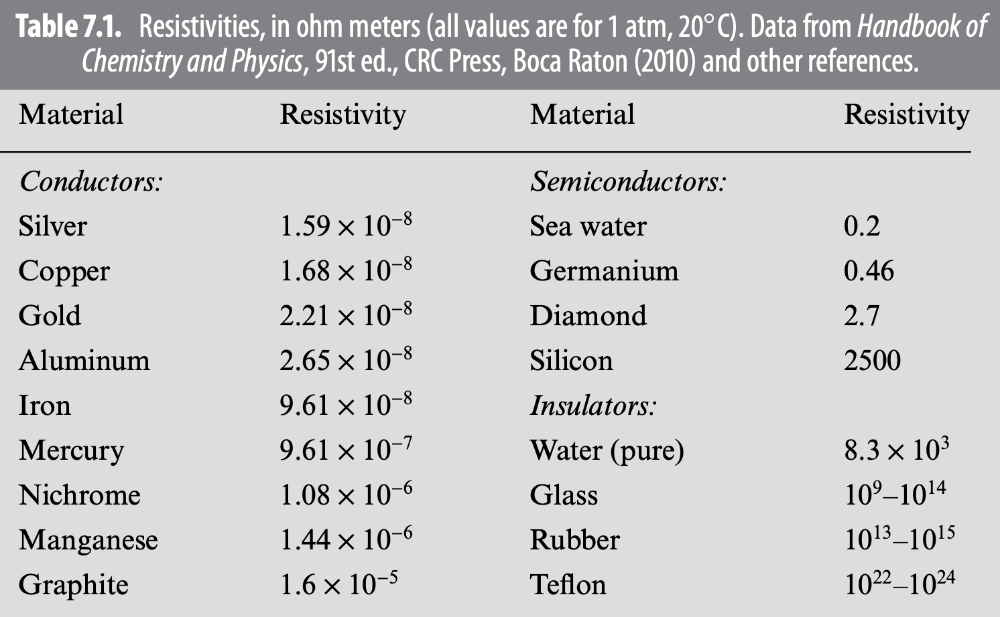

# Chapter 7 - Electrodynamics

> Reference "*Introduction to Electrodynamics*" (5e) by David Griffiths.

---

Electrostatics is the study of the electric field $\vec{E}$ of static electric charges; magnetostatics is the study of the magnetic field $\vec{B}$ of *moving* electric charges. **Electrodynamics** is therefore the study of the electric field $\vec{E}$ of moving electric charges.

# Electromotive Force

To make a current flow, some force on the charges is needed - thus, current density can be written as proportional to the *force per unit charge* $\vec{f}$. 
$$
\vec{J} = \sigma \vec{f} = \sigma (\vec{E}+\vec{v}\times\vec{B})
$$
> Usually, the charge velocity is small enough that $\vec{v}\times\vec{B}=0$, so we can represent it as
> $$ \vec{J} = \sigma \vec{E}\qquad \text{(weird-lookin' Ohm's law)}$$
> This works because $\vec{E}\neq0$ for *moving* charges within a conductor, though $\vec{E}=0$ for static. 

> To convert current density to current:
> $$I = \int \vec{J}\cdot d\vec{a}$$

$\sigma$ is the **conductivity** of a material, with the **resistivity** being
$$
\rho = \frac{1}{\sigma}
$$
- Metals can be regarded as perfect conductors: $\sigma \approx \infty$
- Insulators/dielectrics: $\sigma \approx 0$

> Resistors are made of low-conducting (hence high-resistivity) materials.