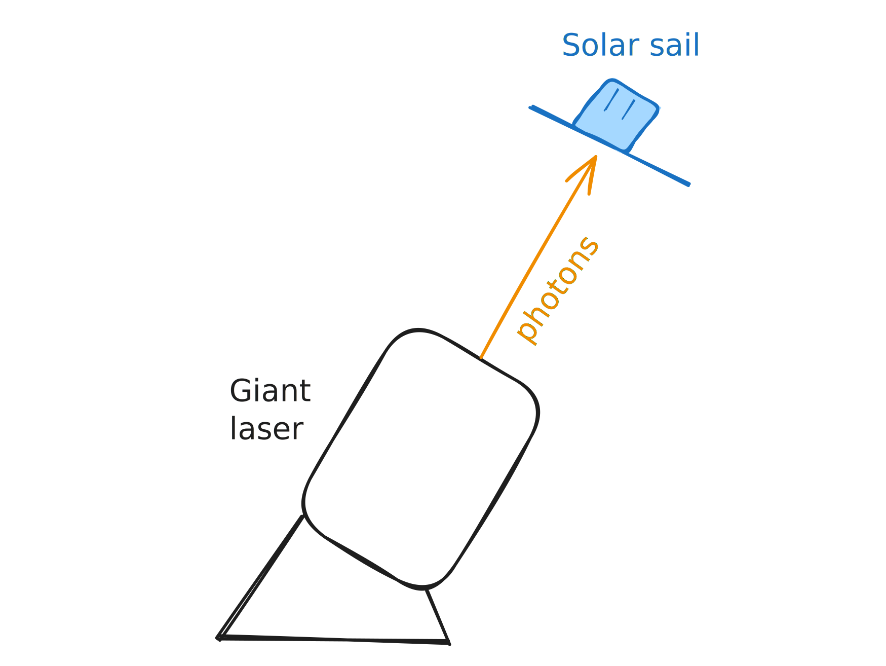

# Chapter 8 - Conservation Laws

The mathematical equation for local conservation of charge (better known as the **continuity equation**) is
$$\frac{\partial \rho}{\partial t} = -\vec{\nabla}\cdot \vec{J}$$

# Poynting's Theorem

The *total energy* stored in electromagnetic fields is
$$u = \frac{1}{2}\left(\epsilon_0 E^2 + \frac{1}{\mu_0}B^2\right)$$
**Poynting's theorem** reads "the work done on charges by the electromagnetic force is equal to the decrease in energy remaining in the fields, minus the energy that flowed out through the surface". 

It's easier understood by the **Poynting vector**:
$$
\vec{S} = \frac{1}{\mu_0}(\vec{E}\times\vec{B})
$$
which represents the *energy per unit time, per unit area* or **energy flux density**. 
> $\vec{S}$ represents the *movement of energy* or transfer of energy, and will point in the direction of this transfer.

The continuity equation for energy is
$$\frac{\partial u}{\partial t} = -\vec{\nabla}\cdot\vec{S}$$

---

# Momentum

Electromagnetic fields *themselves* carry momentum (bizarrely enough). 

Though, I suppose this makes sense - imagine firing a gigantic laser beam from Earth at some spacecraft:

The barrage of photon would cause the solar sail spacecraft to accelerate. This is the principle behind the [Breakthrough starshot](https://en.wikipedia.org/wiki/Breakthrough_Starshot) project. The only way this is possible is if the photons (and hence E/M waves themselves) carried some momentum.

## Maxwell stress tensor

The **Maxwell stress tensor** is used to relate electromagnetic forces and mechanical momentum. 