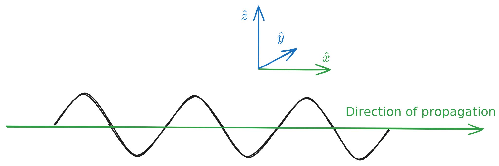

# Chapter 9 - Electromagnetic Waves

> Reference "*Introduction to Electrodynamics*" (5e) by David Griffiths.

---

Griffiths defines a wave as "*a disturbance of a continuous medium that propagates with a fixed shape at a constant velocity*".

If we represent such a wave mathematically, then we can say that the displacement $z$ (from the origin) at some later time $t$ is
$$f(z,t) = f(z-vt,0) = g(z-vt)$$
Or just 
$$f(z,t) = g(z-vt)$$
Solutions to this equation are determined via the **wave equation**. Let $u=z-vt$, such that $g(z-vt)=g(u)$. 
$$
\frac{d^2g}{du^2} = \frac{\partial^2 f}{\partial z^2} = \frac{1}{v^2}\frac{\partial^2f}{\partial  t^2}
$$
here the **speed of propagation** $v$ is given by 
$$v = \sqrt{\frac{T}{\mu}}$$
Functions of the form $g(z-vt)$ are not the only solutions - the wave equation has the square of $v$, so another class of solutions looks like $h(z+vt)$ - so the most general solution to the wave equation is
$$f(z,t) = g(z-vt)+h(z+vt)$$
> Note that this is a **linear** equation thus the sum of any solutions is also solution.

Waves that travel across some medium (like waves on an ocean or guitar string, moving with velocity $v$) are called **transverse**. Those that act more like a slinky are called **longitudinal waves**. 

## Sinusoidal waves

Sinusoidal waves take the form
$$
f(z,t) = A\cos(k(z-vt)+\delta)
$$
- $A$ is the **amplitude**.
- $\delta$ is the **phase constant**.
- $k$ is the **wave number**, and is related to wavelength by
$$\lambda = \frac{2\pi}{k}$$
> Cosine completes one cycle every $2\pi/k$.

The **period** $T$ is
$$T = \frac{2\pi}{kv} = \frac{\lambda}{v}$$
while the **frequency** (oscillations per unit $t$)
$$f = \frac{1}{T} = \frac{v}{\lambda}$$
Alternatively, the **angular frequency** can be more useful:
$$w = 2\pi f = kv$$
> The direction of propagation is determined by the sign of $k$. A *leftward* wave has $+k$, a *rightward* wave $-k$. 

## Complex wave notation

Waves can also be written in complex notation, by 
$$g(z,t) = Ae^{i(kz-\omega t+\delta)}$$
Or alternatively, with $B=Ae^{i\delta}$,
$$g(z,t) = Be^{i(kz-\omega t)}$$
The actual wavefunction is still given through the real component of this.
$$f(z,t) = \text{Re}[g(z,t)]$$

## Polarization

Transverse waves move along a single axis (the **direction of propagation**):

Thus, there will always be *two* dimensions orthogonal to the direction of propagation given by the **polarization vector** $\hat{n}$, with the **polarization angle** $\theta$.
$$\hat{n} = \cos\theta\:\hat{x} + \sin\theta\:\hat{y}$$
Most waves can therefore be considered a superposition of two waves: one horizontally polarized, one vertically, depending on your axis orientation.
$$g(z,t) = g_1(x,t)\cos(\theta)\hat{x} + g_2(z,t)\sin(\theta)\hat{y}$$
