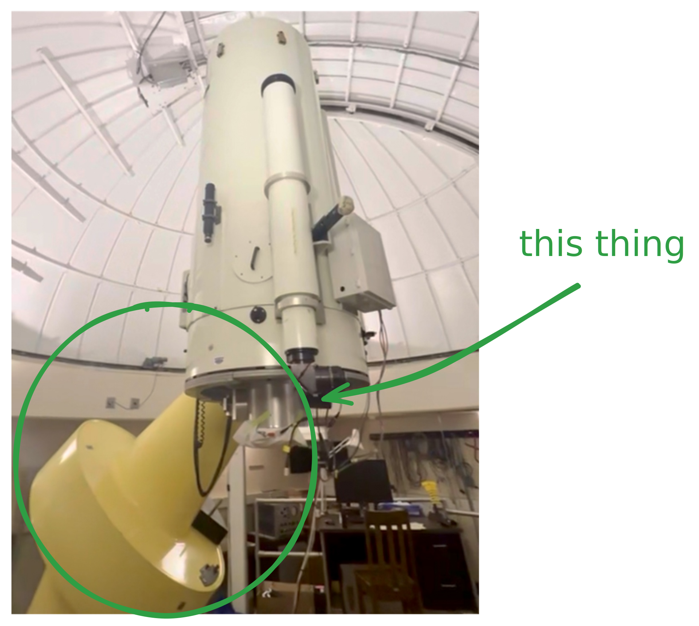
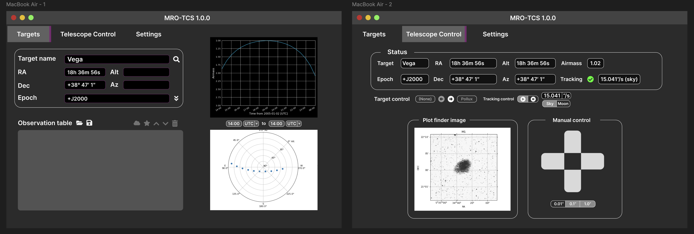

# Building an ASCOM frontend for the MRO

> As part of one of my final projects with the UW AUEG, this post covers the construction of a custom frontend interface to interact with the new [Sidereal Technology ForceOne](https://siderealtechnology.com/BrushlessManual_1_4.pdf) (F1) telescope controller we're installing April-June 2025. 

Many of the telescope systems within the UW [Manastash Ridge Observatory](https://sites.google.com/a/uw.edu/mro/) haven't been updated in a while, with 'a while' meaning (in the 21st century) to (ever). Given the telescope was originally built in 1975, that means many of the systems and electronics are ancient, creaky and sometimes just plain don't work. 

One of those systems in the 'ever' category is the old telescope control system, which controls the telescope mount and helps tell it where to point - quite a critical system. Alas, like a cranky child, it's one that is prone to issues, needs constant monitoring and wire-jiggling, and just generally can be a headache sometimes.

So, after summoning our inner crusty old engineers and putting on some gloves, we've decided to rip out everything and replace it with ✨ better stuff ✨.

---

The Promised Land a.k.a. the **ForceOne Brushless Controller** uses a protocol called ASCOM ("Astronomy Common Object Model") which is a standardized set of instructions that we can use to communicate with motorized telescope mounts.

ASCOM[^1] is really just a set of standards for communicating with a telescope - it's like the metric measuring system, or Python's [PEP8](https://peps.python.org/pep-0008/) style guide. It covers most of the use cases for interacting with a telescope, including focusing, GOTO, dome controls, filter wheels, even [safety monitoring](https://ascom-standards.org/api/#/SafetyMonitor%20Specific%20Methods). 

We're *only* focusing on one subset of these commands: those that can be used to control the telescope mount.

There are some pre-existing GUIs and frontends for working with ASCOM, but I didn't like any of them and some of them were expensive so we decided to make our own. 

> In all seriousness, most existing GUIs are designed around general use cases for ASCOM, and either have too many options for our limited use, or too few. By making our own user interface, we can make something for our own use case, and just for it.

## Design and implementation

Generating a mockup for such a frontend in Figma as a way to guide development:

[^1]: ASCOM is cool. If you're a nerd like me and love cool APIs, see [the ASCOM API](https://ascom-standards.org/api/) which is a comprehensive set of HTTP API endpoints that are broadcast by the controller (the F1 in our case) and are how we communicate with the telescope base. 
