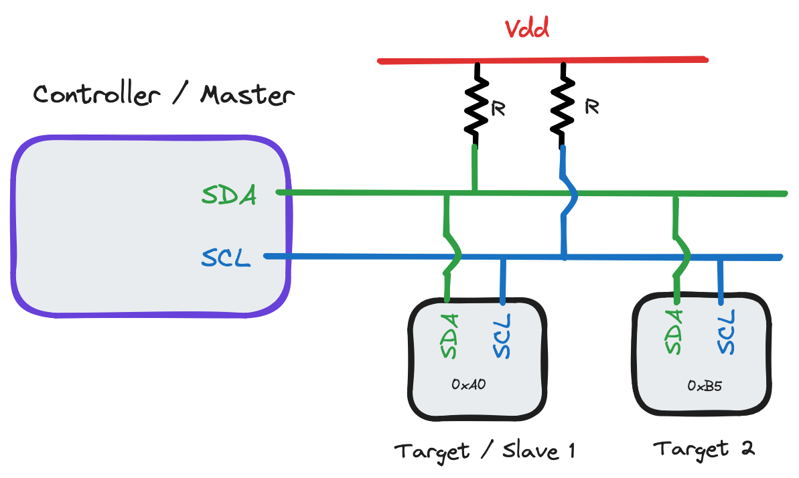
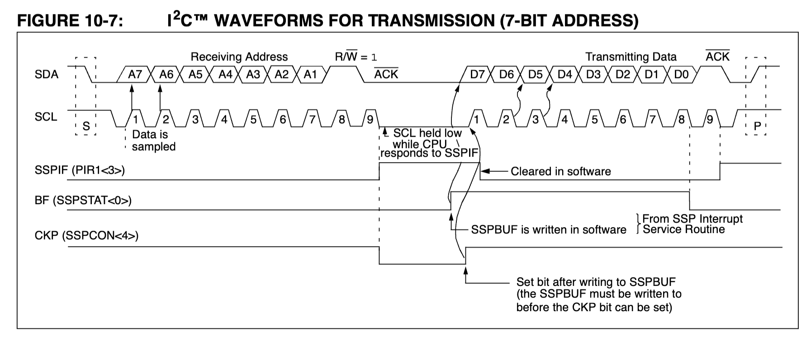
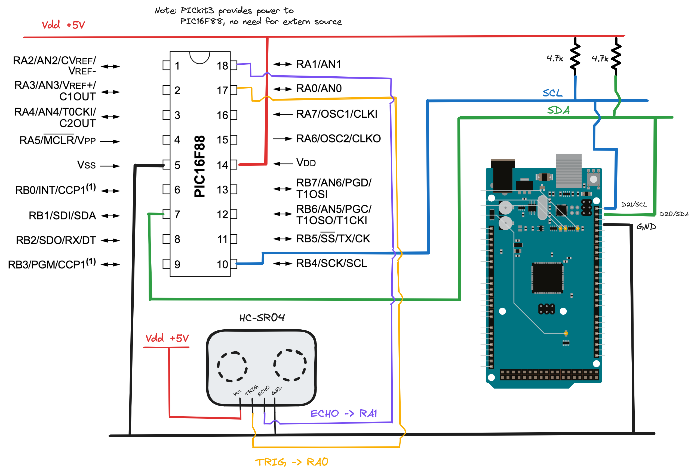
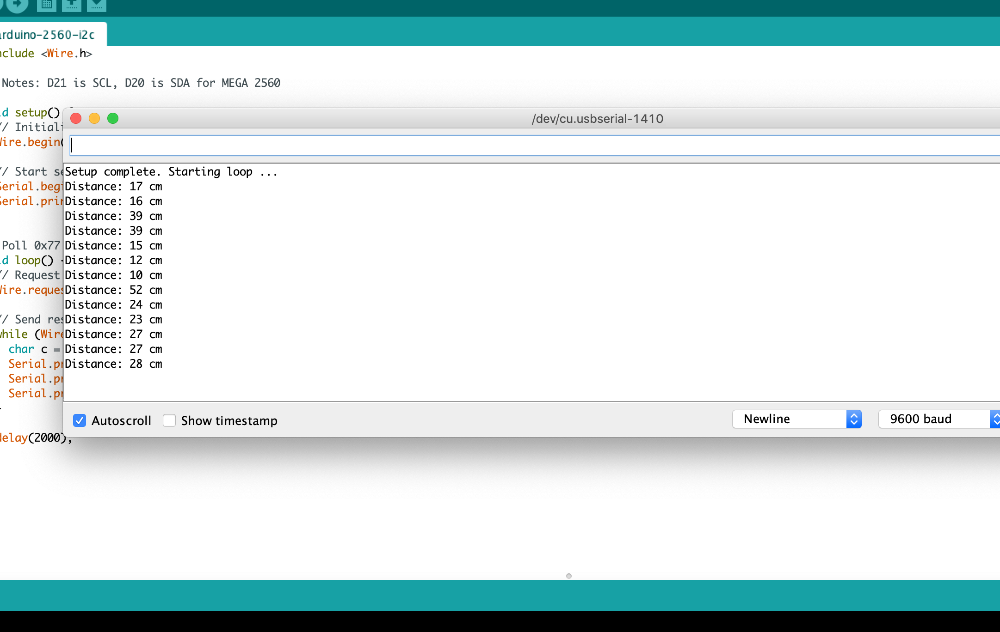

# Using the PIC16F88 as an I2C device

> Final project for **PHYS 335A: Digital Electronics**, taught Spring of 2024 by Dr. David Pengra at the University of Washington. 

---

The [PIC16F88](https://www.microchip.com/en-us/product/PIC16F88) is a 16-bit, lightweight microcontroller from Microchip devices which is useful for a variety of low-cost and low-power, high speed embedded systems operations.

Here I describe some details of how I try to set up an I$^2$C implementation on the PIC16F88, and design a program using [MPASM](https://onlinedocs.microchip.com/oxy/GUID-99287649-615D-4D29-913C-BC89F4A22253-en-US-7/GUID-1C3D0EE8-117C-40FE-A4C4-0B0DD19D6CCF.html) Assembly language to operate it as an I2C target device (slave), to be controlled by higher-level controller (master) devices such as Arduinos or Raspberry Pis. 

**Note:** MPASMx is no longer supported as of MPLAB X v5.40 - use >v5.35 if you're intending to use it here. See the footnote[^compilers] for more details on this & using OSx.  

## Introduction to I2C

I$^2$C (or *inter-integrated circuit*) is, like so many things in electrical engineering, a complicated-looking protocol that's actually pretty simple in a clever sort of way. 

When compared to its closest serial communications cousin [SPI](https://en.wikipedia.org/wiki/Serial_Peripheral_Interface) (or *serial peripheral interface*), I$^2$C only requires 2 datalines (SDA and SCL) compared to SPI's 4 (MISO, MOSI, SCLK and CS), and allows for *far* more devices to be connected due to the use of *peripheral addressing* rather than SPI's chip select. 


The master device / controller, in my case an Arduino Mega 2560, specifies some baudrate to operate the clock frequency on. When *no* data transmission is happening, both SDA and SCL are pulled to `Vdd` through the pullup resistors ($R$ above - typical choices range from 
4.7k$\Omega$ to 10k$\Omega$). 

Since this implementation of I$^2$C is open-drain, the controller and target oscillate lines by just directly grounding them - the pullup resistors avoid shorting the circuit out this way. Note this means that the longer `SCL=0` or `SDA=0`, the more power the circuit will use by extension. 

> Pullup resistor choice is important if you're trying to optimize - small PU resistors have high power consumption but also high speeds, while large PU resistors have low power consumption but also create capacitance delays. [Texas Instruments has a good description](https://www.ti.com/lit/an/slva689/slva689.pdf) of this. 

By my understanding, I$^2$C (in 7-bit addressing space[^addressing]) generally operates like this:

1. Controller device sends a `START` bit by holding SDA low with SCL high. 
2. Controller sends a 7-bit address, one bit per clock cycle. 
3. At the 8th bit (8th time SDA goes HIGH), target devices compare the sent address with their own. If the two match, continue. Otherwise, ignore - this stream isn't meant for that device.
4. Controller and specified target communicate.
5. `END` bit set by either to indicate the conversation ifs over. 

Each 'communication sequence' happens in 8-bit intervals - 7 bits for data, the 8th allowing time for each device to tell the other what to expect next. The [PIC16F88 SSP section](datasheets/PIC16F88-SSP.pdf) of the datasheet has a handy visualization of the target transmitting data back to the host - what we're planning on doing here. 




So - let's talk about the project. 


## I2C Rangefinder Project

We'll use the PIC16F88 in conjunction with the [HC-SR04](https://cdn.sparkfun.com/datasheets/Sensors/Proximity/HCSR04.pdf) ultrasonic rangefinder module to create a rangefinding device, retrieving the rangefinder values from the PIC by communicating over I$^2$C. 

For our controller, we'll use an [Arduino Mega 2560](https://store.arduino.cc/products/arduino-mega-2560-rev3) - chosen because it allows serial console monitoring & has 5V I$^2$C logic by default (the PIC16F88 uses 5V, and thus has 5V I$^2$C outputs), and has a number of high-level logic libraries for interfacing with I$^2$C (see the [Wire library](https://www.arduino.cc/reference/en/language/functions/communication/wire/) for more information). 

> It *is* possible to use an I$^2$C controller with 3.3V logic (such as a Raspberry Pi) with 5V target devices or visa-versa, however you'll need to convert logic levels between the two, either with a dedicated logic-level conversion device or by using N-channel MOSFETs and pull-up resistors. Refer to [NXP note AN10441](https://cdn-shop.adafruit.com/datasheets/AN10441.pdf)  for more information.

### Hardware

Making a circuit diagram for this,


For my pullup resistors I decided to use 4.7k$\Omega$, as I'm not particularly worried about power consumption on a proof-of-concept. Note that `RA<x>` refers to pins `PORTA<x>`, and similarly `RB<x>` refer to pins `PORTB<x>`. 

> **Note**: it's quite important that the controller and target devices share a common ground - otherwise, the "reference ground voltage" for I$^2$C pulses may not be the same and a circuit may not function as hoped!

Here's the physical implementation of this circuit.


### Software

First, I made sure code for the rangefinder was working before fiddling with I$^2$C. I made use of some of the code provided in *Lab 8 - Sonic Ranger with Interrupts & Hardware Control*, ensuring the rangefinder worked by tinkering with the debugger and observing variable changes in response to changed echo distances from the rangefinder. This could have also been done by reusing our *Lab 7* code, but I thought the Lab 8 code looked much neater. 

Now - onto the software side of I$^2$C. The SSP section on I$^2$C in the PIC16F88 datasheet is unfortunately quite lacking with regards to exact implementation methods, so I was forced to scrounge around a bit through sources official and otherwise for information.

> In brief, the PIC16F88 doesn't easily support a controller-mode implementation of I$^2$C out of the box, lacking the MSSP register found in other PICs that would allow easier implementation. 
> 
> Instead, the 'F88 supports a variety of both SPI and I$^2$C *target* device implementations that may be used instead - refer to [Register 10.2 in the datasheet SSP](datasheets/PIC16F88-SSP.pdf) section. If you're looking to implement master-mode on a PIC, look to other devices such as the [PIC16F1508](https://ww1.microchip.com/downloads/en/DeviceDoc/40001609E.pdf) which have MSSP registers.  

Using the [PIC16F88 datasheet section on SSP](datasheets/PIC16F88-SSP.pdf) (paying particular attention to section 10.3.1) as well as the [section on interrupts](datasheets/PIC16F88-STATINT.pdf) and the [section on configuring PORTB](datasheets/PIC16F88-PORTB.pdf), here's the process I followed to implement "*I$^2$C Slave mode, 7-bit address with Start and Stop bit interrupts enabled*".

1. Clear `ANSEL` to enable digital (instead of analog) inputs.
2. Set `TRISB<1>` (SDA) and `TRISB<4>` (SCL) pins, turning them into inputs. 
	- "But wait! I$^2$C is bidirectional!" you might argue - this is true. The SSP (synchronous serial port) module in the PIC16F88 will automatically set and clear `TRISB<1>/<4>` in response to `SDA` and `SCL` events. 
3. Set bits in `SSPCON` (SSP control register): 
	- `SSPCON<5>` - `SSPEN`, enables SSP
	- `SSPCON<4>` - `CKP`, clock polarity, allowing controller to oscillate `SCL`
	- `SSPCON<3:0>=1110` - `SSPM<3:0>`, "SSP mode select". See Register 10.2 in the SSP section of the datasheet for other options - by using `1110`, we're setting our SSP mode to I$^2$C target mode with 7 bit addressing, start/stop interrupts enabled. 
4. Choose an address for your device. It must not be `0x00` or `0x01`, other values allowed up to `0xFF`. I chose `0x77` arbitarily. Write it into `SSPADD`. 
	- Since only bits `SSPSR<7:1>` are compared to `SSPADD`, run an `RLF` instruction (rotate-left-through-carry) on `SSPADD` to make sure your address matches the checked one.
5. Enable interrupts. Set bits:
	- `INTCON<7>` - `GIE`, enable global interrupts
	- `INTCON<6>` - `PEIE`, enable peripheral interrupts 
	- `PIE1<3>` - `SSPIE`, enable SSP interrupts
6. Create interrupt functions in your ISR space
	- Check if `PIR<3>` (`SSPIF`) is set to make sure the interrupt was caused by I$^2$C, if there are multiple possible interrupts in your code. 
	- Function to `Save` `STATUS` and `W` as you normally would.
	- `WriteData` - to send data, write (less than 8 bits total) to `SSPBUF`, then **set** `SSPCON<4>` to indicate to the controller that you (the target) are ready to transmit. `SSPBUF` will now start automatically sending. 
	- Function to `Load` as you normally would
	- Clear `PIR1<3>` (`SSPIF`) to reset the SSP ...
7. ... and `RETFIE`.

My ISR implementation following 6-7 above looks like this:

```armasm
; Interrupt Service Routine ----------------------------------------------------

	ORG 0x0004 ; ISR beginning

SaveState
	MOVWF SAVE_W ; Save W register
	SWAPF STATUS, W ; Save STATUS reg
	MOVWF SAVE_STAT ; ... into temporary reg

LoadAndSend
	MOVFW TimerCounts ; Load last pulse period into W
	MOVWF SSPBUF ; Load SSPBUF with W (will be sent)
	BSF SSPCON,CKP ; Set CKP bit to indicate our buffer is ready

LoadState
	SWAPF SAVE_STAT,W ; Load STATUS
	MOVWF STATUS
	SWAPF SAVE_W, F ; Load W
	SWAPF SAVE_W, W ; Load W into W
	
	BCF PIR1,SSPIF ; Clear serial interrupt flag
	RETFIE ; ... and return to program execution
	
; End ISR ----------------------------------------------------------------------
```

and relevant I$^2$C code blocks like this:

```armasm
; I2C initialization subroutine ------------------------------------------------

SetI2C
    BANKSEL	ANSEL           ; Bank 1
    CLRF	ANSEL           ; Set to all-digital inputs
    BSF		TRISB, TRISB1	; Set PORTB<1> (SDA) as an input
    BSF		TRISB, TRISB4	; Set PORTB<4> (SCL) as an input
    CLRF	SSPSTAT		; Reset SSPSTAT
    
    BANKSEL	SSPCON		; Bank 0
    BSF		SSPCON, SSPEN	; Turn on SSP
    BSF		SSPCON, CKP	; Enable clock (if 0, holds clock low)
    BSF		SSPCON, SSPM3	; I2C 7-bit slave-mode w/ int is SSPM<3:0>=1110
    BSF		SSPCON, SSPM2
    BSF		SSPCON, SSPM1
    BCF		SSPCON, SSPM0
    
    BANKSEL	SSPADD		; Bank 1
    MOVLW	I2C_ADDR	; Load I2C address into W
    MOVWF	SSPADD		; Load SSPADD with I2C_ADDR (0xIC random)
    RLF		SSPADD,F	; Left-shift since SSPSR<7:1> compared
    
    ; Interrupt configuration
    BANKSEL	INTCON		; Bank 0
    BSF		INTCON, GIE	; Enable global interrupts - SSP interrupt on START
    BSF		INTCON, PEIE	; Enable peripheral interrupts
    BANKSEL	PIE1		; Select PIE register
    BSF		PIE1, SSPIE	; Enable SSP interrupts in peripheral interrupt reg
	
; End subroutine ---------------------------------------------------------------
```
## Results

Using the Arduino IDE with the [Wire library](https://www.arduino.cc/reference/en/language/functions/communication/wire/), I set up a basic script that, after initializing I$^2$C and the serial monitor both at a baudrate of 9600, would send an I$^2$C "read" query down `SDA` to address `0x77` (our PIC) to try and retrieve our `TimerCounts` value from our interrupt function `LoadAndSend` shown above. 

```java
#include <Wire.h>

// Notes: D21 is SCL, D20 is SDA for MEGA 2560

void setup() {
  // Initialize I2C
  Wire.begin();
  
  // Start serial output for console monitoring
  Serial.begin(9600);  
  Serial.println("Setup complete. Starting loop ...");
}

// Poll 0x77 address - then sleep for two seconds - then poll.
void loop() {
  // Request 2 bits from 0x77
  Wire.requestFrom(0x77, 1);

  // Send results (if any) to serial monitor
  while (Wire.available()) {
    char c = Wire.read();
    Serial.print("Distance: ");
    Serial.print(c, DEC);
    Serial.println(" cm");
  }

  delay(2000);
}
```

And, after some tinkering, checking the serial monitor revealed ...



Voilà!!

## Notes

I definitely didn't get this first try - I wrote the Arduino script pretty early on to monitor the PIC16F88 while I figured out the maze of interrupt flags necessary to work with I$^2$C. 

 > Something I should note - I've wasted at least a few hours during this project because I wasn't operating on the correct bank while trying to operate on some register. Such problems won't often be immediately apparent, only becoming clear when you step through your code with a debugger and realize a value isn't changing when it should. `BANKSEL` is a friend! 
## Code

The full program I used for this is written below. 

```armasm
;*******************************************************************************
;                                                                             
;    Filename: Final Project I2C Ranger                                       
;    Date: 5/31/2024                                                           
;    File Version: 1.0                                                            
;    Author: Parker Lamb                                                                   
;    Description: Sets PIC16F88 up as I2C-ready ultrasonic rangefinding device.
;                                                                              
;*******************************************************************************

;*******************************************************************************
;
;                Procesor initial setup
;
;*******************************************************************************
    
    list       F=inhx8m, P=16F88, R=hex, N=0 ; File format, chip, and default radix

#include p16f88.inc ;   PIC 16f88 specific register definitions

    __config _CONFIG1, _MCLR_ON & _FOSC_INTOSCCLK & _WDT_OFF & _LVP_OFF & _PWRTE_OFF & _BODEN_ON & _LVP_OFF & _CPD_OFF & _WRT_PROTECT_OFF & _CCP1_RB0 & _CP_OFF
    __config _CONFIG2 , _IESO_OFF & _FCMEN_OFF

    Errorlevel -302 ; switches off msg [302]: Register in operand not in bank 0.

;*******************************************************************************
;
;                Constants and variables
;
;*******************************************************************************

; Program vars
TimerCounts EQU     h'20'	; Saving timer counts
 
;  vars
SAVE_W	    EQU	    h'21'	; Interrupt temporary W storage
SAVE_STAT   EQU	    h'22'	; Interrupt temporary STATUS FSR storage
   
; I2C status
I2C_STAT    EQU	    h'23'	; Check if I2C is connected
I2C_ADDR    EQU	    0x77	; I2C address (const)
	    
; Delay count registers
DInd1	    EQU	    h'24'
DInd2	    EQU	    h'25'
	    
; Delay times
DTime1	    EQU	    .199	; 60 ms delay - outer loop
DTime2	    EQU	    .60		; Nested loop runs for 59,941 cycles
	    
; SCL and SDA locations
#define	    _SDA    PORTB,RB1	; Make _SDA easier to check
#define	    _SCL    PORTB,RB4	; Make _SCL easier to check
	    
;*******************************************************************************
;
;                Memory init & interrupts
;
;*******************************************************************************
 
	    ORG	    0x00
	    GOTO    Init
	    
; Interrupt Service Routine ----------------------------------------------------
            ORG     0x0004               ; ISR beginning
		    
SaveState
    MOVWF	SAVE_W		; Save W register
    SWAPF	STATUS, W	; Save STATUS reg
    MOVWF	SAVE_STAT	; ... into temporary reg
    
LoadAndSend
    MOVFW	TimerCounts	; Load last pulse period into W
    MOVWF	SSPBUF		; Load SSPBUF with W (will be sent)
    BSF		SSPCON,CKP	; Set CKP bit to indicate our buffer is ready
    
LoadState
    SWAPF	SAVE_STAT,W	; Load STATUS
    MOVWF	STATUS
    SWAPF	SAVE_W, F	; Load W
    SWAPF	SAVE_W, W	; Load W into W
    
    BCF		PIR1,SSPIF
    RETFIE			; ... and return to program execution

;*******************************************************************************
;
;                Program start
;
;*******************************************************************************
Init	    ORG	    0x0020
	    
; Set up oscillator to 4 MHz
SetOsc_4MHz 
    BANKSEL	OSCCON
    CLRF	OSCCON
    BSF		OSCCON, IRCF1   ; Bit 5
    BSF		OSCCON, IRCF2   ; Bit 6

    ; Tuned value from Lab 7 - adjust as needed
    MOVLW	0x16
    MOVWF	OSCTUNE

; Reset IO to all digital, all outputs, clear latches
ResetIO
    BANKSEL	PORTA   ; Clear data latch registers
    CLRF	PORTA
    CLRF	PORTB
    BANKSEL	TRISA   ; Data direction on PORTA / PORTB
    CLRF	TRISA   ; Set PORTA to all output
    CLRF	TRISB   ; Set PORTB to all output
    BANKSEL	ANSEL   ; Select digital / analogue register
    CLRF	ANSEL   ; And set to all-digital inputs
	  
; ... and set what we need to
SetIO
    BANKSEL	TRISA
    MOVLW	0xFF
    MOVWF	TRISA		; Set PORTA direction to all inputs
    BCF		TRISA, RA0	; ... except PORTA<0>, an output
 
SetTMR0
    ; TMR0 duration between pulses indicates our radar distance
    BANKSEL	OPTION_REG	; TMR0 operation controlled via OPTION_REG
    CLRF	OPTION_REG	; Clear it - sets PSA to TMR0, low-hi edge
    BSF		OPTION_REG, 0x0
    BSF		OPTION_REG, 0x2	; Set prescaler rate to 1:64 w.r.t oscillator (101)
    BANKSEL	INTCON		; Select interrupt control register
    BCF		INTCON,TMR0IE	; Disable TMR0 OF interrupt (not using here)
    BCF		INTCON,TMR0IF	; Clear flag (maybe unnecessary - do anyway)
    
;*******************************************************************************
;
;                I2C configuration
;   We're using this device in 7-bit I2C slave-mode with stop + start
;   interrupts enabled. 
;
;*******************************************************************************
    
SetI2C
    BANKSEL	TRISB		; Bank 1
    BSF		TRISB, TRISB1	; Set PORTB<1> (SDA) as an input
    BSF		TRISB, TRISB4	; Set PORTB<4> (SCL) as an input
    
;    BANKSEL	SSPSTAT		; Bank 1
    CLRF	SSPSTAT		; Reset SSPSTAT
    
    BANKSEL	SSPCON		; Bank 0
    BSF		SSPCON, SSPEN	; Turn on SSP
    BSF		SSPCON, CKP	    ; Enable clock (if 0, holds clock low)
    BSF		SSPCON, SSPM3	; I2C 7-bit slave-mode w/ int is SSPM<3:0>=1110
    BSF		SSPCON, SSPM2
    BSF		SSPCON, SSPM1
    BCF		SSPCON, SSPM0
    
    BANKSEL	SSPADD		; Bank 1
    MOVLW	I2C_ADDR	; Load I2C address into W
    MOVWF	SSPADD		; Load SSPADD with I2C_ADDR (0xIC random)
    RLF		SSPADD,F	; Left-shift since SSPSR<7:1> compared
    
    ; Interrupt configuration
    BANKSEL	INTCON		; Bank 0
    BSF		INTCON, GIE	; Enable global interrupts - SSP interrupt on START
    BSF		INTCON, PEIE	; Enable peripheral interrupts
    BANKSEL	PIE1		; Select PIE register
    BSF		PIE1, SSPIE	; Enable SSP interrupts in peripheral interrupt reg

;*******************************************************************************
;
;                Main program loop
;   Cause the sonic module to pulse every 10 microseconds. Wait for a response,
;   then save time it took into a register. Repeatedly do this.
;
;   Once I2C interrupt is detected, send information via I2C. 
;
;   TODO only start this loop if START condition detected, stop with I2C STOP.
;
;*******************************************************************************
    ; Reset to bank 0
    BCF	    STATUS, RP0
    BCF	    STATUS, RP1	    ; All of the action is in Bank 0 now
	    
MainLoop    
; Send sonic device a 10-microsecond pulse
Pulse
    BSF		PORTA, RA0	; Set PORTA<0> output to high
    NOP
    NOP
    NOP
    NOP
    NOP
    NOP
    NOP
    NOP
    NOP
    BCF		PORTA, RA0	; Set PORTA<0> output low

; Loop until PORTA<1> goes HI, indicating a response
WaitForResp
    BTFSS	PORTA, RA1	; Check PORTA<1>
    GOTO	WaitForResp	; ... and loop if it's still zero

    ; Start of our response
    CLRF	TMR0		; Start timer from now
WaitUntilLow
    BTFSC	PORTA, RA1	; Check PORTA<1> to see if response finished
    GOTO	WaitUntilLow	; ... loop if still not LOW
    
    ; We have a response! Store timer value in a variable
    MOVFW	TMR0
    MOVWF	TimerCounts
    
    ; Delay for a bit so we aren't constantly polling
    CALL	Delay
    
    ; Return to MainLoop
    GOTO	MainLoop

;*******************************************************************************
;
;                Subroutines
;
;*******************************************************************************
; Loop from Template_for_Ranger_with_interrupts.asm, course lab template
Delay
		MOVLW   DTime2
		MOVWF   DInd2
Loop1		MOVLW   DTime1
		MOVWF   DInd1
Subloop1	NOP
		NOP
		DECFSZ  DInd1,F
		GOTO    Subloop1
		DECFSZ  DInd2,F
		GOTO    Loop1
	RETURN
    
Finish
    END
```

The code for the Mega 2560 is written in [Results](#results).


[^compilers]: With version [v5.40 of MPLAB X](https://www.microchip.com/en-us/tools-resources/archives/mplab-ecosystem), Microchip's dedicated compiler/IDE, Microchip upgraded all their binaries to 64-bit. However, since `mpasmx` was *not* updated from 32 bits, and Mac OSx [does not support 32-bit applications](https://support.apple.com/en-us/103076) since Mojave, Mac users will need to either use Windows or a VM. 

[^addressing]: See Wikipedia's [page for addressing structure](https://en.wikipedia.org/wiki/I%C2%B2C#Addressing_structure) for more details. 
